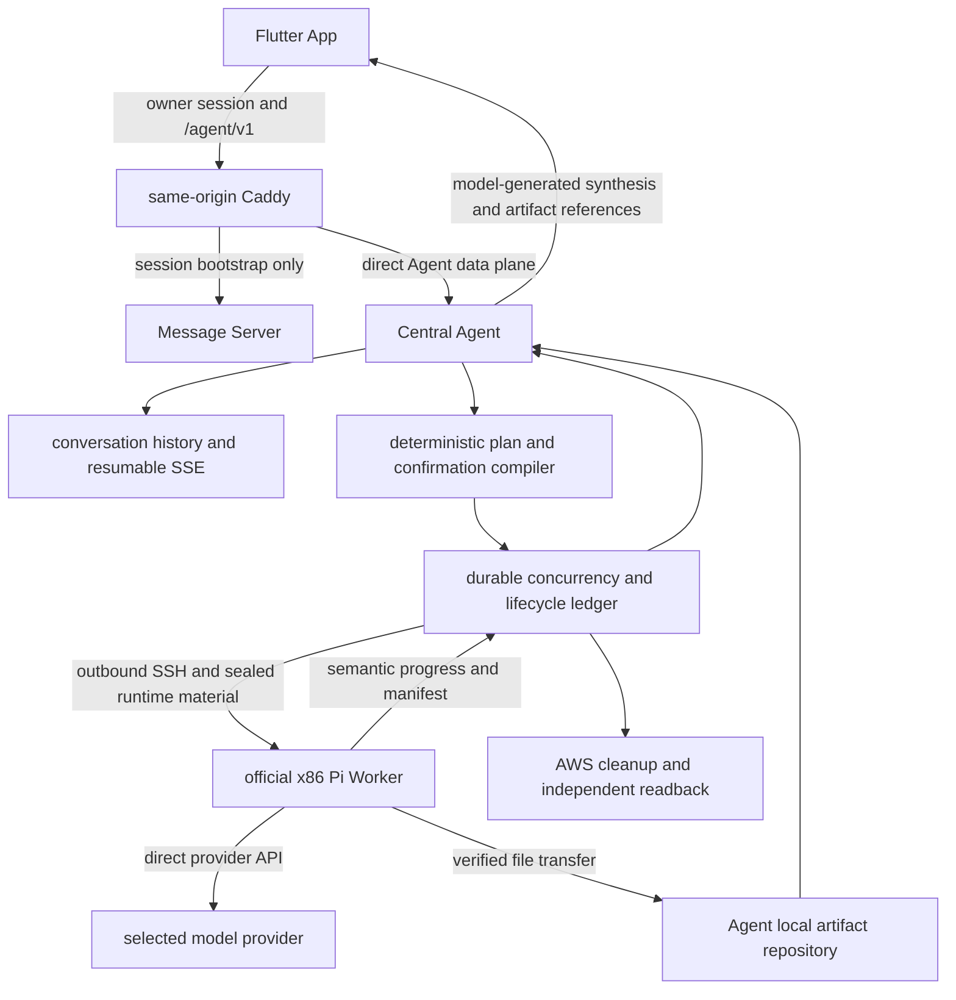

# AWS Agent OS 已验证闭环能力主分支迁移计划

## 1. 文档状态

- 状态：可执行计划，尚未开始主分支迁移。
- 基线时间：2026-08-18。
- 迁移来源：三仓 `codex/aws-agent-os-adam-integration`。
- 迁移目标：三仓各自最新 `origin/main`。
- 测试环境：仅使用 demo4 和独立模拟器，不改动 demo2。
- 发布原则：单元测试、构建测试和真实 AWS 闭环全部通过后才创建 PR。

本文档是本次三仓主分支迁移的总计划。现有
`docs/aws-agent-os-runtime-lifecycle-migration-plan.md` 仍可作为时间与生命周期专题记录，
但所有跨仓范围、目标架构、迁移顺序和最终验收均以本文档为准。

## 2. 结论

本次迁移不对现有集成分支执行整体 rebase、merge 或批量 cherry-pick。三个仓库都从
最新 `origin/main` 创建同名迁移分支，只迁移已经验证的产品行为、边界测试和必要实现。

原因如下：

1. 新主分支已经采用 App 经同源 `/agent/v1/*` 数据面直达 Agent 的架构，Message
   Server 不再代理 Agent 业务请求。
2. 新主分支已经拥有 Agent 本地交付物仓库、持久会话、可恢复 SSE、确认机制和 SSH
   Worker 基础设施，其中一部分比旧闭环更适合作为长期架构。
3. 现有闭环分支包含旧 Message Server Agent Gateway、ProductCore Execution V2 代理、
   CloudFormation、S3/KMS、WorkerControl 和旧公开契约，整体搬运会恢复已经删除的架构。
4. 三仓与各自主分支的分叉较大。机械合并既难以审查，也无法证明最终运行的是新主分支
   的数据面和存储边界。

目标不是让新主分支“长得像旧分支”，而是让新主分支具备相同或更好的真实闭环：

```text
用户提出重任务
  -> Central 理解上下文并提出 Pi Worker 计划
  -> 用户看到一项预计时间、费用和资源后批准
  -> Agent 启动官方 x86 Pi Worker
  -> Pi 直接调用用户选择的模型并自主工作
  -> Central 在后台持续掌握语义进度
  -> Agent 先收回并验证全部交付物
  -> 正常结束后立即销毁 Worker 并独立回读资源
  -> Central 基于上下文、结果和交付物生成真实回复
  -> Worker 已销毁后，用户仍可在 App 查看交付物
```

## 3. 固定基线

### 3.1 已推送的迁移来源

| 仓库 | 来源提交 | 已验证内容 |
| --- | --- | --- |
| Flutter | `15ff9c994c7dd89590059105d4e3b6032bd1e010` | 批准状态回读、交付物 UI、模拟器原生资产和布局测试 |
| Message Server | `603ff5affa4ebcd28869d9f72d59296759122167` | Worker 运行与交付物契约对齐、旧数据面闭环 |
| Agent | `771fdd3d9fdc9c50f9c52aee050ae79d3d492afe` | Pi Worker、直接模型凭据、时间语义、生命周期和交付物闭环 |

以上提交只作为行为和测试证据，不作为整体合并来源。

### 3.2 2026-08-18 的目标主分支快照

| 仓库 | `origin/main` | merge base | 主分支独有 / 来源分支独有 |
| --- | --- | --- | --- |
| Flutter | `2b50dec38de38305221ffae1239238cf3809e0df` | `8a808aaff9fadaec126cb171d688c079420b1fed` | 152 / 15 |
| Message Server | `a4b750bcb7aef314b5e6ae67a92c6845c060a8c3` | `33bcc6f90a0bbab1b7d745333e36dd8df08ab743` | 100 / 7 |
| Agent | `fe77df7489df5356a2a59f7bce11113e472f5850` | `92704f684305d3f3f18802f8cf25982630bfe020` | 256 / 25 |

执行迁移前必须重新 `fetch` 并记录新的主分支提交。如果主分支已前进，应从新的提交创建
迁移分支并重新运行阶段 0；不得悄悄继续使用本表的旧快照。

### 3.3 来源分支已完成的验证

- Flutter 的 Cloud Worker 与 Agent 页面测试共 326 项通过。
- Flutter 静态分析在 ASCII 临时路径中通过，结果为 `No issues found`。
- iOS 模拟器构建通过，产物同时包含 `arm64` 和 `x86_64` 原生资产。
- 两个 Apple Silicon iOS 模拟器均完成覆盖安装和启动。
- Message Server 相关 Go 测试、生成契约测试和服务端构建通过。
- Agent 的 Cloud Worker、Conversation、Execution、PostgreSQL 和命令包测试在 Linux
  容器中通过，`go vet` 与全部命令构建通过。

这些结果证明来源分支可用，但不能代替目标主分支上的重新实现和重新验收。

## 4. 不可变产品决策

迁移过程中不得用实现便利覆盖以下产品决策：

1. 产品与分支语义统一称为 **AWS Agent OS**。用户界面称 **Pi Worker**；
   `cloudworker` 可以继续作为内部技术域名，但不能让用户误以为是另一种 Worker。
2. MVP 只支持官方制作并验证的 Pi Worker 镜像。Worker Market 和第三方镜像不在本次范围。
3. Pi Worker 使用 x86_64。镜像、实例类型和启动校验不得静默切换为 ARM。
4. 同一用户最多并发运行 3 个云端 Pi Worker。并发事实必须持久化并可在 Agent 重启后恢复。
5. Pi 内部可以自主创建多个子 Agent、子进程和模型调用。不得设置产品级子 Agent 数量、
   子进程数量、累计 token 或累计模型调用预算。
6. Worker 直接调用模型服务。Agent 只把当前任务需要的模型配置与凭据安全地交给 Pi，
   不代理模型请求，不收集完整思考链，也不把模型密钥写入计划、日志或交付物。
7. 上下文长度和单次输出能力来自已选模型 profile。不得为所有模型写死一个更小窗口；
   Pi 自己负责接近模型上下文边界时的压缩与继续执行。
8. 每个任务只向用户显示一项预计时间。预计时间只用于说明和价格估算，不是停止时间、
   销毁时间、模型 deadline 或工具 deadline。
9. 私有 `instance_lifetime` 只用于 Central 失联或资源孤儿时兜底。成功、失败和取消都应在
   收回结果后立即销毁实例，不能等待预计时间或 `instance_lifetime`。
10. Central 在后台监控 Worker，但普通对话不展示工具调用和完整思考过程。对话只显示需要
    用户决策的内容、Central 的真实回复和关键交付物。
11. Central 必须在同一会话中读取 Worker 结果与交付物，再由模型生成上下文相关的最终回复。
    正常成功不能由固定程序模板代替。
12. 交付物先归档到 Agent 自有节点，再销毁 Worker。Worker 销毁后仍可访问，保留时间不少于
    30 天；S3 不是交付物的长期唯一来源。
13. 用户更换 AWS 或模型凭据时，如果存在活动任务，应阻止更换并提供终止任务入口；没有
    活动任务时，新 revision 原子替换旧 revision。
14. 本次只迁移闭环能力，不顺带修复新主分支上与闭环无关的问题。

## 5. 目标架构



### 5.1 保留新主分支的边界

- Flutter 使用同源 `/agent/v1/*` 直接访问 Agent 数据面。
- Message Server 只负责用户会话、短期 Agent ticket 和反向代理入口，不拥有 Agent
  任务、确认、进度、交付物或对话历史。
- Agent 的 PostgreSQL 是计划、确认、执行、租约、事件和交付物元数据的唯一事实源。
- Agent data root 是交付物内容的唯一长期事实源，数据库只保存相对路径、摘要和大小。
- 采用主分支现有可恢复 SSE 和服务器端会话上下文，不另建第二套执行历史。
- 采用主分支的出站 SSH 控制方式，不重新引入 Worker 到 Agent 的公网控制监听器。

### 5.2 明确禁止迁回的旧实现

- Message Server `internal/agentgateway` 和 Cloud Worker 业务代理。
- ProductCore Execution V2 作为 Pi Worker 数据面的并行路径。
- WorkerControl 公网入站监听器。
- Central 模型转发或模型 relay。
- CloudFormation 作为单任务启动的必要控制层。
- S3/KMS 作为交付物查看的必要条件或长期唯一存储。
- 固定实例类型、固定 10/30 分钟任务 deadline、累计 token 上限和子进程上限。
- 为兼容旧分支而保留双写、双读或隐藏 fallback。

## 6. 能力差异与目标动作

| 能力 | 新主分支现状 | 已验证闭环证据 | 目标动作 |
| --- | --- | --- | --- |
| 数据面 | App 同源直达 Agent | 来源分支仍有 Message Server 代理 | 完整保留主分支边界 |
| 会话记忆 | Agent 持久历史与服务器端上下文 | Central 可接续 Worker 结果 | 在同一 turn 中回注结构化结果并真实总结 |
| 批准 | 有确认域和可恢复状态 | 已修复批准后状态回读 | 移植幂等批准与权威 read-after-write 测试 |
| 时间 | `EstimatedRuntimeMinutes` 被写入 `MaxRuntimeSeconds` | 预计时间与生命周期已分离 | 删除任务 runtime deadline，只公开预计时间 |
| Worker | 保留式 SSH Worker，动态 Ubuntu 24.04 | 官方 Pi AMI 的临时任务闭环 | 为 job 增加官方 `ephemeral_pi` provider |
| 架构 | 可选择 x86_64 或 arm64 | 产品已决定 x86_64 | 官方 Pi 路径只允许 x86_64 |
| 算力 | 按最低要求选择最便宜实例 | 重任务曾被 `t3.small` 拖慢 | 增加工作负载 profile 和确定性最低配置 |
| 并发 | 主分支有 Worker 管理能力 | 产品并发上限为 3 | 持久租约限制云端 job 并发为 3 |
| 模型 | 可向 SSH Worker提供模型凭据 | relay 已移除，Pi 可直调模型 | 只注入选中 profile 的凭据与真实模型窗口 |
| Pi 自主性 | 仍有任务级 limits 结构 | 已取消累计模型预算 | 删除总 token、总模型预算和子进程数量限制 |
| 进度 | 有运行状态与事件 | 来源分支可监控 Worker | 增加语义里程碑，心跳不冒充进度 |
| 交付物 | Agent 本地 artifact repository | 来源分支支持 64 MiB 和 30 天 S3 | 采用本地仓库并保留 64 MiB 初始闭环能力 |
| 生命周期 | 保留 Worker，显式删除 | 来源分支完成即销毁并回读 | job 成为一次性资源；service 行为不改 |
| 最终回复 | 有 Conversation 模型循环 | 已能基于 Worker 结果总结 | 成功路径禁止固定模板，模型看见结果和引用 |
| App 展示 | 已有卡片、查看和保存 | 来源分支修复布局与下载状态 | 只移植缺失行为，不替换主分支页面结构 |

## 7. 三仓职责

### 7.1 Agent 仓库

Agent 是本次迁移的主要实现仓库，负责：

- 计划编译、报价、确认、凭据 revision 和并发租约；
- 官方 Pi AMI 选择、EC2 启动、出站 SSH、任务投递和状态采集；
- 直接模型凭据材料化和任务结束后的彻底清除；
- 结果验证、交付物导入、本地持久化和下载；
- 成功、失败、取消、重启恢复、兜底回收和 AWS 资源回读；
- 将结构化 Worker 结果作为工具结果交还同一 Central 会话；
- Central 自主总结、后续指代解析和可恢复 SSE。

主要目标模块以新主分支为准：

- `internal/cloudworker/`
- `internal/cloudworker/sshworker/`
- `internal/cloudworker/sshflow/`
- `internal/cloudworker/localartifact/`
- `internal/coreconversation/`
- `internal/store/postgres/core_cloud_worker_*`
- `internal/store/postgres/core_conversation_*`
- `cmd/dirextalk-agent/core_cloud_worker_*`
- `api/proto/dirextalk/agent/v1/core_cloud_worker.proto`

### 7.2 Flutter 仓库

Flutter 只负责用户体验和本地投影：

- 发送任务并订阅同一 turn 的 SSE；
- 渲染预计时间、费用、算力和安全摘要；
- 幂等提交批准或取消，并立即从 Agent 回读权威状态；
- 展示简洁进度、Central 最终回复和交付物卡片；
- 支持打开、预览、保存和分享常见交付物；
- 在断网、重连、App 重启后恢复同一执行状态。

主要目标模块以新主分支为准：

- `lib/data/agent_cloud_worker.dart`
- `lib/data/native_agent_turn_transport.dart`
- `lib/presentation/providers/cloud_worker_conversation_provider.dart`
- `lib/presentation/agent/native_agent_cloud_worker_card.dart`
- `lib/presentation/agent/cloud_worker_artifact_viewer.dart`
- `lib/presentation/agent/native_agent_artifact_card.dart`
- `test/agent_cloud_worker_test.dart`
- `test/agent_pages_test.dart`
- `test/native_agent_turn_coordinator_test.dart`

### 7.3 Message Server 仓库

Message Server 不承接 Pi Worker 业务。默认预期是没有业务代码变更，只完成以下核验：

- owner session 能签发最短必要权限的短期 Agent ticket；
- Caddy 将 `/agent/v1/*` 直接路由到 Agent；
- Message Server 不读取或缓存确认、Worker 状态、模型凭据和交付物；
- Agent 更新和重启不要求 Message Server 同步重启；
- 当前 session/action 契约足够时，不为了制造“三仓都有改动”而提交空改动。

只有 ticket scope、同源路由或共享生成契约确实缺失时才修改 Message Server。不得恢复
`internal/agentgateway`。

## 8. 分阶段实施计划

每个阶段只允许一个可观察工作流，完成本阶段测试后才能进入下一阶段。每个阶段应形成
独立英文 Git commit，禁止把架构、运行时、UI 和部署改动塞进一个大提交。

### 阶段 0：冻结新基线并建立迁移分支

**目标**

从执行当天最新的三仓 `origin/main` 建立同名分支
`codex/aws-agent-os-mainline-migration`，保留当前集成分支作为只读证据。

**动作**

1. `fetch --prune` 后记录三个目标提交、merge base 和分叉计数。
2. 在干净 worktree 中从各自 `origin/main` 创建迁移分支。
3. 在未修改代码前运行主分支完整单元测试、静态检查和构建。
4. 将当前失败项区分为主分支基线问题与迁移引入问题，不顺带修复无关基线问题。
5. 保存来源分支的关键测试名、真实 E2E 记录和 AMI release identity，不复制构建缓存。

**退出门槛**

- 三仓分支都可追溯到新的 `origin/main`。
- 基线测试结果有时间、命令和提交号。
- 来源分支、demo2 和用户未提交修改均未被改变。

### 阶段 1：先固定公开契约和时间语义

**目标**

让类型系统无法再把预计时间误用为任务停止时间。

**Agent 动作**

1. 公共计划只保留 `expected_runtime_seconds` 和 `max_output_bytes`。
2. 从公共和内部任务限制中删除 `max_runtime_seconds` 与累计 `max_tokens`。
3. 单次模型调用的 maximum output tokens 继续来自模型 profile；它不是累计预算。
4. 私有配置新增或收口 `instance_lifetime`，不进入 App projection，不由 Central 模型填写。
5. 预计时间参与用户说明和价格估算，但不得生成 context deadline、Pi stop time 或 AWS
   destroy deadline。
6. 费用授权记录与预计时间分离。费用信息可以展示和审计，但不能把预计时间变成隐藏 kill
   switch。
7. 修改 Protobuf、生成代码、JSON fixture、数据库迁移、API contract 和 release contract。

**Flutter 动作**

- 批准卡只显示一项“预计时间”，不显示最短、最长或销毁倒计时。
- 删除任何基于预计时间本地判定失败、停止动画或隐藏卡片的逻辑。

**关键测试**

- 预计 30 分钟的任务在 2 分钟完成时立即进入收集和销毁。
- 预计 10 分钟后仍运行的任务不会被 Agent 停止或标记超时。
- 只有私有 `instance_lifetime` 能触发 orphan recovery。
- 序列化后的公开计划不含最大运行时间、累计 token 或基础设施销毁 deadline。

**提交边界**

- Agent：契约、迁移、生成代码和时间语义测试一个提交。
- Flutter：时间展示与 fixture 一个提交。

### 阶段 2：实现官方一次性 Pi Worker provider

**目标**

在新主分支 SSH 框架中增加明确的 `ephemeral_pi` job provider，不改变现有 service
workload 的保留式 Worker 语义。

**Agent 动作**

1. 官方 Pi AMI 按 region 映射，并固定 AMI ID、架构、Pi 版本、Worker release digest 和
   镜像资格摘要。
2. 启动前确定性验证 AMI 为私有/受信、x86_64、状态可用且 block device 满足计划。
3. Agent 使用 AWS SDK 创建一次性 EC2、EBS、临时安全组和临时 SSH 身份；不依赖公开
   Docker Hub，也不依赖 CloudFormation。
4. Agent 只通过出站 SSH 连接 Worker。SSH 主机身份、启动 nonce、execution ID 和 plan
   digest 必须绑定，防止连到错误实例。
5. 任务材料和模型凭据只在用户批准后发送。模型 key 进入 Pi 进程配置或环境，不写入磁盘
   归档、计划、事件、日志、命令行和数据库明文。
6. Pi 直接访问模型 provider。Agent 不提供模型 HTTP relay。
7. 模型 profile 的 provider、model、interface、context window 和单次 maximum output
   tokens 一并传给 Pi；Pi 使用自身压缩机制管理长任务。
8. 不设置 Pi 子 Agent、子进程、模型调用次数或累计 token 的产品级上限。

**算力选择**

1. Central 只提出 provider-neutral 的 vCPU、内存、磁盘和工作负载类别。
2. 确定性编译器校验最低要求，并从当前 region 可用的 x86_64 on-demand catalog 选择实例。
3. `t3.small` 只可用于明确的轻任务，不可作为 PPT、浏览器渲染、文档转换或多 Agent
   任务的默认值。
4. presentation profile 初始最低门槛为 4 vCPU、8 GiB 内存和非 burst 优先；真实 PPT E2E
   后用资源证据调整，不能用预计时间代替算力判断。
5. 选择结果、价格来源时间和 catalog revision 写入不可变确认摘要。

**并发**

- 每个用户的活动一次性 Pi job 上限为 3。
- 使用数据库租约和条件更新计数，Agent 重启后不得丢失并发事实。
- 第 4 个任务保持排队，不静默转为本地执行，也不影响已运行 Worker 内部的子 Agent。

**关键测试**

- AMI 架构、摘要或 region 不匹配时在 AWS mutation 前失败。
- presentation 任务不会选择 `t3.small`。
- 第 4 个 job 排队；任一 job 终止后只放行一个等待任务。
- 模型 key 不出现在计划 JSON、数据库普通读取、日志和进程参数中。
- 断开 Agent 模型 relay 不影响 Pi 直接调用 provider。

### 阶段 3：完成即销毁、异常兜底与恢复

**目标**

正常路径快速结束，异常路径不丢结果、不留 AWS 资源。

**状态机**

```text
waiting_confirmation
  -> queued
  -> provisioning
  -> running
  -> collecting
  -> validating
  -> destroying
  -> verified_destroyed
  -> succeeded | failed | canceled
```

**Agent 动作**

1. Worker 的心跳只证明连接存活；只有租约保护的 terminal result 才代表任务完成。
2. 成功时先停止写入、生成 manifest、收回交付物并验证，再立即销毁。
3. 失败和取消时先尝试收回日志摘要、partial result、workspace manifest 和已有交付物，
   然后立即销毁。
4. `instance_lifetime` 到期时执行同一“尽力收集后销毁”流程，不把它冒充业务超时。
5. Agent 重启后从数据库和 AWS tag 回读 execution，恢复 collecting、destroying 或等待中的
   幂等动作。
6. 所有 create/delete 调用使用稳定 idempotency identity，重试不得创建第二套资源。
7. 销毁后独立查询本次实际创建的 EC2、EBS、ENI、公网地址、Security Group 和 SSH key
   material；全部不存在才写 `verified_destroyed`。
8. 清理失败进入可重试运维状态并持续告警，不能向用户谎报“已销毁”。

**关键测试**

- 成功、失败、取消都在交付物提交后立即清理。
- Central 在 provisioning、running、collecting 和 destroying 阶段分别重启，最终只有一个
  终态且没有重复实例。
- 模拟网络中断、SSH 中断、AWS eventual consistency 和删除 API 重试。
- 到达私有 `instance_lifetime` 时已有成果被保留，资源最终回读为不存在。

### 阶段 4：交付物先落 Agent 本地仓库

**目标**

Worker 销毁不影响用户查看代码、文档、PPT、图片、报告、结论或数字。

**Agent 动作**

1. Pi 输出结构化 result manifest，包含名称、相对路径、media type、大小、SHA-256、类别和
   推荐重要性，不包含绝对 Worker 路径。
2. Agent 通过已有 SSH 通道把交付物复制到 data root 的 staging 目录。
3. 拒绝绝对路径、目录穿越、符号链接逃逸、特殊设备、重复名称、摘要不符和声明外文件。
4. 初始保持已验证的单次执行 64 MiB 输出授权；超限必须明确失败并保留 manifest，禁止
   截断或只留下一个 `final.json`。后续扩大上限应另做容量与移动端测试。
5. 验证全部文件后原子移动到 Agent 本地 artifact repository，并在 PostgreSQL 提交
   artifact receipt；只有 receipt 成功后才允许销毁 Worker。
6. 交付物默认至少保留 30 天。节点空间允许时默认不自动删除，用户主动删除或明确存储策略
   才能提前结束保留。
7. 下载接口按 owner、account generation、conversation 和 artifact ID 授权，支持摘要校验、
   range/read 和稳定 MIME。
8. PPTX、PDF、PNG/JPEG、Markdown、纯文本、JSON、CSV、压缩包和补丁均作为一等交付物，
   不强迫所有任务返回代码包。
9. 一个自然语言结论或数字可以直接进入 Central 回复；只有需要持久查看或下载时才生成文件。

**Flutter 动作**

- 对话显示 Central 选择的重要交付物，支持打开、保存和分享。
- 文件来自 Agent 本地仓库，不能再依赖已经销毁的 Worker URL。
- 下载失败显示可重试错误，不把 404、摘要错误或权限错误统称为“已过期”。
- 本次继续采用按需打开/保存。Agent 详情页全局 Deliverables 文件夹和默认自动下载到设备
  是后续产品功能，不阻塞本次闭环迁移。

**关键测试**

- Worker 销毁后重新进入会话仍可打开 README、PPTX、PDF 和图片。
- 归档中任一文件摘要不匹配时，不提交半套成功交付物。
- 30 天保留测试使用可注入时钟，不等待真实时间。
- App 在 iPhone 小屏、横屏和 1.0/1.3/2.0 text scale 下无溢出。

### 阶段 5：Central 自主监控、记忆与最终回复

**目标**

Central 真正拥有 Worker 上下文，而不是在任务后附加固定成功模板。

**进度模型**

Worker 只发送结构化、低体积事件：

- task claimed；
- runtime ready；
- model started；
- tool activity summary；
- files changed summary；
- validation summary；
- result manifest ready；
- terminal result。

心跳单独存储，不重复写入对话，不将 Pi 完整思考过程、逐 token 文本或每条 shell 输出传给
Central。Central 后台可以读取关键状态和脱敏日志尾部，用户需要时再进入 Agent 详情页查看。

**Conversation 动作**

1. `cloud_worker` 工具调用保持在原用户 turn 中；批准后继续同一工具调用和同一会话。
2. terminal result 必须包含 execution ID、状态、关键结论、验证结果、artifact references、
   partial 标记和失败摘要。
3. Conversation 模型拿到结构化工具结果后继续生成最终 assistant message，不能由 handler
   拼接固定正文。
4. Central 的最终消息引用持久 artifact ID。后续用户说“这个文件”“刚才的 PPT”时，模型
   可从已持久化的历史消息与工具结果解析，不要求 App 额外上传当前查看对象。
5. 工具参数 JSON 损坏时只允许一次确定性修复或模型重试，之后返回清晰错误，禁止无限
   “Submitting the task”。
6. 模型总结失败时保留已完成执行和交付物，允许同一会话恢复总结；不得伪造固定成功回复。
7. 并行工具调用按 tool-call ID 成组持久化，防止历史回放时出现 provider 拒绝或 Central
   永久不回复。

**关键测试**

- Central 回复内容来自 Worker 真实结果，并准确引用多个交付物。
- 用户追问“README 里怎么使用”时，Central 从历史 artifact reference 读取正确文件。
- 大量 Pi 工具活动不会把完整 trace 塞入 Conversation context。
- SSE 断开重连、App 重启和 Agent 重启后，最终回复只生成一次。
- terminal result 已完成但总结暂时失败时，交付物仍可访问且可重新触发总结。

### 阶段 6：Flutter 批准、状态与交付体验收口

**目标**

让 App 只呈现 Agent 权威状态，消除批准闪动、无限提交、空白加载和布局破坏。

**动作**

1. 发送任务使用稳定 request ID；网络结果未知时先按 ID 回读，不自动重复创建任务。
2. 批准按钮使用 confirmation ID、revision 和 idempotency key。点击后立即禁用当前 revision，
   等 Agent read-after-write 后切换状态。
3. App 不根据旧 SSE 重放把 `running` 退回 `waiting_confirmation`。
4. 等待批准、已批准、排队、启动、运行、收集、清理和完成均来自服务端 projection。
5. 页面进入时先分页加载最近消息，再恢复 SSE；不能等待完整历史或所有交付物下载后才显示。
6. 10 秒客户端请求超时只表示结果未知，必须显示可恢复状态并执行幂等回读，不能清空页面。
7. 长消息、批准卡、交付物卡和动态字体使用稳定约束；不修改整个 App 的全局字体或主题来
   修复局部溢出。
8. 保留 iOS ML Kit Apple Silicon 原生资产构建修复，并在覆盖安装时保持 bundle ID、登录态
   和本地数据。

**关键测试**

- 快速双击批准只产生一次确认；批准后不会再次闪出按钮。
- 模拟响应丢失时，App 回读到已批准任务而不是再提交一次。
- 旧 waiting event 晚到时不能覆盖较新 running revision。
- 进入长历史会话先显示首屏，不出现持续空白或全量下载阻塞。
- 两台指定模拟器覆盖安装后无需重新登录。

### 阶段 7：Message Server 边界核验

**目标**

证明闭环在没有 Message Server Agent 业务代理的情况下成立。

**动作**

1. 运行 owner session ticket、权限和过期测试。
2. 验证 Caddy `/agent/v1/*` 路由目标与 SSE header/timeout 配置。
3. 用代码搜索和运行期日志证明 Message Server 不接触模型 key、AWS key、Worker 状态和
   交付物内容。
4. Agent 单独升级或重启，Message Server 继续提供普通聊天与 session bootstrap。
5. 如果无需代码变更，在发布证据中记录 no-op verification，不创建无意义提交。

**禁止项**

- 不恢复 `internal/agentgateway`。
- 不增加 Cloud Worker proxy endpoint。
- 不把 Agent 数据库存储到 Message Server。

### 阶段 8：demo4 真实发布与闭环验收

**发布前**

1. 三仓运行完整测试、静态检查、生成物检查和 release build。
2. 构建官方私有 x86 Pi AMI，记录 AMI ID、region、release digest、Pi 版本和资格报告。
3. 对 demo4 数据库和配置做可恢复备份，记录当前可回滚 release。
4. 覆盖部署 demo4 Agent；只有 Message Server 确有改动时才部署它。
5. 覆盖安装专用模拟器 App，保留登录态；不操作 demo2。

**真实任务序列**

1. **轻任务**：Python 程序、测试和 README。证明任务可以早于预计时间完成并立即销毁。
2. **LogScope 重任务**：代码、测试、JSON、CSV 和文本报告。证明多文件归档与 Central 总结。
3. **PPT 任务**：生成可打开的 PPTX、PDF、逐页 PNG 和 QA 报告。证明算力选择、Pi 工具链、
   64 MiB 交付能力和多媒体展示。
4. **追问任务**：在同一会话询问“刚才 PPT 的第三页是什么”。证明 Central 记忆和引用。
5. **取消任务**：运行中取消，收回 partial artifacts 后清理。
6. **恢复任务**：运行中重启 Central，证明租约、SSE、状态和终态可恢复。
7. **凭据任务**：活动任务期间尝试更换 key 被阻止；任务结束后更换成功且旧 revision 不再用于
   新任务。

**AWS 现场监控**

- Worker 启动后必须实际 SSH 进入或通过受控诊断确认 Pi 已领取任务、模型调用已开始、工具在
  工作、workspace 有变化。
- 对 CPU、内存、磁盘、网络、burst credit 和进程树做只读观察，不能只看 Central 心跳。
- 任务异常时在销毁前采集脱敏日志尾部、workspace manifest 和已有产物，回答“卡在哪里”。
- 最终按 execution tag 独立回读所有临时资源，并保存 8/8 或当前实际资源集合的清理证据。

**最终通过标准**

- 三类成功任务均得到 Central 真实总结和可打开交付物。
- PPTX 在 Keynote/PowerPoint 兼容查看链路中可打开，PDF/PNG 视觉检查通过。
- 预计时间从未作为停止、失败或销毁时间。
- Worker 结束后交付物仍可访问。
- 成功、失败、取消和重启恢复均无 AWS 残留。
- demo2、普通聊天、Message Server 和已有登录态未受影响。

## 9. 测试矩阵

| 层级 | Agent | Flutter | Message Server |
| --- | --- | --- | --- |
| 单元 | plan compiler、selector、lifecycle、artifact、conversation | reducer、card、viewer、layout | ticket、route contract |
| 契约 | Protobuf、JSON projection、DB migration、secret sentinel | fixture、SSE revision、API parsing | no Agent business proxy |
| 集成 | PostgreSQL、AWS fake、SSH fake、restart reconciliation | fake Agent、断网、重连、覆盖安装 | Agent 独立重启 |
| 构建 | `go test ./...`、`go vet ./...`、`go build ./cmd/...`、`buf lint` | `flutter test`、`flutter analyze`、iOS simulator build | `go test ./...`、`go vet ./...`、server build |
| 真实 E2E | official AMI、direct model、artifact import、cleanup readback | 批准、进度、总结、打开/保存文件 | session bootstrap only |

任何只在 fake provider 中通过、但没有真实 Pi AMI 和真实交付物验证的能力都不能标记为完成。

## 10. 提交与 PR 策略

### 10.1 建议提交顺序

1. `docs: define AWS Agent OS mainline closure contract`
2. `refactor(cloud-worker): separate estimates from lifecycle authority`
3. `feat(cloud-worker): run official ephemeral Pi jobs`
4. `feat(cloud-worker): persist artifacts before teardown`
5. `feat(agent): synthesize Pi results in conversation context`
6. `fix(agent-ui): reconcile approvals and worker progress`
7. `test(cloud-worker): cover demo4 production closure`

提交可按实际模块细分，但每个提交必须可测试、可审查且不包含构建缓存、凭据、日志或真实
artifact 内容。

### 10.2 PR 条件

在以下条件全部满足前不创建 PR：

- 三仓必要单元测试和构建通过；
- demo4 的轻任务、LogScope、PPT、取消和重启恢复通过；
- Worker 销毁后交付物可读取；
- AWS 临时资源全部独立回读为不存在；
- 变更中没有 Message Server Agent Gateway、模型 relay、S3 必选路径和旧 deadline；
- PR 描述列出解决的问题、新增能力、测试命令、真实 E2E execution ID、AMI release 和资源
  清理证据。

Agent 与 Flutter PR 应作为同一 release train 交付。Message Server 无代码变更时不创建 PR，
只把核验结果链接到另外两个 PR。

## 11. 风险与控制

| 风险 | 控制措施 |
| --- | --- |
| 把保留式 SSH Worker 和一次性 Pi job 混为一套生命周期 | provider 和 workload kind 显式分离，job 测试禁止 reuse |
| 预计时间再次变成 deadline | 删除字段、禁止 context deadline、加入跨层契约测试 |
| PPT 仍落到低配 burst 实例 | presentation workload floor、live catalog、真实资源观测 |
| 先销毁 Worker 后复制文件 | artifact receipt 是 destroy 前置条件 |
| S3 或临时 URL 过期导致文件消失 | Agent 本地仓库作为长期事实源 |
| Central 只收到固定摘要 | terminal tool result 回注 Conversation，模型继续同一 turn |
| 进度事件淹没上下文 | 心跳分离，只持久化语义里程碑和脱敏摘要 |
| 批准状态来回闪动 | revision 单调、幂等批准、权威 read-after-write |
| 网络超时导致重复任务 | 稳定 request ID 和结果未知后的查询恢复 |
| 密钥泄漏到 Worker 磁盘或日志 | 仅任务进程材料化、secret sentinel、结束清除和镜像取证 |
| 新主分支持续变化 | 每阶段开始 fetch，使用 range-diff 审查，不在旧快照上盲做 |
| 迁移影响 demo2 | 独立 demo4 域名、配置、实例、数据库和模拟器 |

## 12. 本次不做

- Worker Market、第三方镜像上传、评分、签名和审核体系。
- Agent 详情页全局 Deliverables 文件夹和所有文件默认自动下载到设备。
- 主分支 retained service Worker 的产品重构。
- 与 Pi Worker 闭环无关的 Adam 主分支历史问题。
- 多租户 Agent 集群、跨用户 Worker 池和图形化 DAG 编排。
- 模型 relay、Message Server 业务代理和 S3 强制依赖。
- demo2 升级或数据迁移。

## 13. 完成定义

只有同时满足以下条件，才可以宣布“已把 AWS Agent OS 的 Pi Worker 闭环迁移到新主分支”：

1. 三仓实现基于执行时最新 `origin/main`，不是旧分支整体合并结果。
2. 用户批准后任务只创建一次，并能稳定进入 provisioning/running。
3. 官方 x86 Pi Worker 直接调用用户所选模型，并可自主使用子 Agent 和工具。
4. Central 能看到语义进度，但普通对话不暴露完整思考和工具噪声。
5. 预计时间只用于展示和估价，从未触发停止或销毁。
6. 成功、失败、取消和兜底路径都先收回成果，再立即清理临时资源。
7. Agent 本地仓库持久保存交付物，Worker 销毁后至少 30 天可访问。
8. Central 在原会话中基于真实结果生成最终回复，并能理解后续“这个文件”等指代。
9. Flutter 在长消息、动态字体、重连和覆盖安装场景下没有卡死、闪动或布局溢出。
10. Message Server 没有恢复 Agent 业务代理，也不接触模型或 AWS 明文凭据。
11. demo4 真实 PPT 闭环通过，所有 AWS 资源完成独立回读，demo2 不受影响。
12. PR 包含清晰问题说明、功能清单、测试证据、真实 E2E 证据和回滚说明。
