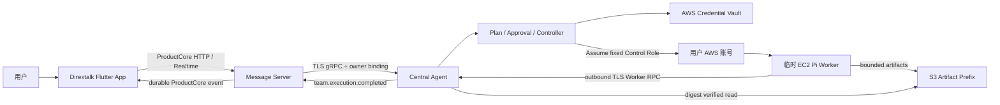
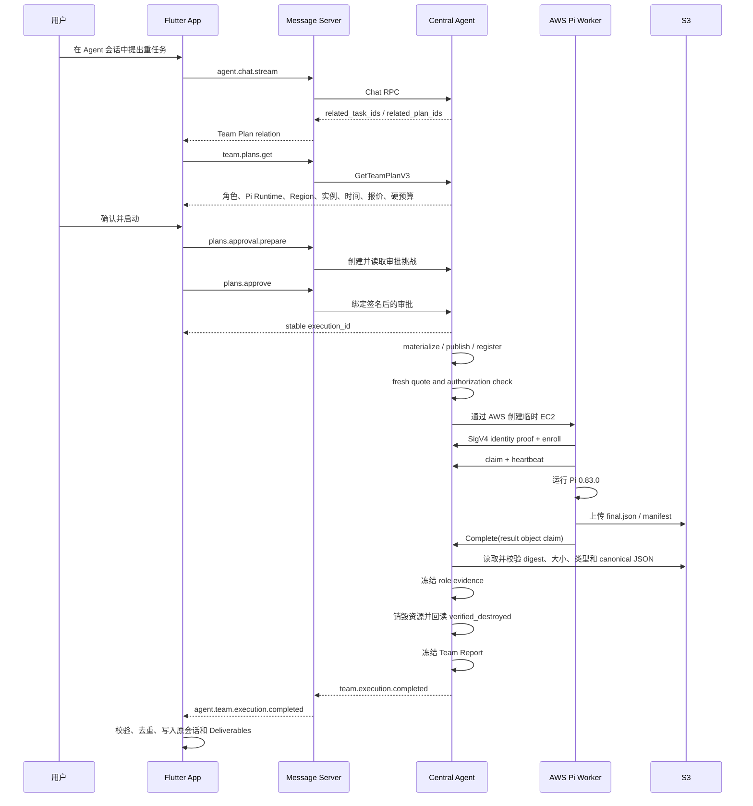

# AWS Agent OS: Pi Worker 云端任务闭环技术实现

> 文档状态：已实现、已部署、已完成两次真实 App-to-Worker-to-App 验收
> 最后核对：2026-08-07
> 范围：单角色、单 Pi Worker、AWS EC2 临时任务闭环
> 不包含：Adam 迁移方案、Worker Market、Runs/Tasks 进度页、多 Worker 市场化能力

## 1. 文档目的

本文说明 Dirextalk 如何把用户在 App 会话中提出的一项重任务，转换为一个经过报价和授权的 AWS 临时 Worker 任务，并完成以下闭环：

1. App 发起任务；
2. Central Agent 生成受限 Team Plan；
3. 用户确认报价和临时 AWS 资源授权；
4. Central Agent 在用户的 AWS 账号中创建临时资源；
5. Pi Worker 启动、证明身份、领取唯一任务并执行；
6. Worker 只提交受限结构化结果和 Artifact；
7. Central Agent 校验结果、销毁资源并生成不可变报告；
8. Message Server 可靠地把完成事件转发给 App；
9. App 在原会话显示完成消息和交付物元数据；
10. 独立 AWS API 查询确认任务资源归零。

这份文档描述的是已经跑通的历史闭环，不是未来架构设想。后续把能力迁移到 Adam 框架时，应把本文作为行为基线和验收基线，而不是原样搬运全部旧 RPC 与旧内部模块。

## 2. 代码基线与交付边界

闭环分布在三个同名分支中：

| 仓库 | 分支 HEAD | 闭环功能代码基线 | 说明 |
| --- | --- | --- | --- |
| `dirextalk-agent` | `51bc9ae` | `78a9db7` | `cc093b9` 记录最终验收；之后两个提交只包含 Worker 进度设计文档 |
| `dirextalk-message-server` | `7f3aa36` | `cc52c7d` | HEAD 只比闭环代码多一份未实施的进度方案 |
| `dirextalk-flutter` | `e2de881` | `46675dfd` | HEAD 只比闭环代码多一份未实施的 Flutter Runs 方案 |

当前 Agent worktree 中未跟踪的 `internal/workerprogress/`、`000064_worker_milestone_events.up.sql` 和相关测试，不属于 `aws-agent-os` 已提交内容，也不属于本文所称的已实现闭环。

## 3. 闭环的核心定义

这个闭环不是“Central 远程 SSH 进入一台机器运行命令”，也不是“模型拿到 AWS key 后自由调用 AWS”。它由三个互相约束的层组成：

- **模型理解层**：模型只能提出受限的工作目标和角色建议。
- **可信控制层**：Central 的确定性代码选择已审核 Runtime、实例规格、预算、安全边界和资源图，并负责授权、恢复、校验和销毁。
- **临时执行层**：Pi Worker 只执行已签发的单个任务，不能修改计划、扩张预算或自行创建其他 AWS 资源。

最终成功的定义也不是“Worker 说自己完成了”，而是同时满足：

```text
Worker 已成功完成
+ 结构化结果通过 Central 校验
+ Artifact digest/大小/类型与对象内容一致
+ Team Report 已冻结
+ EC2/EBS/ENI/EIP/安全组全部 verified_destroyed
+ 完成事件已绑定原会话并送达 App
```

## 4. 总体架构



### 4.1 三仓职责

| 组件 | 负责 | 不负责 |
| --- | --- | --- |
| Flutter App | 会话发起、Plan 展示、确认动作、执行状态轮询、完成事件校验、本地持久化、Artifact 元数据显示 | 不调用 AWS SDK，不决定 AMI/实例，不直接连接 Worker |
| Message Server | App owner-only action、TLS gRPC 桥接、owner 注入、公开 DTO 清洗、完成事件持久化中继 | 不执行模型，不创建 AWS 资源，不解释 Worker 原始输出 |
| Central Agent | 计划编译、报价、授权、AWS 凭证保管、资源编排、Worker 控制、结果校验、清理、报告和完成事件 | 不允许模型直接提交 provider 字段或 AWS SDK 请求 |
| Pi Worker | 证明 EC2 身份、领取唯一任务、运行 Pi、上传受限结果、心跳和完成上报 | 不接收入站连接，不持有用户长期 AWS key，不拥有计划/预算决策权 |
| AWS Reaper | 根据到期 Manifest 兜底销毁遗留临时资源 | 不参与正常任务规划和结果生成 |

## 5. 用户看到的完整流程



有一个容易误解但非常重要的行为：**没有单独的 Team `execute` 调用**。用户确认后，审批成功本身就是执行启动边界，返回稳定的 `execution_id`。如果响应在网络中丢失，App 可以重新读取 Plan，通过 Plan 上已绑定的 `execution_id` 恢复，而不是再启动一次。

## 6. 第一阶段：会话理解与受限 Plan

### 6.1 App 发起会话 Turn

Flutter 在 `lib/presentation/agent/agent_pages.dart` 中为每次发送生成新的 Turn UUID，并提交：

- `conversation_id`；
- `expected_conversation_revision`；
- 用户消息；
- 当前允许的模型配置；
- 重连所需的 Turn 标识。

Chat 完成响应可包含 `related_task_ids` 和 `related_plan_ids`。App 根据这些 relation 在会话中展示 Team Plan 卡片，而不是把一段模型文字误当成可执行计划。

### 6.2 模型只有提案权

Central 的模型工具只接受有界 `TeamProposal` / `RoleProposal`。模型可以表达：

- 目标；
- 建议角色；
- 工作类型；
- 所需能力；
- 依赖关系；
- 工作区模式。

模型不能直接指定：

- AWS Access Key；
- AWS SDK 参数；
- 任意 AMI；
- 任意实例类型；
- 任意启动脚本；
- 任意出入站网络；
- 任意花费上限；
- 未审核 Worker 镜像。

`internal/teamplan/compile.go` 由可信代码结合 Runtime Catalog、Worker Release、模型配置、Cloud Connection 和策略，把提案编译成不可变 Plan。编译结果固化：

- Pi Runtime family/version/adapter；
- 模型 provider/model/interface；
- EC2 架构和实例规格；
- 最大并发数；
- 输入/输出 Token 区间；
- 最短、预计、最长运行时间；
- 计算与模型费用区间；
- hard budget；
- 安全权限和临时资源保留策略；
- Plan digest、catalog revision、policy revision。

第一版 MVP 的接受面是单 Pi Worker。虽然旧数据结构能表达多个 Role 和依赖，但本文记录的真实验收只证明单角色闭环。

## 7. 第二阶段：报价与授权

### 7.1 App 的本地安全检查

Flutter 的 `lib/data/native_agent_team.dart` 使用严格字段白名单解析 Plan。Team 卡片只有在以下条件成立时才允许进入确认流程：

- provider 是 AWS；
- 所有 assignment 都是 Pi；
- adapter 是 `pi_json_task_v1`；
- Worker 使用受支持的临时公网 TLS 出站模式；
- 没有公网入站；
- 资源自动销毁；
- 最长生命周期有限；
- 报价、hard budget、并发数、时间和资源字段内部一致。

未知字段、未知枚举、非法 UUID、digest、时间或 revision 会直接失败关闭。

### 7.2 Challenge 与签名绑定

审批 Challenge 把以下事实一起绑定：

- Plan ID、revision、digest；
- AWS account/Region 和 Cloud Connection；
- Worker 数量和最大并发；
- 最低、预计、最高费用及 hard budget；
- Launch Authorization；
- 网络模式；
- 资源最长生命周期；
- 每个角色允许的实例规格和最高费用；
- 签名者 key、签发时间和过期时间。

Agent 协议提供 Approval Device、Challenge 和 Ed25519 Signature 合约。当前 Message Server 的 Team 正常路径从受保护的 service key 和 owner 确定性派生 session signer；App 只提交“确认”动作和 challenge 绑定字段，不上传私钥或自由签名内容。

`ApprovePlan` 会重新读取 challenge，并再次核对 revision、challenge ID、Plan digest、签名者、Launch Authorization ID 和 digest。审批窗口过期、报价过期、任何绑定漂移或重复但内容不同的请求都会被拒绝。

### 7.3 创建 AWS 资源前再报价

审批时看到的价格不是无限期授权。Controller 在真正进入 provisioning 前取得 fresh quote，并验证：

- 币种一致；
- 报价仍在最大年龄内；
- 角色最高费用没有超过授权；
- 总费用没有超过 hard budget；
- Region、实例规格和 Worker Release 没有漂移。

因此“用户批准了旧报价”不能自动演变成“Central 按新价格继续创建资源”。

## 8. 第三阶段：AWS 凭证与控制权

### 8.1 长期凭证保存

用户接入 AWS 时提供的 CSV/JSON 凭证由 `internal/awsprovider/credentials.go` 解析。原始字节在解析后被主动擦除。可长期使用的凭证由 `internal/awsfoundation/vault.go` 中的 `CredentialVault` 以 AES-GCM 信封加密保存，并绑定：

- Central Agent instance；
- owner；
- AWS account；
- Region；
- Connection revision。

凭证不会写入 Team Plan、Worker Task、聊天消息、公开 DTO 或普通日志。

### 8.2 每次操作只短暂解封

Central 需要调用 AWS 时才短暂解封连接凭证，并通过 `AssumedControlAWSConfig` 假设固定 Control Role。真正执行资源创建的是类型化 Provider，不是模型，也不是 Message Server。

Worker 获得的是任务所需的最小 AWS instance profile 和 deployment-scoped Secret/Artifact 访问能力。它不获得用户上传给 Central 的长期 AWS key，也不获得 Control Role 的控制面权限。

## 9. 第四阶段：可恢复的 Central Controller

### 9.1 角色状态机

核心循环在 `internal/teamcontroller/controller.go`：

```text
intent
  -> input_ready
  -> artifacts_ready
  -> worker_registered
  -> bootstrap_ready
  -> provisioning
  -> active
  -> result_ready
  -> destroying
  -> completed
```

每个状态只做一类副作用：

| 状态 | 动作 | 成功后进入 |
| --- | --- | --- |
| `intent` | 固化角色输入 | `input_ready` |
| `input_ready` | 发布 workspace、recipe、execution 和 secret bundle | `artifacts_ready` |
| `artifacts_ready` | 创建预期 Deployment/Worker 身份 | `worker_registered` |
| `worker_registered` | 发布不可变 bootstrap | `bootstrap_ready` |
| `bootstrap_ready` | 记录 fresh quote 并打开 provisioning 门 | `provisioning` |
| `provisioning` | 创建/回读 AWS 资源图 | `active` |
| `active` | 等待 Worker 终态，收集并校验结果 | `result_ready` 或 `destroying` |
| `result_ready` | 结果已冻结，开始清理 | `destroying` |
| `destroying` | 销毁资源、Secrets 并验证 Worker 终态 | `completed` |
| `completed` | 等待 execution-level finalizer 收口 | 终态 |

### 9.2 为什么能在崩溃后继续

Controller 是 PostgreSQL 驱动的 reconciliation loop，不依赖进程内“跑到哪一步”的记忆。它每轮执行：

1. 处理过期 Plan；
2. 查找可 dispatch 的 Execution；
3. 调度满足依赖和并发约束的 Role；
4. 查找可恢复的 Role operation；
5. 根据持久化 phase 只执行下一步；
6. 对 ready Execution 进行 finalization。

所有关键写操作都使用：

- 确定性 ID；
- idempotency key；
- request hash；
- expected revision；
- compare-and-swap；
- 不可变 digest 绑定。

相同请求重放会返回原结果；相同幂等键但内容不同会失败；并发 Controller 的 revision conflict 被视为另一实例已推进，下一轮重新读取事实即可收敛。

## 10. 第五阶段：确定性的 AWS 临时资源图

`internal/teamprovision` 将已批准角色投影为封闭 AWS 图：

```text
Dedicated Security Group (zero ingress)
        |
        v
Exclusive ENI ---- Elastic IP
        |
        v
EC2 Worker Instance ---- delete-on-termination root EBS
```

关键约束：

- 安全组没有入站规则；
- 只允许批准的 DNS/HTTPS 出站；
- 专用 ENI 和 EIP 归属当前 Deployment；
- 使用 on-demand EC2；
- AMI、架构、实例类型和 instance profile 来自已批准 Role；
- root EBS 加密并随实例删除；
- IMDSv2 是身份校验事实的一部分；
- 所有资源携带 Agent、owner、Task、Deployment 和 Approval 标签；
- 每个 AWS create 使用确定性 client token；
- 创建后必须读取 AWS 实际状态并写入 Resource Ledger。

生产验收使用大阪 Region 的一台 `t3.small` 和 AMI `ami-023e6b2d57694b86d`。

### 10.1 响应丢失不等于重新创建

如果 AWS 已创建资源，但 Central 在收到响应前断线，下一轮不会盲目再次创建。Provider 使用确定性 token、逻辑 Resource ID、标签和实际 API read-back 来确认资源是否已存在，再把事实补写进 Ledger。

## 11. 第六阶段：Worker 启动与身份认证

### 11.1 AMI 边界

Worker AMI 包含固定 rootfs、`dirextalk-cloud-worker`、Pi 0.83.0、受审核 result extension 和必要运行资产。Worker 进程以非 root UID/GID `65532` 运行。镜像不包含：

- AWS CLI；
- Docker；
- Node/npm 开发工具链；
- Central 控制面凭证；
- 用户长期 AWS key；
- 通用 SSH/SSM 运维入口。

### 11.2 Outbound-only

EC2 启动后从 IMDS user data 读取 bootstrap，并只通过出站 TLS 连接 Central 的 `WorkerControlService`。Central 不需要进入实例，也不开放 SSH 或业务入站端口。

### 11.3 生产 EC2 身份证明

真实 Worker 不是仅凭一段 enrollment token 就被信任。它先请求一次性 identity challenge，再提交 SigV4 签名的 STS `GetCallerIdentity` proof。Central 联合检查：

- challenge 是否一次性且未过期；
- AWS account 和 Region；
- Deployment/Worker 预期身份；
- Resource Ledger 中的 EC2；
- 实时 EC2 instance ID；
- ownership tags；
- instance profile；
- IMDSv2 配置；
- Connection revision。

全部匹配后才建立 Worker session。

### 11.4 Worker 状态机

```text
pending_enrollment -> ready -> leased -> finished
                                  |
                                  +-> cancel_requested -> finished
```

关键 Worker RPC 位于 `api/proto/dirextalk/agent/v1/agent.proto`：

- `CreateIdentityChallenge`；
- `EnrollVerifiedIdentity`；
- `GetCurrentAssignment`；
- `Claim`；
- `Heartbeat`；
- `RecordEvidence`；
- `EmitMilestone`；
- `Complete`。

`Claim` 会创建新的 `attempt` 和 `lease_epoch`。Heartbeat 延长租约；旧 epoch、过期租约、并发活跃租约和 cancel 后的执行请求都被拒绝。Worker 重启先调用 `GetCurrentAssignment`，只能恢复仍属于自己的合法租约或进行新的 fenced claim。

## 12. 第七阶段：Pi 执行

### 12.1 不把自然语言直接交给任意 Shell

Central 先生成不可变 `worker-runtime-task/v1`，其中包含：

- Task/Role/Action ID；
- 目标；
- 已验证 context digest；
- workspace mode；
- 固定 Runtime release；
- 固定模型 provider/model；
- credential slot；
- 最大输出 Token；
- 超时和 Artifact 规则。

Worker 只执行该签发任务。Pi 的工具集合由 workspace mode 决定：

- 无 workspace：只允许提交结果；
- 只读 workspace：`read/grep/find/ls` 加结果工具；
- 可写 workspace：再加入 `bash/edit/write`。

### 12.2 固定 Pi 调用

`internal/workerruntime/pi.go` 使用固定非交互参数：

- JSON mode；
- no session；
- offline；
- 固定 provider/model；
- 固定 result extension；
- 关闭额外 extensions、skills、prompt templates、themes 和 context files；
- 禁止交互式 approve；
- 最终必须恰好调用一次 `dirextalk_submit_result`。

### 12.3 输出预算修复

第一次真实失败后发现：Pi 的 DeepSeek 内置配置没有把签名 Plan 的输出上限正确传给 provider。修复后的链路是：

```text
Plan assignment output_maximum
-> immutable Worker Task MaxOutputTokens
-> task-local 0600 models.json
-> DeepSeek maxTokensField=max_tokens
-> provider request max_tokens
```

旧任务没有该字段时使用有界兼容值 8192。正式 Linux x64 Pi 0.83.0 archive digest、可执行文件 digest 和 result extension digest 在 AMI 发布前均被验证；真实 Pi 还通过 loopback provider 测试确认出站参数确实是 `max_tokens=128`。

### 12.4 只接受结构化 final

Pi 事件流必须按合法顺序出现 session、agent start/end/settled 和 result tool event。最终 Artifact 是 canonical JSON：

```json
{
  "schema_version": "dirextalk.agent.pi-final/v1",
  "status": "completed",
  "summary": "...",
  "deliverables": ["..."],
  "tests": ["..."],
  "risks": ["..."]
}
```

缺少 result tool、重复提交、非法事件顺序、未知字段、过大输出或非 canonical JSON 都不会被当作成功。

## 13. 第八阶段：失败分类与隐私

Pi/进程失败会在原始诊断被擦除前转换为封闭 stage/code，包括：

- `process_start`；
- `process_timeout`；
- `process_output_limit`；
- `process_exit_nonzero`；
- `provider_authentication`；
- `provider_quota`；
- `provider_rate_limit`；
- `provider_request`；
- `provider_server`；
- `provider_network`；
- `pi_aborted`；
- `pi_event_invalid`；
- `pi_final_missing`。

以下内容禁止进入持久化证据、普通日志、Message Server DTO 或 App 完成消息：

- 原始 stderr；
- provider response body；
- Pi `errorMessage` 原文；
- prompt 和完整 context；
- 思考过程；
- 工具参数和工具原始输出；
- AWS/model credential；
- 内部 Secret、checkpoint 和 result object 坐标。

这解决了“把 Worker 的所有思考和工具过程取回导致数据过大”的问题。Central 只获取最终受限 Artifact 和校验所需的 claim，不拉取完整执行轨迹。

## 14. 第九阶段：结果上传与 Central 校验

### 14.1 Worker 提交的是 claim，不是可信结论

Worker 把 Artifact 上传到自己的 deployment/lease-scoped S3 prefix，并生成 `ResultManifestV2`。成功 `Complete` 必须携带：

- result object ref；
- SHA-256；
- 字节数；
- media type；
- Deployment/Worker/Task/Step；
- attempt 和 lease epoch；
- Recipe/Execution digest。

Result manifest 最多包含 8 个 runtime result。单个对象 claim 上限 8 MiB。对象必须位于 Worker 被授权的准确 S3 prefix 中，不能用外部 URL 或另一个 Deployment 的对象冒充。

### 14.2 Central 独立验证

`collectRoleResult` 只在 Worker 已 `finished/succeeded` 后运行：

1. 重新读取 Deployment；
2. 使用当前 Cloud Connection 打开准确 S3 prefix；
3. 按 claim 限长下载对象；
4. 验证内容长度和 SHA-256；
5. 解析并验证 `ResultManifestV2`；
6. 对每个 `final.json` 调用 Pi adapter 的独立 validator；
7. 检查 canonical JSON；
8. 将 Artifact 重新绑定到 Role、Action、Task、Deployment 和 Connection；
9. 持久化 immutable result evidence；
10. 进入 `result_ready`。

Worker 的“我完成了”在完成这些步骤前始终是不可信声明。

### 14.3 Central 是否再次调用模型总结

已验收的单 Pi 闭环**没有第二次模型调用**。Central 使用确定性代码把验证后的 Pi final 投影为 Team Report：

- `summary`；
- `deliverables`；
- `tests`；
- token usage；
- artifact SHA-256。

Worker 自报 `risks` 仍保留在内部 evidence，但从公开 Team Report、Message Server 完成事件和 App 消息中排除。AWS 清理状态只能来自 Central 的 Resource Ledger 和独立 read-back，不能由 Worker 文本声明。

## 15. 第十阶段：销毁与 Reaper

### 15.1 正常销毁

角色结果被冻结后进入 `destroying`。`internal/app/team_role_cleanup.go`：

1. 读取与原 Plan/Approval 精确绑定的清理授权；
2. 调度 Deployment 资源销毁；
3. 删除已发布 deployment secret versions；
4. 逐个回读 Resource Ledger；
5. 要求每项状态是 `verified_destroyed`；
6. 再核对 Worker 已进入 terminal state；
7. 才把 Role 推进到 `completed`。

验收要求覆盖五类任务资源：

- EC2 instance；
- root EBS volume；
- ENI；
- Elastic IP；
- dedicated security group。

### 15.2 Reaper 兜底

每个临时资源都有 auto-destroy 授权、deadline 和 AWS 侧 expiry manifest。即使 Central 长时间不可用，`dirextalk-aws-reaper` 也能按 Manifest 回收过期资源。

Central 与 Reaper 并发清理时使用 revision fencing 和终态合并：已经被 Reaper 验证销毁的资源不会因为 Central 的旧 revision 再被判为失败。

### 15.3 Execution 何时算完成

Execution finalizer 只有在以下事实同时成立时才创建唯一 Team Report 并发出完成事件：

- 所有 Role 已有冻结的结果或合法终态；
- 所有 Role 都进入 `completed`；
- Resource Ledger 清理已验证；
- Plan、Execution、Role、Result digests 一致；
- report 尚未被另一个并发 finalizer 创建。

因此 App 收到 `completed + cleanup_verified=true` 时，代表的不只是模型执行结束，也代表临时 AWS 资源已完成 Central 侧验证清理。

## 16. 第十一阶段：Message Server 可靠中继

### 16.1 App action bridge

Message Server 向 App 暴露 owner-only ProductCore actions，闭环主要使用：

- `agent.team.plans.get`；
- `agent.team.plans.approval.prepare`；
- `agent.team.plans.approve`；
- `agent.team.executions.get`。

写操作使用 HTTP-only 边界；读操作可通过受控 HTTP/Realtime surface。Message Server 从节点身份固定派生 owner，App 不能自行提交或切换 owner。

Message Server 到 Agent 使用 TLS 1.3 gRPC、受保护文件中的 `DTX-Service-Key`、消息大小限制和超时。返回对象的 owner 与 runner owner 不一致时整体拒绝。

### 16.2 DTO 清洗

`p2p/internal/agentgrpc/team_actions.go` 将 Agent Proto 映射为公开 JSON，使用严格：

- 字段白名单；
- UUID/digest/revision/timestamp 校验；
- 封闭状态枚举；
- Plan/Execution/Report/Artifact 交叉绑定。

它主动省略：

- service key；
- 模型和 AWS 凭证；
- 内部资源坐标；
- Secret/checkpoint/result ref；
- Worker 原始输出。

### 16.3 Durable completion relay

Agent 在成功 Team Report 与 verified cleanup 同一事务边界内产生 `team.execution.completed` task event。这个事件是内部触发信号，不是用户可见消息。完成交付按以下顺序执行：

1. 从 PostgreSQL cursor 读取最后确认的 Agent event sequence；
2. 调用 `TaskService.WatchEvents(after_seq)`；
3. 遇到 Team completion 摘要后，不直接转发；
4. 调用 RuntimeService `SynthesizeTeamCompletion(owner_id, source_event_id)`；
5. Central 按事件 ID 重新读取并核对 conversation/execution/task/plan/revision/report digest/generated time/cleanup；
6. Central 重新读取完整 Team Report 和已保留 Artifact，确认每个 final digest 都有真实 Artifact 绑定；
7. Central 把去密且有大小上限的完成材料作为内部 tool observation 送入模型，Worker 文本只作为数据，不能成为指令；
8. Central 使用持久 RuntimeConfig 和原 conversation 历史生成真实 assistant reply，并把 observation 与回复原子提交到权威会话；
9. Message Server 收到 Central 的 `message_id`、`content` 和 `conversation_revision` 后，才写入 ProductCore `agent.team.execution.completed` v2 event；
10. dedupe key 绑定 Execution ID 和 Report digest；
11. ProductCore 持久化成功后才单调推进 cursor；
12. 断流或模型失败后从未提交 cursor 重试，同一个 source event 使用确定性 Runtime request ID，不重复调用模型。

完成结果通过 realtime `server.event` 送达 App。它不是 Matrix 聊天消息，但 Central 生成的回复已经是原 durable Chat conversation 的正式组成部分。Message Server 不执行模型、不总结报告，也不拥有助手话术。

用户在 Worker 运行和完成期间仍可继续对话。Central 对同一 owner/conversation 的普通 Chat 与后台完成合成使用跨进程 PostgreSQL advisory lock 串行执行，并在锁内重新读取 revision。先获得锁的一方提交后，后一方基于包含该新消息的完整历史继续生成，不因后台通知与前台消息竞争而丢失用户回合或重复执行工具。

## 17. 第十二阶段：Flutter 完成展示

### 17.1 Plan 卡与轮询

`NativeAgentTeamPlanCard`：

- 重新获取 Plan；
- 展示 Region、实例、Pi Runtime、预计时间和费用；
- 复用 prepare idempotency key 处理模糊响应；
- 用户确认后调用 approve；
- 读取稳定 `execution_id`；
- 正常时每 2 秒读取 Execution，失败后 5 秒重试；
- Widget 重建后从 Plan 的 `execution_id` 恢复。

### 17.2 完成事件严格校验

Flutter 只接受 schema `dirextalk.product.agent-team-execution-completed/v2`。事件必须满足：

- source event sequence 合法；
- source event ID 是 canonical UUID；
- conversation ID 与当前账号数据域匹配；
- `assistant_message.message_id` 与 `content` 非空，且该内容由 Central RPC 返回；
- `conversation_revision` 非负并相对本地会话单调前进；
- 顶层 Execution/Task/Plan/revision 与内嵌 Execution 一致；
- Execution status 是 `completed`；
- `cleanup_verified=true`；
- report digest 和 generated time 一致；
- 每个 Artifact 都能绑定 report 中的 Role/Action/final digest。

事件按 sequence 串行应用。处理失败时不 ack，重连后重放。最终消息直接使用 Central 返回的稳定 message ID，因此重复完成事件只会写入一次；App 不生成任何助手正文。

### 17.3 App 展示什么

App 在原会话中写入 Central 的真实回复，并把结构化 Artifact 作为独立附件卡展示。Central 可根据任务和上下文自由决定正文中应突出结论、数字、风险、需要用户决定的事项或文件，不受固定模板限制。结构化区域可展示：

- Central 验证后的 summary；
- deliverables；
- tests；
- token usage；
- cleanup verified；
- Artifact 名称、类型、大小、SHA-256、生成时间和保留截止时间。

Artifact 卡不直接下载和展示原始对象内容。历史 Artifact 元数据同时进入 Settings 下的 Deliverables 页面，并按账号域和 Artifact ID 去重。

普通连续对话不要求 App 再附加 Artifact ID、Task ID 或 Execution ID。因为上一条助手消息、内部完成 observation 和 Artifact manifest 已进入 Central 的权威 conversation，Central 应从自己的历史理解“这个文件”“刚才的数字”等指代。若同一条回复主动列出多个同名或同类对象，Central 应在回复中使用清晰名称消除歧义。

## 18. 恢复与幂等矩阵

| 故障 | 恢复方式 | 防重复机制 |
| --- | --- | --- |
| Chat socket 断开 | 相同 Turn 重新附着并按 `after_seq` 重放 | `(owner_id, turn_id)` + request digest |
| Plan prepare 响应丢失 | 复用 prepare idempotency key | 同 key 同请求返回原 challenge |
| Approve 响应丢失 | 重新读取 Plan 上的 `execution_id` | Plan/approval/materialization 唯一绑定 |
| Central 在 AWS create 后崩溃 | 下一轮从 phase 和 AWS read-back 恢复 | deterministic resource ID/client token/tags |
| Worker 启动后重启 | `GetCurrentAssignment` + fenced claim | attempt + lease epoch |
| Worker lease 过期 | 新 claim 提升 epoch | 旧 epoch 的 heartbeat/evidence/complete 被拒绝 |
| S3 上传成功但 Complete 响应丢失 | 重放同一 Complete | caller/idempotency/request hash/revision |
| Central 收到重复结果 | 返回或识别已冻结 evidence | immutable result digest + CAS |
| Central/Reaper 同时清理 | 读取 verified terminal fact 后收敛 | revision fencing + terminal merge |
| Agent completion stream 断开 | 从 PostgreSQL cursor 重连 | 单调 cursor + execution/report dedupe |
| App 重复收到完成事件 | 使用稳定 message ID 合并 | Execution ID 去重 + sequential event apply |

## 19. Worker 镜像发布流程

Worker 发布不是每次 Central 改动都重新做 AMI。只有 Worker binary、rootfs、Pi installation、result extension 或 AMI 构造变化时才进入完整发布链：

```text
source commit
-> immutable Agent/Worker release manifest
-> deterministic Worker rootfs archive
-> digest verification
-> temporary x86 builder
-> AMI create
-> encrypted snapshot available
-> AMI runtime verification
-> Worker Release record
-> one bounded candidate task
-> promote only after App-to-App success and zero-resource read-back
```

`publish-worker-ami` 将 prepare、build、verify 分成独立 durable stage。每个阶段保存受保护 receipt，AMI/snapshot 的异步等待可以从现有 receipt 继续，不需要重新编译和上传。

当前保留的官方 Worker 发行事实：

- Pi：`0.83.0`；
- AMI：`ami-023e6b2d57694b86d`；
- encrypted snapshot：`snap-0ae9af10d9f1a406e`；
- Linux x64 Pi archive SHA-256：`b0625eb623197b0afe20c870d21ef2f34481f1504e5777df3f698a66c7636f5f`；
- Linux x64 Pi executable SHA-256：`c25c16162b62eda32deb0d544bcae5e5d6c6148958e17130e6aed2d115104f1a`；
- result extension SHA-256：`39e98a6a8339a48c0b1609ff7aed3c7af0807ee9e2cb4a975b64e46a2e5f94d9`。

## 20. 测试分层

### 20.1 Agent

| 测试层 | 主要覆盖 |
| --- | --- |
| `internal/teamplan` | 模型提案到受限 Plan、Runtime 和预算选择 |
| `internal/teamapproval` / `teamorchestration` | Challenge、签名、过期、revision 和执行前验证 |
| `internal/teamcontroller/controller_happy_path_test.go` | 完整十阶段角色状态机 |
| `internal/worker` | enrollment、claim、lease、heartbeat、cancel、complete、重放 |
| `internal/workerruntime` | Pi 真实二进制、事件解析、Token、超时、输出限制、失败分类 |
| `internal/workerresult` | S3 prefix、object claim、digest、canonical final |
| `internal/awsprovider` / `resource` | typed create、read-back、response loss、destroy |
| `internal/awsreaper` | expiry manifest、并发清理、恢复 |
| PostgreSQL integration | revision fencing、幂等、唯一报告、事务内完成事件 |

### 20.2 Message Server

| 测试 | 主要覆盖 |
| --- | --- |
| `p2p/internal/agentgrpc/team_actions_test.go` | Pi Plan、approval、execution、report、artifact、cleanup 映射 |
| `team_completion_test.go` | 完成摘要后二次回读及绑定验证 |
| `p2p/internal/agentcompletion/relay_test.go` | cursor、重试、dedupe、无效事件拒绝 |
| `database_schema_migration_test.go` | cursor 表和单调更新 |
| `routing_ws_test.go` / action tests | owner auth、HTTP/WS transport 边界 |

### 20.3 Flutter

| 测试 | 主要覆盖 |
| --- | --- |
| `test/native_agent_team_test.dart` | Pi-only、AWS、安全授权、report/cleanup/artifact 绑定 |
| `native_agent_team_plan_card_test.dart` | 确认并启动、模糊响应恢复、轮询 |
| `native_agent_team_completion_test.dart` | 完成事件校验和重复只写一次 |
| `native_agent_chat_store_test.dart` | 后台结果与页面快照并发、账号隔离 |
| `as_event_stream_refresh_controller_test.dart` | sequence、失败重放、cursor 重连 |
| `agent_pages_test.dart` | relation 卡片和活动会话完成消息 |

测试证明的是各层行为；真实 AWS E2E 由下一节的验收账本证明。

## 21. 两次真实验收证据

### 21.1 恢复门禁任务

2026-08-05，第一条完整成功链：

| 事实 | 值 |
| --- | --- |
| Task | `019fd102-aee9-76e7-882e-9e4ac356d6f0` |
| Plan | `5f733ab7-faf5-58cb-a751-4ff0ac707408` |
| Execution | `3020fb7f-8a01-553e-9c42-738f8b64e342` |
| Dispatch | `f882a238-835f-53b8-af26-17de5111841c` |
| Deployment | `1fa19eae-f620-5dee-ba98-27a601cbd4be` |
| Worker | `3624e3a9-2375-5143-86bb-745c1424fba8` |
| Region/实例 | Osaka / `t3.small` |
| AMI | `ami-023e6b2d57694b86d` |
| Runtime | Pi `0.83.0`，首次 attempt 成功 |
| 任务结论 | `2,000,000` 以内素数 `148933` 个，总和 `142913828922` |
| `final.json` | 686 bytes |
| Artifact SHA-256 | `bdf5bfcb60c7a5627c3a4f75fee6be26f2a387d3a154efea3c2e5f73188cadc6` |
| Team Report digest | `sha256:369774cd87709048cac370cab96851161a82b500ee2c30395bbe0dafcccb4e7a` |

结果由两种独立筛法交叉验证。Central 完成 Artifact 校验、报告冻结和五类资源 `verified_destroyed` 后，Message Server 在原会话唯一绑定下发布完成事件，App 显示结果。独立 AWS API 返回任务标签下 EC2/EBS/ENI/EIP/安全组五个空集合。

### 21.2 Single-Pi MVP 收口任务

第二条链关闭了“Worker 自报风险污染公开结果”的问题：

| 事实 | 值 |
| --- | --- |
| Agent release | `v0.1.0-alpha.20260805.89-78a9db7192dd` |
| Agent image digest | `sha256:17645d686ed54f43cce9a21b055ef607fd3cc7201bb0d8a6267e8a0458fa515d` |
| Task | `019fd25d-fdd0-79fd-aa13-cc8c898e1eb6` |
| Plan | `9a66d16a-850e-563e-8c3c-88c83ef0ee6b` |
| Execution | `867021eb-ae17-544a-9fb6-84402c37b7be` |
| Dispatch | `3cba234a-860f-56ca-a32d-bb47eb3de1d4` |
| Deployment | `7625c5eb-220d-514f-9fd2-0e5b181bcb2b` |
| Worker | `05ca9f90-a1cf-5f3e-afc2-724965c5f0b8` |
| Region/实例 | Osaka / `t3.small`，只启动一次 |
| 任务结论 | `5,000,000` 以内素数 `348513` 个，总和 `838596693108` |
| `final.json` | 1,719 bytes |
| Artifact SHA-256 | `sha256:372f9fb0c17edb32fb57ab8a4d0cb3e6debf142a6ea155ab011341c99ba93e67` |
| Team Report digest | `sha256:097a9497ba3f174fc9cdacf44104201d052e66ca730201f4c4f56582552d6134` |

App 自动收到完成消息和 Artifact metadata，公开结果不含 Worker risks。Central 和独立 AWS API 再次确认五类任务资源归零。用于发布的临时 x86 builder、root volume、ENI、安全组、IAM role/profile、S3 input versions、Buildx session 和 ECR authorization 也在流程结束后确认不存在。

## 22. 已知边界

以下能力**没有**被本文所述闭环实现或验收：

1. Worker Market、第三方镜像上传和审核；
2. 多种 Worker Runtime 的生产调度；
3. 多 Worker 并行的真实 AWS 验收；
4. Agent “Runs and Tasks” 历史列表；
5. Central 持久化 Worker 进度 timeline；
6. App 中的实时 Worker 思考和工具过程；
7. Team Execution 专用 Cancel action 和详情页 Cancel 控件；
8. 在 App 中直接下载和打开 Artifact 对象；
9. Adam 架构下的新协议和新模块边界。

当前 Worker 仍保持 zero ingress 且没有 SSM。它已经能把六类封闭 milestone 经 Agent relay 写入 CloudWatch，保留 30 天；但 Central 尚未把这些 milestone 持久化成产品事实，`GetTeamExecutionV3` 也不能返回 timeline。因此 CloudWatch 只能作为运维审计源，不能被描述成用户可见的 Runs 功能。

## 23. 迁移时必须保留的行为

迁移到 Adam 框架时，不需要保留所有旧模块名和 RPC 数量，但必须保留以下已验证性质：

- 模型只有提案权，可信代码才有 AWS mutation 权；
- Plan/quote/budget/Region/Runtime/AMI/网络/保留期必须在授权中不可变绑定；
- 批准成功直接产生稳定 Execution，模糊响应可以恢复；
- AWS graph 必须 deterministic、typed、tagged、read-back verified；
- Worker 必须 outbound-only，使用 AWS 实例事实证明身份；
- Task/lease/attempt/epoch 必须 fenced；
- Pi 必须使用已审核 immutable release 和签名输出预算；
- 只回传 bounded structured result，不回传思考和工具轨迹；
- Worker 结果必须经 Central 独立校验才能成为报告；
- Worker 文本不能声明云资源已清理；
- verified cleanup 必须是 Execution 成功条件；
- 完成事件必须 durable、cursor-resumable、idempotent、与原会话唯一绑定；
- App 必须严格校验 schema 和 cross-object bindings；
- 最终仍需一条新的 App-to-Worker-to-App 真实 AWS 任务和任务标签资源归零证明。

## 24. 关键代码索引

### 24.1 Agent

| 领域 | 文件 |
| --- | --- |
| Team Proto | `api/proto/dirextalk/agent/v1/team.proto` |
| Worker Proto | `api/proto/dirextalk/agent/v1/agent.proto` |
| Plan 编译 | `internal/teamplan/compile.go` |
| Approval | `internal/teamapproval/`、`internal/teamorchestration/service.go` |
| Durable Controller | `internal/teamcontroller/controller.go` |
| Controller Ports | `internal/teamcontroller/types.go` |
| AWS 资源图 | `internal/teamprovision/` |
| AWS typed Provider | `internal/awsprovider/resource_provider*.go` |
| AWS 凭证 Vault | `internal/awsfoundation/vault.go` |
| Worker 身份授权 | `internal/app/worker_identity_authorizer.go` |
| Worker 状态/租约 | `internal/worker/service.go` |
| Cloud Worker 入口 | `cmd/dirextalk-cloud-worker/main.go` |
| Pi Adapter | `internal/workerruntime/pi.go` |
| Process 限制 | `internal/workerruntime/process.go` |
| 失败分类 | `internal/workerruntime/failure.go` |
| Result Manifest | `internal/workerrunner/runtime_result.go` |
| Worker RootFS 构建 | `cmd/dirextalk-worker-rootfs/`、`internal/workerrootfs/` |
| Worker AMI 构建与验证 | `internal/workerami/`、`deploy/container/worker-ami/` |
| Result 校验 | `internal/workerresult/collector.go` |
| S3 Collector | `internal/app/team_result_collector.go` |
| 清理 | `internal/app/team_role_cleanup.go` |
| Reaper | `cmd/dirextalk-aws-reaper/main.go`、`internal/awsreaper/` |
| AMI 发布 | `cmd/dirextalk-agent/publish_worker_ami.go`、`internal/workeramictl/` |
| 真实验收账本 | `docs/delivery-tracker.md` |
| AMI 恢复/发布 | `docs/worker-ami-release.md` |

### 24.2 Message Server

| 领域 | 文件 |
| --- | --- |
| Product actions | `p2p/serviceapi/actions.go` |
| Agent gRPC client | `p2p/internal/agentgrpc/client.go` |
| Team action/DTO 映射 | `p2p/internal/agentgrpc/team_actions.go` |
| Team session approval | `p2p/internal/agentgrpc/team_session_approval.go` |
| Agent completion watch | `p2p/internal/agentgrpc/team_completion.go` |
| Durable completion relay | `p2p/internal/agentcompletion/relay.go` |
| Event cursor | `p2p/storage/storage_agent_event_cursor.go` |
| Remote composition | `p2p/internal/agent/module.go`、`setup/monolith.go` |

### 24.3 Flutter

| 领域 | 文件 |
| --- | --- |
| Team Plan/Execution/Artifact 合约 | `lib/data/native_agent_team.dart` |
| 完成事件持久化 | `lib/data/native_agent_team_completion.dart` |
| Chat store | `lib/data/native_agent_chat_store.dart` |
| Team Plan 卡 | `lib/presentation/agent/native_agent_team_plan_card.dart` |
| Artifact 卡 | `lib/presentation/agent/native_agent_artifact_card.dart` |
| Realtime event controller | `lib/presentation/providers/as_event_stream_provider.dart` |
| Artifact 聚合 | `lib/presentation/providers/native_agent_chat_store_provider.dart` |
| Deliverables 页面 | `lib/presentation/pages/agent_deliverables_page.dart` |

## 25. 最终结论

这套闭环已经证明了一个最小但完整的 Agent OS 路径：Central 可以把模型理解转成可信计划，在用户授权后调度用户 AWS 账号中的临时 Pi Worker，让 Worker 只执行被批准的任务，并在结果通过校验、资源完成销毁后，把一个可恢复、可去重、与原会话绑定的完成事实送回 App。

它当前是“官方单 Pi Worker MVP”，不是完整 Worker Market，也不是最终 Adam 架构。后续开发应以本文列出的行为不变量和两次真实验收证据为基线，逐步替换旧接口，而不是重新发明一套未经闭环验证的执行链。
