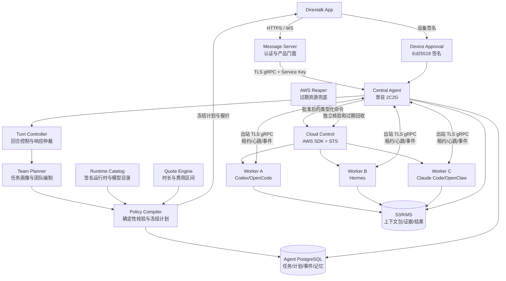

# Native Agent v2 系统规划

版本：0.1

日期：2026-07-29

状态：架构审阅稿

范围：Dirextalk 单节点常驻 Central Agent、多云端临时 Worker Agent、App 交互和全生命周期控制

> 本文定义目标架构、产品边界和验收标准，不替代
> `docs/delivery-tracker.md`。后者仍是唯一实施进度账本。

## 1. 结论

Native Agent v2 不应成为一台 2 核 2G 机器里塞满所有能力的“超级
Agent”。它应成为一个低资源、长期在线、可信且可恢复的中央控制系统：

1. 在常驻节点上理解用户目标、维护上下文和长期记忆。
2. 判断任务是否能本地完成，还是需要一个或多个云端 Worker。
3. 在创建资源前完成团队编制、运行时选型、工时估计和成本区间估算。
4. 把完整计划展示给用户，取得设备签名批准后才产生云资源和费用。
5. 为每个 Worker 下发最小必要上下文、工具、模型和权限。
6. 实时接收心跳、阶段成果、证据和最终结果。
7. 由 Central Agent 验证、汇总和交付结果，而不是把 Worker 原始输出直接
   当成事实。
8. 任务完成、失败、取消或超时后自动销毁临时资源，并独立核实没有资源
   泄漏。

核心形式是：

**轻量可信控制平面 + 按需高性能执行平面 + 用户签名审批 + 可验证结果与销毁**

## 2. 产品目标

### 2.1 必须实现

- Central Agent 可常驻在 2 vCPU、2 GiB 节点。
- App 用户可直接与 Central Agent 对话。
- Central Agent 能识别复杂、耗时、并行或高工具调用任务。
- Central Agent 能决定 Worker 数量、角色、依赖关系和最大并行度。
- Central Agent 能从已认证目录中选择 Claude Code、Codex、OpenCode、
  Hermes、OpenClaw 或未来运行时。
- 创建资源前展示：
  - 每个 Worker 的角色和任务；
  - Agent 运行时及版本；
  - 模型配置的公开名称；
  - 实例规格和数量；
  - 预计运行时间区间；
  - 预计费用区间；
  - 最大批准预算；
  - 数据保留和自动销毁策略。
- 只有用户签名批准冻结计划后，Agent 才能启动 AWS 资源。
- Worker 可并行或按依赖顺序执行。
- Central Agent 可实时监控、取消、重试、重新规划和收回结果。
- 临时 Worker 默认自动销毁，销毁必须有独立云端读回证据。
- Central Agent、Message Server、App 和 Worker 的职责边界清晰。

### 2.2 非目标

- 不把 Central Agent 做成可执行任意 shell 的云管平台。
- 不让模型直接调用 AWS CLI、任意 AWS API 或 Docker Socket。
- 不允许模型自由拼接镜像名、使用 `latest` 或下载未审核插件。
- 不让 Service Key 代替用户批准费用、公开网络、秘密交付或销毁。
- 不在第一阶段实现跨客户共享 Worker、中央多租户 SaaS、EKS 或多云。
- 不保证报价精确等于最终账单，只提供有依据的区间和硬预算护栏。
- 不默认让多个写入型 Worker 修改同一个工作目录。

## 3. 总体架构



## 4. 组件职责

### 4.1 Dirextalk App

- 只连接 Message Server，不直连 Agent 或 AWS。
- 展示对话、任务、团队计划、报价、批准、进度、结果和销毁状态。
- 在设备本地保存 Ed25519 私钥，私钥永不上传。
- 对冻结计划的确定性签名载荷签名。
- 对计划变更、追加 Worker、提高预算、延长保留期重新确认。

### 4.2 Message Server

- 负责用户登录、owner 映射和产品 API 兼容。
- 通过挂载的最小权限 Service Key 调用 Agent gRPC。
- 不持有 AWS 控制权限、模型密钥或设备签名私钥。
- 不复制 Agent 的任务、规划、Worker 或云控制实现。
- 对 App 仅暴露严格白名单、owner-scoped、去敏后的视图。

### 4.3 Central Agent

- 是唯一的任务控制平面和事实协调者。
- 拥有 Turn Controller、Task Kernel、Team Planner、Policy Compiler、
  Runtime Catalog、Quote Coordinator、Worker Coordinator、Memory 和
  Evidence Ledger。
- 使用 Go AWS SDK v2 的类型化端口控制资源。
- 不执行用户 shell，不加载重型浏览器，不在本机运行外部 Agent。
- 本地模型调用和后台规划都受并发、内存、超时和租约预算约束。

### 4.4 Cloud Worker

- 一次部署只服务一个批准计划中的一个角色。
- 使用专属 EC2、专属 Worker 身份、专属任务租约和最小数据权限。
- 不拥有 IAM、EC2、EBS、CloudFormation 等控制权限。
- 只通过出站 TLS 与 Central Agent 通信，不开放公网入站端口。
- 只获得该角色所需的模型 SecretRef、工具白名单和上下文包。
- 所有结果、检查点和证据写入版本化、KMS 加密的对象存储。

### 4.5 AWS Reaper

- 在 Central Agent 或数据库不可用时执行到期资源兜底回收。
- 只删除同时满足批准、所有权标签、任务/计划绑定和过期条件的资源。
- 不删除 Managed 资源或所有权不明确的资源。

## 5. Central Agent 内部架构

### 5.1 Turn Controller

参考 Product Agent、Codex、Claude Code、Hermes 和 OpenClaw 的优点，采用
明确的回合状态机：

```text
prepare
  -> understand
  -> retrieve_memory
  -> decide_local_or_delegate
  -> propose_team
  -> compile_and_quote
  -> await_approval
  -> execute
  -> observe
  -> validate
  -> synthesize
  -> finalize
```

Turn Controller 必须做到：

- 每个阶段都有输入、输出、超时、重试和持久化边界。
- 模型输出不能直接触发云资源或费用。
- 工具结果与模型叙述分开保存。
- Response Arbiter 决定最终给用户展示什么，禁止“任务尚未完成但模型声称
  已完成”。
- App 断线、Agent 重启或模型失败后可从持久状态继续。

### 5.2 Task Kernel

任务使用持久化 DAG：

- `Task`：用户目标、状态、结果和保留策略。
- `Step`：角色级或控制平面级工作单元。
- `Attempt`：一次有租约和 epoch 的执行尝试。
- `Checkpoint`：可恢复中间状态。
- `Evidence`：工具调用、测试、文件摘要、外部读回等证据。
- `Result`：版本化最终产物引用。

第一版执行器仅保留：

- `CONTROL_PLANE`
- `CLOUD_WORKER`

### 5.3 Team Planner

Team Planner 使用模型理解任务，但只允许输出受约束的 `TeamProposal`：

- 角色 ID、名称和目标；
- 工作类型；
- 必要能力；
- 前置依赖；
- 只读、隔离写入或串行独占工作区；
- 粗略时长区间；
- 粗略输入/输出 token 区间；
- 最低资源需求；
- 模型质量和上下文需求；
- 可选的运行时偏好。

Team Planner 不能输出：

- AMI ID、镜像 URL 或镜像摘要；
- AWS 实例 ID、VPC、Security Group；
- shell、用户数据或任意命令；
- API Key 或 Secret 值；
- 最终费用批准；
- 未注册的 Agent 名称。

### 5.4 Policy Compiler

Policy Compiler 是确定性代码，不是 LLM。它负责：

- 验证角色 DAG 无环、依赖存在。
- 限制 Worker 总数和最大并行度。
- 检测并发写入冲突。
- 从签名目录选择已认证运行时。
- 选择与运行时兼容、已配置的模型 Profile。
- 选择满足最低资源的可用实例。
- 计算时长、费用区间和硬预算。
- 冻结计划并生成摘要。
- 任何变化都产生新 revision，旧签名失效。

默认建议：

- 默认最多 4 个 Worker。
- 系统硬上限 8 个 Worker。
- 默认最大并行 3 个 Worker。
- 写入型 Worker 使用独立 worktree/checkout。
- 同一共享工作区的写入必须显式串行。
- 默认 On-Demand；Spot 必须经过独立的可中断能力认证。

## 6. Agent 运行时能力目录

### 6.1 目录原则

生产环境不内置“看到名字就运行”的逻辑。每个可选运行时必须有一条经发布
流程认证的 `RuntimeRelease`：

- 稳定 release ID；
- 运行时 family；
- 固定版本和源码 commit；
- 官方来源和许可证结论；
- 内容寻址镜像摘要；
- 支持的架构；
- 最低/推荐 CPU、内存和磁盘；
- 受支持的模型接口；
- 工具能力；
- 统一任务适配器版本；
- 冷启动测量值；
- 安全扫描、功能测试和认证时间；
- `candidate / qualified / disabled` 状态。

只有 `qualified` 能进入选型。禁止 `latest`、浮动 tag、运行时自更新和任务中
动态安装未知插件。

整份目录由独立的 Ed25519 发布密钥签名。每条 `qualified` 记录必须绑定 SBOM、
构建 provenance、漏洞扫描、Runtime Adapter 合同测试和许可证决策的 SHA-256
摘要。Agent 启动时从受保护的只读挂载读取目录和公钥，验证签名后计算目录
revision；目录、公钥、资格证据或镜像摘要发生变化时，旧计划不能静默复用。

### 6.2 统一 Worker Runtime Adapter

每个外部 Agent 都包装成统一协议：

```text
Prepare(context_bundle, policy)
Run(role_assignment)
Stream(milestone, tool_receipt, usage, checkpoint)
Cancel(reason)
Collect(result_manifest)
Shutdown()
```

适配器隐藏各 Agent 的 CLI、HTTP、ACP 或 Gateway 差异。Central Agent 只看
统一事件，不解析终端颜色文本或自然语言日志。

### 6.3 初始运行时定位

| Runtime | 优先任务 | 可借鉴能力 | 不应默认使用的场景 |
| --- | --- | --- | --- |
| Codex | 代码实现、测试、重构、代码审查 | 非交互执行、沙箱、MCP、代码工作流 | 非代码型长期个人助理 |
| Claude Code | 大型代码库、复杂推理、代码团队协作 | 子 Agent、MCP、权限和沙箱、长上下文 | 简单低成本任务 |
| OpenCode | 供应商中立的代码任务、Headless 服务 | HTTP 服务、多模型、细粒度权限、MCP | 需要长期个人记忆的工作 |
| Hermes | 通用工具任务、研究、长期运行和技能复用 | ACP/API、MCP、记忆、技能、Docker 后端思想 | 要求最小启动体积的短代码任务 |
| OpenClaw | 通讯、多渠道、浏览器和广泛自动化 | Gateway、渠道路由、技能、子 Agent、持久会话 | 默认代码 Worker 或只需一次 shell 的短任务 |

选型不是固定排名。例如：

- 代码实现：优先 Codex、Claude Code 或 OpenCode。
- 独立代码审查：可故意选择与实现 Worker 不同的 runtime/model。
- 通用研究和工具编排：优先 Hermes。
- 多渠道通讯和浏览器自动化：优先 OpenClaw。
- 简单诊断：继续使用最小原生 Worker，不启动重型 Agent。

### 6.4 运行时引入顺序

建议按以下顺序认证，不代表能力排名：

1. Codex + OpenCode：先跑通两个代码 Worker 和交叉审查。
2. Hermes：覆盖通用工具、研究和长任务。
3. Claude Code：完成商业使用、Headless、权限和镜像发布认证后启用。
4. OpenClaw：只在渠道、浏览器或广泛技能任务中启用，不作为通用默认。

每个运行时必须独立通过许可证、服务条款、API 凭据方式、沙箱、退出码、取消、
用量统计、结果协议和资源占用认证。

参考官方能力资料：

- Claude Code：
  <https://code.claude.com/docs/en/features-overview>
- Codex：
  <https://github.com/openai/codex>
- OpenCode：
  <https://opencode.ai/docs/agents/>
- Hermes：
  <https://github.com/NousResearch/hermes-agent>
- OpenClaw：
  <https://docs.openclaw.ai/subagents>

## 7. 多 Worker 团队编制

### 7.1 示例

用户目标：“分析两个仓库，完成服务端替换方案，实现迁移并做回归测试。”

Central Agent 可以产生：

| Role | Runtime 候选 | 依赖 | 工作区 |
| --- | --- | --- | --- |
| 架构分析 | Hermes / Claude Code | 无 | 只读 |
| 现有服务审计 | Codex / OpenCode | 无 | 只读 |
| 迁移实现 | Codex / Claude Code | 前两项 | 隔离写入 |
| 独立审查 | Claude Code / Codex | 迁移实现 | 只读 |
| 回归与安全测试 | OpenCode / Codex | 迁移实现 | 隔离写入 |
| 最终整合 | Central Agent | 全部 | 控制平面 |

总角色可以是 5 个，但最大并行可能只有 2 个。报价和 UI 必须同时展示：

- 总 Worker 数；
- 峰值并行数；
- 哪些先执行、哪些等待；
- 每个 Worker 的 Agent 和模型；
- 整体预计墙钟时间。

### 7.2 并发约束

- 只读分析可以并行。
- 写代码的 Worker 必须使用独立 worktree。
- 多个补丁由 Central Agent 或专门集成 Worker 合并。
- 两个 Worker 不允许同时写同一共享目录。
- Worker 不得自行再创建 AWS Worker。
- 外部 Agent 自带的子 Agent 只能在该 Worker 的已批准资源和权限内运行，并计入
  同一个预算；默认关闭嵌套创建云资源。

## 8. 时长和成本估算

### 8.1 报价构成

估算至少包含：

```text
总成本区间 =
  EC2 运行成本
  + 根卷和数据卷
  + 模型输入 token
  + 模型输出 token
  + 日志/对象存储
  + 已批准的网络和固定服务成本
```

计划显示三组值：

- 最低估计；
- 期望估计；
- 最高估计；
- 另加一个用户实际批准的硬预算。

硬预算建议为最高估计加 20% 安全余量，但不得超过产品或用户设置的上限。

### 8.2 时长估算

模型提出每个角色的最低、期望和最长执行时间。确定性调度器再加入：

- 镜像冷启动；
- 依赖等待；
- 最大并行限制；
- 必要的结果验证阶段。

整体时间使用 DAG 调度计算，不能简单把所有 Worker 时长相加。

### 8.3 不确定性声明

报价必须明确：

- 模型 token 取决于实际推理和工具循环。
- 外部付费 MCP、网站、第三方 API 可能不在估算内。
- 网络流量和失败重试可能增加费用。
- 报价不是 AWS 账单承诺。
- 达到硬预算、最长时间或最大重试次数时自动停机并请求新批准。

## 9. 用户批准协议

用户签名的不是一句“同意”，而是完整冻结计划：

- owner、Agent instance、plan ID、revision；
- 任务目标摘要；
- 每个角色及依赖；
- runtime release、版本和镜像摘要；
- 模型 Profile 和 SecretRef；
- Region、实例类型、数量和磁盘；
- 网络、数据和工具权限；
- 预计时长和 token 区间；
- 报价快照、有效期和硬预算；
- 保留策略和销毁期限；
- 允许的重试和预批准 fallback；
- 签名 challenge 和失效时间。

以下变化必须重新报价和签名：

- 新增 Worker；
- 换成未预批准 runtime/model；
- 提高实例规格；
- 提高预算；
- 开放公网；
- 增加 Secret、工具或数据范围；
- 延长资源寿命；
- 从临时资源变为 Managed。

如果计划预先列出等价 fallback，Central Agent 可在同一预算和权限内切换；否则
必须生成 change order。

## 10. Worker 启动与模型配置

### 10.1 启动流程

1. 持久化创建意图。
2. 取得短期 STS Control Role。
3. 使用确定性 ClientToken 创建实例和依赖资源。
4. 写入 owner、task、plan、approval、deadline 标签。
5. Worker 使用实例身份向 Central Agent 发起 enrollment。
6. Central Agent 校验 EC2 身份、批准计划和 Worker ID。
7. Worker 取得一次性、部署范围的会话凭据。
8. Worker 下载并校验上下文包和 runtime release。
9. Worker 从加密 secret channel 获取该角色唯一需要的模型凭据。
10. Runtime Adapter 启动 Agent，并回报 ready。

### 10.2 模型密钥

- App 和 Message Server 不接触 Worker 明文模型密钥。
- Central Agent 数据库只保存 SecretRef，不保存普通明文。
- Worker 只在内存或受限文件中得到对应角色的密钥。
- 密钥不进入 prompt、命令参数、日志、事件、结果或检查点。
- 任务结束后清理内存、临时文件和云端 secret delivery。
- 条件允许时使用短期 token；不支持短期 token 的供应商使用部署级最小暴露。

## 11. Central 与 Worker 通讯

### 11.1 控制通道

- Worker 主动建立出站 TLS gRPC 长连接。
- 服务端校验 Worker 身份、deployment、task、step、attempt 和 lease epoch。
- Worker 无需公网入站端口。
- 心跳和租约断开后，Central Agent 不立刻重复执行；先做 fencing 和状态读回。

### 11.2 事件

统一事件至少包括：

- `worker.enrolled`
- `runtime.preparing`
- `runtime.ready`
- `task.started`
- `tool.started`
- `tool.completed`
- `milestone`
- `usage.updated`
- `checkpoint.saved`
- `result.published`
- `task.completed`
- `task.failed`
- `worker.shutdown`

事件必须有单调序号、时间、attempt、lease epoch 和去敏摘要。

### 11.3 结果回收

同时支持推和拉：

- Worker 完成时主动上报 Result Manifest。
- Central Agent 可按 deployment/step 主动查询状态。
- 大文件、补丁、日志、测试报告放在 S3/KMS。
- gRPC 只传摘要、哈希、大小、媒体类型和版本化引用。
- Central Agent 下载后校验 SHA-256、大小、owner、deployment 和对象版本。

## 12. 结果验证与整合

Central Agent 不直接信任 Worker 的“完成”声明。结果需经过：

1. 协议和哈希校验。
2. 任务目标覆盖检查。
3. 工具证据检查。
4. 测试或外部读回。
5. 多 Worker 冲突检测。
6. 必要时交给独立 Reviewer Worker。
7. Response Arbiter 形成最终答复。

代码任务建议采用：

```text
Implementer Worker
  -> Test Worker
  -> Independent Reviewer
  -> Integration Worker or Central controlled merge
  -> Final verification
```

Worker 产出的补丁不能自动推送主分支。Git push、PR、部署和生产变更继续遵守用户
指令和独立权限策略。

## 13. 长期记忆

### 13.1 记忆分层

- `Conversation Memory`：当前会话和短期上下文。
- `Task Memory`：目标、计划、决策、检查点和结果。
- `Canonical Memory`：经过验证、可跨任务复用的事实。
- `Procedural Memory`：技能、操作步骤和成功模板。
- `Evidence Store`：原始工具回执、文件摘要和外部读回。

### 13.2 写入原则

- Worker 不能直接写 Canonical Memory。
- Worker 只提交候选事实和证据。
- Central Agent 做去重、来源验证、冲突检测和敏感信息过滤。
- 只有稳定、可追溯、用户允许保留的信息进入长期记忆。
- 记忆条目带来源、有效期、可见范围、版本和撤销状态。

### 13.3 Worker 上下文包

Worker 只拿到最小必要内容：

- 角色目标；
- 依赖 Worker 的已验证输出；
- 相关代码或文档快照；
- 适用规则；
- 工具白名单；
- 输出 schema；
- 预算、时间和停止条件。

不把完整历史聊天、全部长期记忆或无关联系人数据复制到 Worker。

## 14. 2 核 2G 常驻预算

建议 Central Agent 资源预算：

| 组件 | 目标预算 |
| --- | --- |
| Go Agent 控制进程 | 最高约 1 GiB 容器内存 |
| PostgreSQL 共享服务中的 Agent DB | 独立数据库和角色 |
| 并发本地模型回合 | 总计 2 |
| 并发后台规划 | 1 |
| 浏览器、代码编译、大型解析 | 0，转 Worker |
| 本地 shell/任意插件 | 0 |

控制平面保持低内存的方法：

- 事件和结果使用游标、流式读取和对象引用。
- 大文件不进入模型上下文或 PostgreSQL 大字段。
- 工具目录按需发现，不一次加载全部 schema。
- 长对话使用分层摘要和 Canonical Memory。
- 后台控制器使用有界队列和租约。
- 外部 Agent 进程只在 Worker VM 运行。

## 15. 安全模型

### 15.1 权限分层

| 身份 | 可以做什么 | 不能做什么 |
| --- | --- | --- |
| App 用户会话 | 读取和请求产品动作 | 直接调用 Agent/AWS |
| Message Server Service Key | owner-scoped Agent API | 批准费用或拿到云密钥 |
| Approval Device | 签名高风险计划 | 执行 AWS API |
| Central Control Role | 执行已批准类型化云操作 | 任意 shell/未批准扩权 |
| Worker Role | 读取自身任务资源、写自身结果 | IAM/EC2/EBS 控制 |
| Runtime Agent | 使用角色白名单工具 | 自行创建 Worker 或扩权 |
| Reaper | 删除严格匹配的过期临时资源 | 删除 Managed/未知资源 |

### 15.2 必须防护

- Prompt injection 导致工具或数据越权。
- Worker 伪造完成、结果或用量。
- 旧租约 Worker 提交迟到结果。
- Agent 重启导致重复创建实例。
- 报价后镜像、模型或网络漂移。
- App 签名密钥跨账号或跨节点复用。
- 日志泄漏模型/API/AWS 凭据。
- 任务取消后 Worker 继续花费。
- 数据和 EBS/S3 资源未销毁。
- 外部 Agent 的自动更新、插件安装或遥测绕过计划。

## 16. 状态机

### 16.1 Plan

```text
researching
  -> composing_team
  -> resolving_catalog
  -> quoting
  -> ready_for_confirmation
  -> approved
  -> executing
  -> completed

ready_for_confirmation -> expired
ready_for_confirmation -> superseded
approved -> change_required
```

### 16.2 Worker

```text
planned
  -> provisioning
  -> enrolling
  -> preparing
  -> ready
  -> running
  -> verifying
  -> terminal
  -> destroying
  -> verified_destroyed
```

异常状态包括：

- `failed_retriable`
- `waiting_user`
- `cancellation_requested`
- `destroy_blocked`
- `orphaned`

## 17. 故障和调整策略

| 故障 | 默认行为 |
| --- | --- |
| 模型无法形成合规团队 | 带确定性错误反馈重新规划，不创建资源 |
| 没有合格 runtime | 告知能力缺口，不用未知镜像替代 |
| 报价过期 | 自动重报价，要求重新签名 |
| 实例无容量 | 使用计划内批准的等价 AZ/offer，否则 change order |
| Worker 启动失败 | 在重试上限和预算内重建同一角色 |
| Runtime 崩溃 | 从检查点恢复或使用预批准 fallback |
| Worker 失联 | fencing 旧租约，云端读回后决定重试 |
| 结果校验失败 | 标记失败或派 Reviewer，不声称成功 |
| 成本接近硬预算 | 停止新工具调用，保存检查点，请求用户决定 |
| 用户取消 | 立即停止调度、发送取消、进入销毁 |
| Central Agent 重启 | 从 PostgreSQL/outbox 恢复，不重复创建 |
| AWS 删除失败 | `destroy_blocked`，持续重试并告警 |

## 18. App 体验

用户在聊天中应看到四个阶段：

### 18.1 正在规划

显示 Central Agent 正在分析任务，但不展示模型内部思维链。

### 18.2 待确认计划

显示：

- 团队结构；
- 每个 Worker 的 Agent、角色和实例；
- 依赖和最大并行；
- 预计时间；
- 费用范围和最大预算；
- 风险、排除项和销毁策略；
- “确认创建并开始计费”。

### 18.3 执行中

显示角色级状态、阶段成果、用量、取消和等待用户输入。用户不需要看原始终端
日志，必要诊断通过去敏附件提供。

### 18.4 已完成

显示：

- Central Agent 汇总结果；
- 每个 Worker 的产出和验证；
- 最终文件/补丁/报告；
- 费用摘要；
- Worker 和资源销毁证据；
- 是否有进入长期记忆的内容。

## 19. 数据模型演进

现有 Cloud Plan v1/v2 面向单 Recipe、单资源组和单 Worker。多 Worker 不应通过
重复字段勉强扩展，而应新增 Plan v3：

```text
TeamPlanV3
  PlanBinding
  GoalBinding
  RuntimeCatalogBinding
  PricingSnapshotBinding
  WorkerAssignments[]
    Role
    Dependencies[]
    RuntimeRelease
    ModelProfile
    SecretRefs[]
    ResourceScope
    ToolScope
    DataScope
    DurationAndTokenEstimate
    RetryAndFallbackPolicy
  ScheduleEstimate
  CostEstimate
  HardBudget
  RetentionScope
```

Plan v3 仍使用确定性 CBOR 和 Ed25519。现有诊断 Worker 的 Plan v1/v2 保持兼容，
迁移期间两种计划并存。

## 20. 测试体系

### 20.1 领域测试

- TeamProposal schema、DAG、并发写入和上限。
- Runtime/Model/Compute 目录校验。
- 确定性 runtime 选型和稳定 tie-break。
- 时长 DAG 调度。
- token/计算成本区间和溢出边界。
- Plan 摘要跨进程确定一致。

### 20.2 合同测试

- Go Protobuf、Message Server 映射和 Flutter 严格解析。
- 未知字段、错误 owner、错误 revision、过期 quote 全部 fail closed。
- Go/Dart 确定性 CBOR 与签名 golden vectors。

### 20.3 Worker 适配器测试

每个 runtime 独立验证：

- 固定版本和镜像摘要；
- Headless 启动与 ready；
- 模型凭据从文件读取；
- MCP/工具白名单；
- 取消、超时和退出码；
- 流式事件和 token 用量；
- checkpoint 和 resume；
- 结果 manifest；
- 无自动更新、无多余网络、无 secret 日志。

### 20.4 本地模拟 E2E

- Fake AWS + PostgreSQL 18。
- 1、2、4、8 Worker DAG。
- 并行、串行、失败重试、取消和 Central 重启。
- App 从对话到批准、进度、结果和销毁。

### 20.5 真实 AWS E2E

在授权的一次性账号和 Region 中：

1. App 下达复杂任务。
2. Central Agent 形成多 Worker 计划。
3. App 设备签名批准。
4. Agent 创建多个临时实例。
5. Worker 领取各自任务并实时回报。
6. Central Agent 收回、验证并汇总结果。
7. 用户收到最终产物。
8. Agent 销毁全部资源。
9. 独立扫描 EC2、EBS、ENI、EIP、SG、Endpoint、Snapshot、S3、
   Secrets、DynamoDB manifest 和标签。
10. 证明没有未拥有或未销毁的计费资源。

### 20.6 2C2G 验收

- 连续 24 小时运行。
- 前台对话与后台任务同时存在。
- 多 Worker 心跳和事件流。
- Agent 容器不 OOM、不失去健康检查。
- PostgreSQL 和 Message Server 不被挤压。
- 控制面无浏览器、编译器或外部 Agent 重进程。

## 21. 实施阶段

本节只说明架构顺序；完成状态以 `delivery-tracker.md` 为准。

### 阶段 A：现有基础闭环

- 单诊断 Worker。
- owner-scoped 云任务接口。
- App 任务、报价、批准、进度、取消和结果面板。
- 服务密钥安全轮换。
- demo2 App 到 Worker E2E。

### 阶段 B：Team Plan 领域层

- `TeamProposal`。
- Runtime/Model/Compute Catalog。
- 确定性选型。
- DAG 调度、时长和费用区间。
- 不可变 Plan 摘要。

### 阶段 C：Plan v3 与 App 审批

- Protobuf 和 PostgreSQL。
- 多 Worker 报价。
- Ed25519/CBOR 签名。
- App 团队计划 UI。
- change order 和预算护栏。

### 阶段 D：通用 Worker Runtime

- 统一 Runtime Adapter。
- Codex/OpenCode 首批认证。
- 通用上下文包、工具回执和结果 manifest。
- 多 Worker 调度、心跳、检查点和结果整合。

### 阶段 E：扩展运行时

- Hermes。
- Claude Code。
- OpenClaw。
- 每个 runtime 独立发布、禁用和回滚。

### 阶段 F：记忆和 Turn Controller

- Canonical Memory。
- Evidence Ledger。
- Response Arbiter。
- Worker 候选记忆审核。
- 跨任务恢复和重规划。

### 阶段 G：生产验收

- demo2 全链路。
- 2C2G 24 小时压力测试。
- 多 Worker 真实 AWS 任务。
- 故障注入。
- 安全审计。
- 零资源泄漏证明。

## 22. 当前事实边界

截至 2026-07-29：

已经具备：

- 独立 Go Agent、PostgreSQL Task/Step、云计划和 Worker 协议。
- 类型化 AWS 控制、报价、设备签名审批、资源账本和 Reaper。
- 一个真实诊断 Worker 的启动、结果回收和验证销毁证据。
- Central Agent 在 2C2G 上的本地并发和容器预算。
- Message Server 的 owner-scoped 云任务门面。
- Flutter 的任务、计划、报价、批准、进度、取消和结果基础面板。
- 四个仓库均在独立 `codex/native-agent-v2` 分支开发。

正在实现：

- App 审批设备与 Agent 现有信任根的安全交接。
- demo2 新版 Agent、Message Server 和 App E2E。
- Team Plan 的受约束领域模型、选型和估算器。

尚未实现或尚未验收：

- Claude Code、Codex、OpenCode、Hermes、OpenClaw 的生产镜像目录。
- 多 Worker Plan v3 和整单设备签名。
- 通用高工具调用 Worker Runtime Adapter。
- 多 Worker 真实 AWS 协作和结果整合。
- Canonical Memory 和完整 Turn Controller。
- 2C2G 24 小时持续压力验收。

因此，当前系统不能声称已经能从 App 自动选择并调度上述多个 Agent。现阶段的
真实能力仍是受控诊断 Worker；本规划描述的是正在逐步实现的目标系统。

## 23. 建议确认的产品决策

建议以以下默认值继续开发：

1. 默认 Worker 上限 4，系统硬上限 8。
2. 默认最大并行 3。
3. 默认使用 On-Demand，不使用 Spot。
4. 费用展示最低/期望/最高，硬预算为最高估计加 20%。
5. 达到硬预算、最长时间或最大重试次数时自动停止并请求新批准。
6. 一个角色对应一个隔离 Worker；不共享运行时进程。
7. 多个写代码 Worker 使用独立 worktree，由独立集成步骤合并。
8. Runtime 必须固定版本、固定摘要并通过资格认证。
9. Runtime fallback 只有在原计划列明时可自动切换。
10. OpenClaw 不作为默认 Worker，只用于通讯、浏览器和广泛自动化任务。
11. Worker 不直接写长期记忆，必须由 Central Agent 验证后提升。
12. 第一批通用运行时先完成 Codex 和 OpenCode，再加入 Hermes、Claude Code
    和 OpenClaw。

## 24. 最终验收定义

Native Agent v2 只有同时满足以下条件，才可以称为“可生产使用的中央调度
Agent”：

- 用户可从 App 下达一个真实复杂任务。
- Central Agent 可解释为什么本地不执行。
- Central Agent 生成合理的角色、Agent、资源、时间和成本计划。
- 用户能理解并签名批准完整计划。
- Agent 在无人工 AWS CLI 操作的情况下启动多个 Worker。
- 每个 Worker 只获得自己的任务、模型、数据和权限。
- Central Agent 实时掌握每个 Worker 的状态。
- Worker 失败、重启、失联或取消不会重复收费或产生双重执行。
- Central Agent 能验证并取回所有结果，形成可用最终产物。
- App 能持续显示任务状态和最终结果。
- 所有临时资源被销毁并独立读回验证。
- Central Agent 在 2 核 2G 节点上持续稳定运行。
- 日志、数据库、对象存储和 App 中不存在明文模型/AWS 密钥。
- 主分支和生产环境变更仍遵守独立批准、测试和发布流程。
