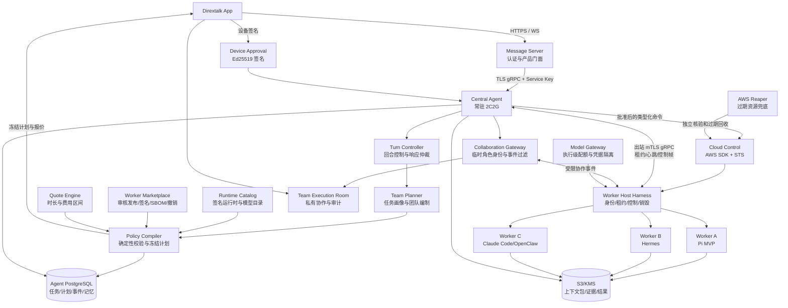

# Native Agent v2 系统规划

版本：0.7

日期：2026-08-02

状态：持续维护的架构与实施基线

范围：Dirextalk 单节点常驻 Central Agent、多云端临时 Worker Agent、App 交互和全生命周期控制

> 本文定义目标架构、产品边界和验收标准，不替代
> `docs/delivery-tracker.md`。后者仍是唯一实施进度账本。

## 1. 结论

Native Agent v2 不应成为一台 2 核 2G 机器里塞满所有能力的“超级
Agent”。它应成为一个低资源、长期在线、可信且可恢复的中央控制系统：

1. 在常驻节点上理解用户目标、维护上下文和长期记忆。
2. 判断任务是否能本地完成，还是需要一个或多个云端 Worker。
3. 在创建资源前完成团队编制、运行时选型、工时估计和成本区间估算。
4. 把完整计划展示给用户，取得设备签名批准后才产生云资源和费用。
5. 为每个 Worker 下发最小必要上下文、工具、模型和权限。
6. 实时接收心跳、阶段成果、证据和最终结果。
7. 由 Central Agent 验证、汇总和交付结果，而不是把 Worker 原始输出直接
   当成事实。
8. 任务完成、失败、取消或超时后自动销毁临时资源，并独立核实没有资源
   泄漏。
9. Central Agent 只能部署经过 Worker Marketplace 审核、签名且未撤销的
   精确 Release；模型和用户输入都不能指定任意镜像。
10. 多 Worker 可在受控 Team Room 中直接协作，但房间不替代 Harness
    控制协议，也不能扩大计划、权限或预算。

核心形式是：

**轻量可信控制平面 + 审核型 Worker 生态 + 按需高性能执行平面 + 用户签名审批 +
可验证协作、结果与销毁**

### 1.1 已确认的产品架构决策

- Central Agent 与 Worker Host Harness 共同构成平台“操作系统”；第三方
  Worker Agent 是遵守公开 SDK/ABI 的“应用”。
- Worker 开发者交付签名 OCI 镜像和 Manifest，不交付拥有云控制权限的 AMI。
  统一 Worker Host、身份、网络、凭据代理、观测和销毁由 Dirextalk 控制。
- Worker Marketplace 是强制部署边界，不是推荐列表。只有审核证据完整、签名
  有效、组织可见、未过期且未撤销的精确 Release ID 和镜像摘要可以进入 Plan。
- Dirextalk 通讯能力作为可选协作平面：一个 Team Execution 对应一个私有
  Team Room；Worker 使用执行级临时身份，经 Collaboration Gateway 发言。
- Worker 实例销毁后，任务 Grant 和房间成员资格立即撤销；实例身份
  停止刷新，已签发云凭据在记录的最迟时间前失效，房间默认只读归档。
  后续 Worker 恢复同一逻辑角色，但使用新实例身份和经筛选的 Context Bundle，
  不复用旧凭据，也不默认吞入全部聊天历史。
- 云端 Worker 能力以一个稳定的领域级 Worker Control API 为唯一权威接口；
  MCP/模型工具、运维 CLI 和第三方 SDK 只是这个接口的不同适配器，不能各自
  形成独立的任务状态或资源生命周期。
- 模型、公网搜索、托管浏览器和结果存储是 Harness 管理的云能力，不是
  Worker 镜像内置的长期密钥。AWS Worker 默认使用经审核的
  `CloudCapabilityProfile`，绑定 EC2 Instance Profile、可调用的 Bedrock
  模型、AgentCore Gateway/Search/Browser、Region、费用和时间上限。
- IAM Role 按能力类型预先创建并可复用，不在每个任务中创建和删除。
  实例销毁后停止获取新的临时凭据；Harness 同时撤销任务 Grant、关闭
  托管工具会话并等待已签发凭据失效。可复用 Role 保留不等于凭据仍有效。
- OpenAI、Tavily、Brave、Exa 等第三方 API 作为 BYOK/兼容能力；
  只有当云厂商没有等价能力或用户明确选择时才使用，不是 AWS Worker
  的默认凭据路径。
- Central 模型只能调用 owner-scoped、参数受限的任务工具，不能持有任意
  AWS CLI、Shell、Docker Socket 或长期 AWS 凭据。AWS Provider Adapter 可在
  受信控制面内部使用 AWS SDK；运维 CLI 只用于发布、诊断、灾难恢复和独立
  读回，不属于正常任务执行路径。
- “已请求取消”“Task 已取消”“Worker 已停止”和“云资源已核验不存在”是
  四个不同事实。任何模型回复、CLI 退出码或数据库单一状态都不能替代后续
  资源读回证据。

### 1.2 当前最小闭环冻结范围

第一轮不同时验证多个运行时、多 Worker 协作、Marketplace、Team Room 或
Model Gateway。只验证一条可证明的产品闭环：

1. 用户在 App 的 Agent 对话中提交一个明显超出常驻 2C2G 节点职责的重任务。
2. Central Agent 根据任务类型、所需工具、预计时长和本地资源边界，主动选择
   “本地回答”或“建议启动云端 Worker”；模型只能提出建议，确定性策略负责
   拒绝越权、无目录匹配或不需要云资源的计划。
3. 云端方案固定为一个角色、一个 On-Demand EC2 实例和一个经过固定摘要验证的
   Pi Worker Release，不允许模型或客户端提供镜像、AMI、命令或凭据。
4. App 展示任务判断理由、Pi 版本、实例规格、预计时间、费用上限和自动销毁
   策略；用户完成设备签名批准后才允许创建实例。
5. 专用 Worker AMI 预装 Dirextalk Harness、Pi 独立二进制和 Dirextalk
   结构化结果扩展；实例启动时不执行 npm 安装、在线更新或任意插件下载。
6. Worker 通过既有出站 TLS 控制链领取任务和临时模型凭据，Pi 在隔离工作区
   执行，并以固定终止工具返回结构化结果、用量和可选补丁。
7. Central 验证并取回 Result Manifest 后向 App 交付结果；成功、失败、取消和
   超时都必须进入同一自动销毁流程。
8. 独立 AWS 读回必须证明本次实例、根卷、ENI、EIP、专用安全组和临时 Secret
   均已消失；只有明确批准保留的版本化结果和正式 AMI/Snapshot 可以继续存在。

首个 Pi Release 冻结为官方 `v0.83.0` Linux x64 独立包，发布资产 SHA-256 为
`b0625eb623197b0afe20c870d21ef2f34481f1504e5777df3f698a66c7636f5f`。
正式 Worker AMI 还必须额外绑定 Pi 可执行文件摘要、结构化结果扩展摘要、
Runtime Installation 摘要和 Dirextalk Worker rootfs 摘要。

Central 当前继续使用 Go 控制平面和现有 Eino 推理后端。架构预留
`ReasoningBackend`，未来可把 Pi Agent Core 作为无云权限、无任意系统工具的
受限推理后端；这不属于本轮 MVP，也不能改变 Go 对审批、预算、AWS、事实存储、
结果验证和销毁的最终权威。

本轮明确延后：

- 两个及以上 Worker、DAG 协作和 Worker 间通信；
- 第三方 Marketplace、Team Room 和长期角色恢复；
- Model Gateway 正式代理和第三方 Worker 开放；
- Codex、OpenCode、Hermes、Claude Code、OpenClaw 等其他运行时；
- 把 Pi 替换为 Central 的默认推理后端。

## 2. 产品目标

### 2.1 必须实现

- Central Agent 可常驻在 2 vCPU、2 GiB 节点。
- App 用户可直接与 Central Agent 对话。
- Central Agent 能识别复杂、耗时、并行或高工具调用任务。
- Central Agent 能决定 Worker 数量、角色、依赖关系和最大并行度。
- Central Agent 能从已认证目录中选择 Claude Code、Codex、OpenCode、
  Hermes、OpenClaw 或未来运行时。
- 创建资源前展示：
  - 每个 Worker 的角色和任务；
  - Agent 运行时及版本；
  - 模型配置的公开名称；
  - 实例规格和数量；
  - 预计运行时间区间；
  - 预计费用区间；
  - 最大批准预算；
  - 数据保留和自动销毁策略。
- 只有用户签名批准冻结计划后，Agent 才能启动 AWS 资源。
- Worker 可并行或按依赖顺序执行。
- Central Agent 可实时监控、取消、重试、重新规划和收回结果。
- 临时 Worker 默认自动销毁，销毁必须有独立云端读回证据。
- Central Agent、Message Server、App 和 Worker 的职责边界清晰。

### 2.2 非目标

- 不把 Central Agent 做成可执行任意 shell 的云管平台。
- 不让模型直接调用 AWS CLI、任意 AWS API 或 Docker Socket。
- 不允许模型自由拼接镜像名、使用 `latest` 或下载未审核插件。
- 不让 Service Key 代替用户批准费用、公开网络、秘密交付或销毁。
- 不在第一阶段实现跨客户共享 Worker、中央多租户 SaaS、EKS 或多云。
- 不保证报价精确等于最终账单，只提供有依据的区间和硬预算护栏。
- 不默认让多个写入型 Worker 修改同一个工作目录。

## 3. 总体架构



### 3.1 云端 Worker 控制面接口

Central Agent 面向的是任务语义，不是 EC2、EBS、IAM 或网络原语。第一阶段
冻结以下 owner-scoped 能力面：

```text
cloud_connection_list
worker_runtime_list
team_plan_prepare
team_task_status
team_task_cancel
worker_task_logs
worker_task_artifacts
worker_task_cleanup_status
worker_task_cost
```

其中 `team_plan_prepare` 只能生成待确认计划，不能创建资源；创建 Worker 必须
消费已经签名且仍有效的批准事实。`team_task_cancel` 必须绑定已认证 owner 和
精确 Task ID、支持幂等重放，并只证明持久化取消命令已被接受。只有
`worker_task_cleanup_status` 返回经过 Provider 独立读回的
`cleanup_verified=true` 与 `cloud_resources_absent=true`，Central 才能向用户
声称没有遗留计费资源。

所有入口调用同一控制面和状态库：

- MCP/Function Tool 供 Central Agent 发现和调用受限能力；
- `dirextalk` CLI 供发布人员、运维和故障恢复使用；
- SDK/API 供 Message Server、官方自动化和未来第三方 Worker 平台接入；
- Provider Adapter 将批准后的领域命令映射到 AWS SDK，并负责幂等、标签、
  短期 STS、重试、对账和销毁；
- PostgreSQL 任务账本、Cloud Resource Ledger 和 Provider 读回是事实来源，
  聊天文字、模型推断和前端缓存都不是事实来源。

用户云账号默认通过带 External ID 的跨账号 Role 或等价短期授权连接。Central
模型只看到 Cloud Connection ID、能力、Region、报价和去敏状态；长期 Access
Key 不进入模型上下文、Worker、App 或消息历史。

## 4. 组件职责

### 4.1 Dirextalk App

- 只连接 Message Server，不直连 Agent 或 AWS。
- 展示对话、任务、团队计划、报价、批准、进度、结果和销毁状态。
- 在设备本地保存 Ed25519 私钥，私钥永不上传。
- 对冻结计划的确定性签名载荷签名。
- 对计划变更、追加 Worker、提高预算、延长保留期重新确认。

### 4.2 Message Server

- 负责用户登录、owner 映射和产品 API 兼容。
- 通过挂载的最小权限 Service Key 调用 Agent gRPC。
- 不持有 AWS 控制权限、模型密钥或设备签名私钥。
- 不复制 Agent 的任务、规划、Worker 或云控制实现。
- 对 App 仅暴露严格白名单、owner-scoped、去敏后的视图。

### 4.3 Central Agent

- 是唯一的任务控制平面和事实协调者。
- 拥有 Turn Controller、Task Kernel、Team Planner、Policy Compiler、
  Runtime Catalog、Quote Coordinator、Worker Coordinator、Memory 和
  Evidence Ledger。
- 通过类型化 Worker Control API 提交计划、查询、取消和执行命令；受信
  Provider Adapter 才使用 Go AWS SDK v2 控制资源。
- 不执行用户 shell，不加载重型浏览器，不在本机运行外部 Agent。
- 本地模型调用和后台规划都受并发、内存、超时和租约预算约束。

### 4.4 Cloud Worker

- 一次部署只服务一个批准计划中的一个角色。
- 使用专属 EC2、专属 Worker 身份、专属任务租约和最小数据权限。
- 不拥有 IAM、EC2、EBS、CloudFormation 等控制权限。
- 只通过出站 TLS 与 Central Agent 通信，不开放公网入站端口。
- 只获得设备签名 Plan 授权的云能力 Profile、工具白名单、任务 Grant
  和上下文包；云原生路径不交付模型或搜索长期密钥。
- 所有结果、检查点和证据写入版本化、KMS 加密的对象存储。

### 4.5 Central Agent 可定制配置面

面向 owner 的可定制能力统一使用“服务器目录 + 去敏读取 + 版本化更新”
契约，而不是让 App 上传任意 JSON。模型、搜索和托管工具对用户统一投影为
Capability Profile；后续记忆策略、规划偏好、通知策略和成本阈值应
沿用同一模式：

- Agent 启动时验证运营方管理的严格目录，Capabilities 只公布可选 ID
  和必要的去敏元数据；
- Message Server 只暴露 owner-scoped 白名单动作，对写入执行 revision
  fencing 和幂等校验，并保留其他配置段；
- App 只展示可选 Profile、计费方、Region、当前状态和有上限的偏好，
  不存储或回显 API Key、SecretRef 或长期云凭证；
- 任意端点、Worker 镜像、AWS 权限、审批规则、硬预算上限和安全策略
  始终属于运营方或确定性控制面，不能成为用户自由输入。

当前 Tavily/Brave/Exa/Serper 搜索 Profile 只是未部署的 BYOK 兼容实现，
不是冻结的默认生产方案。AWS 默认搜索应改为 AgentCore Gateway Web Search
能力 Profile，并由 IAM 实例身份调用；BYOK 适配器仅在独立审核、凭据隔离、
出站域名、超时、结果大小、日志去敏和故障隔离验收后才能开启。

### 4.6 AWS Reaper

- 在 Central Agent 或数据库不可用时执行到期资源兜底回收。
- 只删除同时满足批准、所有权标签、任务/计划绑定和过期条件的资源。
- 不删除 Managed 资源或所有权不明确的资源。

## 5. Central Agent 内部架构

### 5.1 Turn Controller

参考 Product Agent、Codex、Claude Code、Hermes 和 OpenClaw 的优点，采用
明确的回合状态机：

```text
prepare
  -> understand
  -> retrieve_memory
  -> decide_local_or_delegate
  -> propose_team
  -> compile_and_quote
  -> await_approval
  -> execute
  -> observe
  -> validate
  -> synthesize
  -> finalize
```

Turn Controller 必须做到：

- 每个阶段都有输入、输出、超时、重试和持久化边界。
- 模型输出不能直接触发云资源或费用。
- 工具结果与模型叙述分开保存。
- Response Arbiter 决定最终给用户展示什么，禁止“任务尚未完成但模型声称
  已完成”。
- App 断线、Agent 重启或模型失败后可从持久状态继续。

首个控制内核已按上述阶段落地，但尚未接管 Chat。它只保存 owner、request、
conversation、目标摘要、当前阶段、路由、阶段 attempt/deadline、Plan/Task/
approval 绑定以及产物引用和摘要，不复制会话正文、模型 reasoning、工具参数或
工具结果正文。模型只能产生 `model_candidate` 产物，状态推进 authority 枚举中
不存在 model。`await_approval -> execute` 由 PostgreSQL 原子核对当前
Team Plan、永久设备签名、Task、owner 和 Agent instance；委派任务的
`synthesize -> finalize` 还要求 Plan 与 Task 均已成功终结并已有验证证据。
阶段事件不可修改，所有 mutation 使用 caller-scoped 幂等键和 revision fencing；
丢失响应后的同键重试先返回原快照，不因当前阶段已经前进而误报冲突。

当前这一层是可复用的控制事实内核，不等于自动编排已经打通。下一步仍需由受信
Turn Driver 把 Runtime 的理解/记忆结果、Team Proposal 捕获、Plan v3、Task
状态和最终候选回复逐阶段接入；Message Server 和 App 接入前，现有 Chat RPC
行为保持不变。

### 5.2 Task Kernel

任务使用持久化 DAG：

- `Task`：用户目标、状态、结果和保留策略。
- `Step`：角色级或控制平面级工作单元。
- `Attempt`：一次有租约和 epoch 的执行尝试。
- `Checkpoint`：可恢复中间状态。
- `Evidence`：工具调用、测试、文件摘要、外部读回等证据。
- `Result`：版本化最终产物引用。

第一版执行器仅保留：

- `CONTROL_PLANE`
- `CLOUD_WORKER`

### 5.3 Team Planner

Team Planner 使用模型理解任务，但只允许输出受约束的 `TeamProposal`：

- 角色 ID、名称和目标；
- 工作类型；
- 必要能力；
- 前置依赖；
- 只读、隔离写入或串行独占工作区；
- 粗略时长区间；
- 粗略输入/输出 token 区间；
- 最低资源需求；
- 模型质量和上下文需求；
- 可选的运行时偏好。

Team Planner 不能输出：

- AMI ID、镜像 URL 或镜像摘要；
- AWS 实例 ID、VPC、Security Group；
- shell、用户数据或任意命令；
- API Key 或 Secret 值；
- 最终费用批准；
- 未注册的 Agent 名称。

### 5.4 Policy Compiler

Policy Compiler 是确定性代码，不是 LLM。它负责：

- 验证角色 DAG 无环、依赖存在。
- 限制 Worker 总数和最大并行度。
- 检测并发写入冲突。
- 从签名目录选择已认证运行时。
- 选择与运行时兼容、已配置的模型 Profile。
- 选择满足最低资源的可用实例。
- 计算时长、费用区间和硬预算。
- 冻结计划并生成摘要。
- 任何变化都产生新 revision，旧签名失效。

默认建议：

- 默认最多 4 个 Worker。
- 系统硬上限 8 个 Worker。
- 默认最大并行 3 个 Worker。
- 写入型 Worker 使用独立 worktree/checkout。
- 同一共享工作区的写入必须显式串行。
- 默认 On-Demand；Spot 必须经过独立的可中断能力认证。

## 6. Agent 运行时能力目录

### 6.1 目录原则

生产环境不内置“看到名字就运行”的逻辑。每个可选运行时必须有一条经发布
流程认证的 `RuntimeRelease`：

- 稳定 release ID；
- 运行时 family；
- 固定版本和源码 commit；
- 官方来源和许可证结论；
- 内容寻址镜像摘要；
- 支持的架构；
- 最低/推荐 CPU、内存和磁盘；
- 受支持的模型接口；
- 工具能力；
- 统一任务适配器版本；
- 冷启动测量值；
- 安全扫描、功能测试和认证时间；
- `candidate / qualified / disabled` 状态。

只有 `qualified` 能进入选型。禁止 `latest`、浮动 tag、运行时自更新和任务中
动态安装未知插件。

整份目录由独立的 Ed25519 发布密钥签名。每条 `qualified` 记录必须绑定 SBOM、
构建 provenance、漏洞扫描、Runtime Adapter 合同测试和许可证决策的 SHA-256
摘要。Agent 启动时从受保护的只读挂载读取目录和公钥，验证签名后计算目录
revision；目录、公钥、资格证据或镜像摘要发生变化时，旧计划不能静默复用。

### 6.2 Worker Marketplace 安全边界

Worker Marketplace 不是可选推荐源，而是 Central Agent 的第二层签名信任根。
第一层 Runtime Catalog 证明 Host Harness 能安装和运行某个固定运行时；第二层
Marketplace Registry 证明某个 Worker Agent Release 已经通过平台审核。两层都
匹配时才能生成可批准的 Assignment。

市场分为三个货架：

- `Dirextalk Official`：平台维护并承担发布责任的参考 Worker。
- `Verified Partner`：完成开发者身份、签名身份和每个 Release 审核的第三方
  Worker。
- `Organization Private`：只对指定组织可见的内部 Worker，不能跨组织解析。

每个市场 Release 必须绑定：

- 稳定的 `worker_type_id`、不可变 `release_id` 和语义版本；
- Worker Protocol 版本、固定入口和双向 mTLS 控制协议；
- OCI repository、镜像摘要、镜像签名包；
- Manifest 摘要、SBOM 和构建 provenance；
- 能力、模型接口、工作区模式、最低/推荐资源和最大任务时长；
- 请求的网络服务、工具范围和临时磁盘上限；
- 发布者身份与签名身份验证；
- 漏洞、恶意代码、许可证、静态分析、合同测试、沙箱行为、权限、网络、
  Prompt Injection、数据外泄和资源基准审核证据；
- 审核策略 revision、风险等级、有效期、暂停和撤销事实。

Policy Compiler 只能从当前 Registry 的 `approved` Release 中选择。生成 Plan
时，服务端必须把 Registry ID/revision、发布者、Worker Type、Release、
Manifest、OCI 镜像、审核记录和最终授予权限写入每个 Assignment。用户设备签名
覆盖这些字段；模型不能提供或覆盖它们。形成 challenge、接受批准、发布启动
证据和真正创建实例前都要重新解析同一精确 Release，并检查 Registry、发布者、
Release、审核有效期、组织范围和紧急撤销状态。

Registry 不可用、签名失效、证据过期、字段漂移或撤销检查无法完成时必须失败
关闭。已有 Plan 可以供用户查看，但不能继续启动新的 Worker。紧急撤销默认
阻止尚未启动的角色；对正在运行的实例由撤销策略决定立即取消还是只切断新增
模型/工具权限，所有处理进入 Evidence Ledger。

迁移期间，现有签名 Runtime Catalog 仍可作为 Dirextalk 内部审核白名单，保证
未知镜像不能运行；对外开放第三方 Worker 前，生产配置必须同时启用 Marketplace
Registry，不能以内部兼容模式冒充已经完成市场安全边界。

### 6.2.1 市场解析与用户偏好缓存

Worker Marketplace 是镜像和 Release 的唯一权威事实源；Central Agent 可以
记住用户确认过的常用 Worker，但该记录只能作为排序偏好，不能成为独立信任源。
偏好必须由结构化、owner-scoped 的事实存储维护，不能只存在于模型上下文或自然
语言长期记忆中，也不能保存可直接启动的浮动 AMI ID、镜像 URL 或 `latest` tag。

每条偏好至少记录：任务类别、`worker_type_id`、可接受的发布者范围、版本策略、
资源/费用偏好、最后确认时间、有效期和事实 revision。标准选择顺序固定为：

1. 按任务所需能力查询当前已签名 Marketplace Registry。
2. 过滤未审核、已撤销、过期、组织不可见或与 Runtime Catalog 不兼容的 Release。
3. 在合格候选中使用用户偏好排序，而不是直接采用缓存中的旧镜像。
4. 重新计算当前资源、时间和费用区间。
5. 把精确 Registry revision、Release ID、版本、发布者、镜像摘要、权限、风险和
   费用上限冻结进 Plan，再取得本次设备签名批准。

“用户以前用过”不等于“本次自动批准”。Release 升级、镜像摘要变化、权限扩大、
风险等级上升、费用越界或偏好过期时必须重新展示；未来如支持免重复确认，只能通过
用户设备签名的限时 Standing Policy，且必须同时限制任务类型、Release 范围、权限、
单次/累计预算和到期时间，不得由模型自行推断。

市场暂时不可达时，只允许使用尚未过期、签名有效且撤销新鲜度满足策略的
last-known-good 目录快照；否则失败关闭。当前单 Pi MVP 的受保护签名 bundle 被定义
为只有一条 Dirextalk Official Release 的离线启动快照，后续切换在线 Registry 时
沿用同一选择、冻结、批准和撤销合同，不把 AMI 写死进 Central 模型。

### 6.3 统一 Worker Runtime Adapter

每个外部 Agent 都包装成统一协议：

```text
Prepare(context_bundle, policy)
Run(role_assignment)
Stream(milestone, tool_receipt, usage, checkpoint)
Cancel(reason)
Collect(result_manifest)
Shutdown()
```

适配器隐藏各 Agent 的 CLI、HTTP、ACP 或 Gateway 差异。Central Agent 只看
统一事件，不解析终端颜色文本或自然语言日志。

#### 6.3.1 Worker 运行监控与用户可见性

Worker 按 Central Agent 的子 Agent 运行实例处理。会话只承载目标、批准、必须由
用户处理的问题和最终结果，不逐条显示 Worker 启动、心跳、工具或运行进度。用户从
Agent 详情入口进入独立的“运行与任务”页面，按需查看当前和历史执行；Central 则在
App 未打开时仍持续监控。

Central PostgreSQL 是进度真相源。Worker 只通过现有封闭 milestone vocabulary
上报，Central 重新校验会话、租约和所有权后持久化收件事实，并结合角色调度、心跳、
结果验证和资源账本投影 `queued`、`preparing`、`starting_worker`、
`preparing_input`、`running`、`validating_result`、`cleaning_up` 和终态。
CloudWatch 仅保留异步审计副本，不能作为 App 查询源，也不能因日志故障阻塞任务。

公共投影不包含模型原始思考、工具参数/结果、终端输出、供应商错误原文、Worker/
Deployment ID、AWS 资源 ID、对象/日志坐标或秘密。详细三仓合同、持久化和验收门槛见
`docs/native-agent-v2-worker-progress-design.md`。

截至 2026-07-29，统一协议的第一个可运行内核已经落地，但还不是生产目录：

- `worker-runtime-task/v1` 只允许固定 release、镜像、上下文、工作区、模型
  Profile、凭据槽和目标，不允许任务注入命令、argv、环境变量、路径、端点、
  AWS 操作或秘密。
- Worker 内部使用封闭 Adapter Registry；已实现
  `codex_exec_task_v1`，其他 runtime 名称只是协议保留值，未注册就失败关闭。
- Codex Adapter 使用固定非交互参数、受限 sandbox、标准输入目标、严格 JSON
  Schema、独立进程组取消和限定输出；关闭内部多 Agent、插件、应用、Hooks、
  网页搜索和工具推荐；运行前重新校验安装清单与可执行文件摘要。
- Worker Runner 负责上传有界制品，并把 deployment、Worker、Task、Step、
  attempt、lease epoch、Recipe/Execution 摘要和制品声明写入可恢复 checkpoint
  与最终 manifest。
- Central Result Collector 只按已持久化的结果对象声明下载、校验并读取每个
  runtime 的 `final.json`；Worker 输出仍是不可信候选，必须经过 Validator。

截至 2026-07-30，批准后的第一层受信物化也已落地。`teamexecution`
只接受 Plan 标识和调用者幂等键，重新取得已批准 Plan 与永久设备审批后，生成
确定性的 Execution、Step declaration、Task Step、Deployment 和预期 Worker
身份。角色的依赖、Runtime release/image/adapter、Model Profile/interface、
Compute Offer/实例/资源、时长、Token 上限、并发和硬预算都必须与 Plan 摘要
完全一致；内部模型凭据引用不会进入执行清单，只生成逐角色逻辑凭据槽。
PostgreSQL 在一个事务中写入不可变 Execution/Role/Dependency、追加原 Task
的 Cloud Worker DAG 并推进到 `queued`，并发或重启重放不会重复追加步骤。
数据库会拒绝 Execution/Role JSON 的未知字段，并把每个会影响授权的角色字段
与签名 Plan assignment 逐项核对；Deployment 到预期 Worker 的身份推导也与
现有 Worker Control 共用同一合同。

审批命令会先查找同一幂等键的已提交结果，再读取当前目录、策略、报价、凭据和
连接，因此事实漂移不会破坏已经成功的历史重放。审批 RPC 使用确定性内部键
自动触发物化；若审批已提交而同步物化失败或进程退出，仍返回持久的批准事实，
并把“已批准但无 Execution”保留为明确的恢复意图。后台恢复控制器在启动后
立即运行并周期执行，使用 `(updated_at, plan_id, plan_revision)` 键集分页，
单条坏记录不会阻塞后续 Plan。物化不调用云厂商、不要求报价或连接当前仍有效，
也不读取任何秘密。

`queued` 在这里表示结构已就绪，不代表 Worker 可直接领取。首次付费调度前，
`BeginDispatch` 会重新验证当前报价、目录、模型凭据可用性、计算配置和
Cloud Connection，再在一个事务里推进 Plan `approved -> executing`、
Execution `materialized -> dispatching` 以及 Task 调度修订。Team Worker
领取时必须匹配批准图中的 Deployment/预期 Worker，满足依赖，并在 Execution
行锁下统计有效租约，不能超过 `max_concurrent_workers`。第一份租约将
Execution 推进为 `running`；完整 DAG 成功后进入 `verifying`，任一 Step
失败会原子地把 Plan 和 Execution 置为 `failed`。历史幂等响应不依赖报价仍
有效，因此状态推进或报价过期后仍能安全重放。

Task 取消会在同一 PostgreSQL 事务里封锁尚未完成的 Plan、Execution、Step 和
Attempt；其中包括“已批准但尚未物化”的恢复状态。Central Team Controller
也会把已进入销毁阶段的角色交给严格绑定 Deployment 的清理器，并在 Worker
Deployment 和云资源都达到终态后才允许角色完成。

截至 2026-07-30，批准后的控制路径已接到输入物化、逐角色 Secrets Manager
版本、S3 安装/执行包、Worker 注册与 enrollment、执行前重新报价、类型化
SG/ENI/EIP/EC2 创建、结果校验、资源销毁和 Team Report 最终化。该路径已经过
领域、跨模块和真实 PostgreSQL 测试，但还没有完成真实多 Worker AWS/模型
E2E。生产编译与执行目前只允许 `codex_exec_task_v1`；仓库工作区来源仍是空
快照，因此现有代码仓库任务在可信 workspace/attachment 交接完成前不能视为
生产就绪。

### 6.4 初始运行时定位

| Runtime | 优先任务 | 可借鉴能力 | 不应默认使用的场景 |
| --- | --- | --- | --- |
| Pi | 首个轻量代码/工具 Worker、受控 Headless 执行 | JSON/RPC、模型适配、扩展、技能、结构化终止 | 直接拥有 AWS/长期密钥或承担确定性控制平面 |
| Codex | 代码实现、测试、重构、代码审查 | 非交互执行、沙箱、MCP、代码工作流 | 非代码型长期个人助理 |
| Claude Code | 大型代码库、复杂推理、代码团队协作 | 子 Agent、MCP、权限和沙箱、长上下文 | 简单低成本任务 |
| OpenCode | 供应商中立的代码任务、Headless 服务 | HTTP 服务、多模型、细粒度权限、MCP | 需要长期个人记忆的工作 |
| Hermes | 通用工具任务、研究、长期运行和技能复用 | ACP/API、MCP、记忆、技能、Docker 后端思想 | 要求最小启动体积的短代码任务 |
| OpenClaw | 通讯、多渠道、浏览器和广泛自动化 | Gateway、渠道路由、技能、子 Agent、持久会话 | 默认代码 Worker 或只需一次 shell 的短任务 |

选型不是固定排名。例如：

- 代码实现：优先 Codex、Claude Code 或 OpenCode。
- 独立代码审查：可故意选择与实现 Worker 不同的 runtime/model。
- 通用研究和工具编排：优先 Hermes。
- 多渠道通讯和浏览器自动化：优先 OpenClaw。
- 简单诊断：继续使用最小原生 Worker，不启动重型 Agent。

### 6.5 运行时引入顺序

建议按以下顺序认证，不代表能力排名：

1. Pi：先跑通一个 Worker 的 App 到 AWS 最小闭环。
2. Codex + OpenCode：在同一 Harness 上认证代码 Worker 和交叉审查。
3. Hermes：覆盖通用工具、研究和长任务。
4. Claude Code：完成商业使用、Headless、权限和镜像发布认证后启用。
5. OpenClaw：只在渠道、浏览器或广泛技能任务中启用，不作为通用默认。

每个运行时必须独立通过许可证、服务条款、API 凭据方式、沙箱、退出码、取消、
用量统计、结果协议和资源占用认证。

参考官方能力资料：

- Claude Code：
  <https://code.claude.com/docs/en/features-overview>
- Codex：
  <https://github.com/openai/codex>
- OpenCode：
  <https://opencode.ai/docs/agents/>
- Hermes：
  <https://github.com/NousResearch/hermes-agent>
- OpenClaw：
  <https://docs.openclaw.ai/subagents>
- Pi：
  <https://github.com/earendil-works/pi>

## 7. 多 Worker 团队编制

### 7.1 示例

用户目标：“分析两个仓库，完成服务端替换方案，实现迁移并做回归测试。”

Central Agent 可以产生：

| Role | Runtime 候选 | 依赖 | 工作区 |
| --- | --- | --- | --- |
| 架构分析 | Hermes / Claude Code | 无 | 只读 |
| 现有服务审计 | Codex / OpenCode | 无 | 只读 |
| 迁移实现 | Codex / Claude Code | 前两项 | 隔离写入 |
| 独立审查 | Claude Code / Codex | 迁移实现 | 只读 |
| 回归与安全测试 | OpenCode / Codex | 迁移实现 | 隔离写入 |
| 最终整合 | Central Agent | 全部 | 控制平面 |

总角色可以是 5 个，但最大并行可能只有 2 个。报价和 UI 必须同时展示：

- 总 Worker 数；
- 峰值并行数；
- 哪些先执行、哪些等待；
- 每个 Worker 的 Agent 和模型；
- 整体预计墙钟时间。

### 7.2 并发约束

- 只读分析可以并行。
- 写代码的 Worker 必须使用独立 worktree。
- 多个补丁由 Central Agent 或专门集成 Worker 合并。
- 两个 Worker 不允许同时写同一共享目录。
- Worker 不得自行再创建 AWS Worker。
- 外部 Agent 自带的子 Agent 只能在该 Worker 的已批准资源和权限内运行，并计入
  同一个预算；默认关闭嵌套创建云资源。

## 8. 时长和成本估算

### 8.1 报价构成

估算至少包含：

```text
总成本区间 =
  EC2 运行成本
  + 根卷和数据卷
  + 模型输入 token
  + 模型输出 token
  + 日志/对象存储
  + 已批准的网络和固定服务成本
```

计划显示三组值：

- 最低估计；
- 期望估计；
- 最高估计；
- 另加一个用户实际批准的硬预算。

硬预算建议为最高估计加 20% 安全余量，但不得超过产品或用户设置的上限。

模型价格、算力价格和可用性不能作为模型输出直接进入计划。服务端先把模型定价
目录、云厂商只读价格和实例可用性回执编译成最长 15 分钟有效的不可变
`OfferSnapshot`。计划和设备签名同时绑定 snapshot ID 与内容摘要；任何来源、
单价、Region、实例可用性或模型凭据就绪状态变化都必须生成新 snapshot 和新
Plan revision。

每份 snapshot 还必须绑定完整 `ProviderScope`：云厂商、Cloud Connection ID、
连接 revision 和 AWS 12 位账号 ID。报价适配器只能为构造时绑定的同一 scope
读取证据；连接轮换、跨账号或跨连接复用即使 Region 相同也必须失败并重新报价。
账号 ID 只是身份边界，不是访问凭据，不能替代对当前连接和 STS 身份的执行前
复核。

同一 AWS Service Quota 可能同时约束多个实例类型，因此容量不能只写成单个
实例的 `available=true`。Compute Offer 必须绑定容量池、每实例消耗单位和池内
剩余单位；编队器对同池所有角色统一扣减，容量不足时在展示给用户批准前失败，
而不是等到 `RunInstances` 才发现超配。

### 8.2 时长估算

模型提出每个角色的最低、期望和最长执行时间。确定性调度器再加入：

- 镜像冷启动；
- 依赖等待；
- 最大并行限制；
- 必要的结果验证阶段。

整体时间使用 DAG 调度计算，不能简单把所有 Worker 时长相加。

### 8.3 不确定性声明

报价必须明确：

- 模型 token 取决于实际推理和工具循环。
- 外部付费 MCP、网站、第三方 API 可能不在估算内。
- 网络流量和失败重试可能增加费用。
- 报价不是 AWS 账单承诺。
- 达到硬预算、最长时间或最大重试次数时自动停机并请求新批准。

## 9. 用户批准协议

用户签名的不是一句“同意”，而是完整冻结计划：

- owner、Agent instance、plan ID、revision；
- 任务目标摘要；
- 每个角色及依赖；
- runtime release、版本和镜像摘要；
- 模型 Profile 和 SecretRef；
- 云厂商、Cloud Connection ID/revision、AWS 账号、Region、实例类型、数量和
  磁盘；
- 网络、数据和工具权限；
- 预计时长和 token 区间；
- 报价快照、有效期和硬预算；
- 保留策略和销毁期限；
- 允许的重试和预批准 fallback；
- 签名 challenge 和失效时间。

以下变化必须重新报价和签名：

- 新增 Worker；
- 换成未预批准 runtime/model；
- 提高实例规格；
- 提高预算；
- 开放公网；
- 增加 Secret、工具或数据范围；
- 更换云账号、Cloud Connection 或其 revision；
- 延长资源寿命；
- 从临时资源变为 Managed。

如果计划预先列出等价 fallback，Central Agent 可在同一预算和权限内切换；否则
必须生成 change order。

## 10. Worker 启动与模型配置

### 10.1 启动流程

1. 持久化创建意图。
2. 取得短期 STS Control Role。
3. 解析并重新校验 Plan 签名覆盖的 `CloudCapabilityProfile` revision。
4. 使用确定性 ClientToken 创建实例和依赖资源，挂载已审核、可复用的
   能力类 IAM Instance Profile。
5. 写入 owner、task、plan、approval、capability-profile、deadline 标签。
6. Worker 使用 IMDSv2 取得的实例身份向 Central Agent 发起 enrollment。
7. Central Agent 校验 EC2 身份、批准计划、Worker ID 和能力 Profile。
8. Worker 取得一次性、部署范围的会话凭据和任务 Grant。
9. Worker 下载并校验上下文包和 runtime release。
10. Host Harness 向 Runtime Adapter 暴露 Plan 允许的 Bedrock、AgentCore Search/Browser、
    S3 等类型化能力，不传入 AWS 或供应商长期密钥。
11. Runtime Adapter 启动 Agent，并回报 ready。

### 10.2 模型密钥

- App、Message Server 和 Worker Agent 都不接触模型供应商的长期明文密钥。
- Central Agent 数据库只保存 SecretRef、Profile 和就绪状态，不保存普通明文。
- 对 AWS 云原生路径，Worker Host 使用 Instance Profile 的自动轮换临时凭据
  调用 Plan 允许的 Bedrock 模型；Worker Agent 只看到受限模型工具合同。
- 对第三方 BYOK 路径，Worker Host 只获得执行级 `CredentialGrant`，包含
  模型 Profile、接口、请求次数、Token/费用、有效期和权限上限，不包含
  供应商密钥字节。
- BYOK Worker 通过 Host 上固定的本地 Broker Socket 调用 Model Gateway；Gateway
  在受信边界内解析供应商凭据、执行配额、记录去敏用量并支持撤销。
- 密钥和供应商 Bearer Token 不进入 prompt、命令参数、环境变量、日志、房间
  事件、结果或检查点。
- 任务结束、租约失效、用户取消、预算耗尽或 Release 被紧急撤销时，
  CredentialGrant 立即失效。
- 当前逐 Worker Secret 交付只允许作为迁移期兼容路径，不能作为第三方 Worker
  市场正式开放后的生产凭据模型。

### 10.3 云能力 Profile 与销毁语义

`CloudCapabilityProfile` 是服务器审核目录，至少绑定：

- provider/account/Region 和配置 revision；
- 可复用 IAM Instance Profile ARN 及其策略摘要；
- 可调用 Bedrock 模型 ID、AgentCore Gateway ARN、Search/Browser 能力；
- S3/KMS 结果范围、出站策略、最大并发、最长时间和费用上限；
- 资格证据、区域可用性、有效期、暂停和撤销状态。

Plan 冻结并由用户设备签名精确 Profile ID/revision、模型、工具、Region、
权限和费用上限。启动前重新检查目录、区域可用性和撤销事实；任一漂移
均需重新报价或批准。

销毁验收必须分开记录：任务 Grant 已撤销、AgentCore 工具会话已关闭、
EC2/EBS/ENI 已不存在、实例不再能刷新凭据、已签发凭据的最迟失效时间。
能力类 IAM Role 可保留供后续 Worker 复用，但它不是任务资源，不得被报告为
“随实例删除”。

AgentCore Web Search 的区域可用性必须作为目录事实读取，不能在
模型 prompt 或代码中假定与 Worker Region 相同。跨区域调用需纳入延迟、费用、
数据边界和失败回退报价。

## 11. Central 与 Worker 通讯

### 11.1 控制通道

- Worker 主动建立出站 TLS gRPC 长连接。
- 服务端校验 Worker 身份、deployment、task、step、attempt 和 lease epoch。
- Worker 无需公网入站端口。
- 心跳和租约断开后，Central Agent 不立刻重复执行；先做 fencing 和状态读回。

### 11.2 事件

统一事件至少包括：

- `worker.enrolled`
- `runtime.preparing`
- `runtime.ready`
- `task.started`
- `tool.started`
- `tool.completed`
- `milestone`
- `usage.updated`
- `checkpoint.saved`
- `result.published`
- `task.completed`
- `task.failed`
- `worker.shutdown`

事件必须有单调序号、时间、attempt、lease epoch 和去敏摘要。

### 11.3 结果回收

同时支持推和拉：

- Worker 完成时主动上报 Result Manifest。
- Central Agent 可按 deployment/step 主动查询状态。
- 大文件、补丁、日志、测试报告放在 S3/KMS。
- gRPC 只传摘要、哈希、大小、媒体类型和版本化引用。
- Central Agent 下载后校验 SHA-256、大小、owner、deployment 和对象版本。

### 11.4 Team Room 协作平面

多 Worker 并非始终需要共享聊天。Team Plan 必须显式选择协作拓扑：

- `supervisor`：默认星型，Worker 只与 Central 通讯。
- `shared_team`：互相依赖的 Worker 在同一 Team Execution Room 协作。
- `pipeline`：只允许上游向下游交付已发布 Artifact。
- `review`：实现者与独立审查者可以质疑和答复，但不能自行改变任务范围。

Team Room 是真实、私有、不可联邦的 Matrix 房间，但不是任务控制总线：

- 一个 Team Execution 对应一个独立房间，不把所有任务塞进用户现有 Agent
  Room；主 Agent Room 只接收关键进度和最终摘要。
- 用户和 Central Agent 是长期成员；Worker 以执行级临时角色身份参与。
- Worker 不持有长期 Matrix Token，也不能邀请成员、改权限或创建其他房间。
  Collaboration Gateway 将受限协作事件映射到 Harness 双向控制流。
- 房间消息只允许问题、答复、建议、阻塞、审查意见、状态和 Artifact 引用。
  自然语言消息不能扩大工具、网络、数据、模型、预算或最长运行时间。
- 重大任务修改必须生成签名 `TaskAmendment`；涉及费用、权限、Worker 或数据
  范围变化时必须重新取得用户批准。

身份采用三层模型：

1. `worker_type_id` 是 Marketplace 中的长期应用身份。
2. `role_id` 是本次 Plan 中的逻辑角色身份。
3. `execution_principal_id` 绑定 deployment、attempt、lease epoch 和临时实例。

实例销毁或租约失效后，第三层身份立即退出房间并撤销；历史事件保留原作者与
Release 证据，不能把身份删除后重新指向另一台实例。同一次 Execution 因中断
重启时可恢复同一 `role_id`，但必须产生新的 attempt principal。新任务默认新建
房间和身份。

任务终止后，Central 发布最终 Report 和 Cleanup Receipt，移除 Worker，锁定
房间并按用户/组织保留策略归档。Matrix 完整历史用于人类审计，不直接作为下一
个模型的长期记忆。后续 Worker 只取得 Central 生成并签名的有界 Context
Bundle，其中包含已接受决定、相关事件引用、可信 Checkpoint、Artifact 摘要、
未解决问题、来源和 Token 上限；未经筛选的旧聊天按不可信外部输入处理。

## 12. 结果验证与整合

Central Agent 不直接信任 Worker 的“完成”声明。结果需经过：

1. 协议和哈希校验。
2. 任务目标覆盖检查。
3. 工具证据检查。
4. 测试或外部读回。
5. 多 Worker 冲突检测。
6. 必要时交给独立 Reviewer Worker。
7. Response Arbiter 形成最终答复。

代码任务建议采用：

```text
Implementer Worker
  -> Test Worker
  -> Independent Reviewer
  -> Integration Worker or Central controlled merge
  -> Final verification
```

Worker 产出的补丁不能自动推送主分支。Git push、PR、部署和生产变更继续遵守用户
指令和独立权限策略。

## 13. 长期记忆

### 13.1 记忆分层

- `Conversation Memory`：当前会话和短期上下文。
- `Task Memory`：目标、计划、决策、检查点和结果。
- `Canonical Memory`：经过验证、可跨任务复用的事实。
- `Procedural Memory`：技能、操作步骤和成功模板。
- `Evidence Store`：原始工具回执、文件摘要和外部读回。

### 13.2 写入原则

- Worker 不能直接写 Canonical Memory。
- Worker 只提交候选事实和证据。
- Central Agent 做去重、来源验证、冲突检测和敏感信息过滤。
- 只有稳定、可追溯、用户允许保留的信息进入长期记忆。
- 记忆条目带来源、有效期、可见范围、版本和撤销状态。

### 13.3 Canonical Memory 可信控制合同

本地 `codex/native-agent-v2` 分支已经完成第一版内核：

- migration 46 分开保存不可变 Evidence Ledger、候选事实、一次性设备签名
  challenge、永久 approval、Canonical Memory 身份、不可变 revision 和事件历史；
- Worker 对象摘要固定标记为 `untrusted`，不能单独满足任何事实提升条件；
- Task Result 只作为 `corroborating` 证据，Turn Validator 的通过结果才是
  `verified` 证据；
- 所有事实提升都需要现有 owner approval device 对领域隔离的确定性 CBOR
  payload 签名，签名绑定候选、证据集、目标 Memory、当前 revision 和有效期；
- 用户偏好和决策可由用户签名直接确认；项目事实必须有验证证据，操作流程必须
  同时有同一 Task/Turn 的结果与验证，外部事实最长有效 30 天；
- PostgreSQL trigger 独立读回 Worker/Turn 原始记录，拒绝伪造证据、重复批准、
  越级 revision、事实改写和历史删除；
- Canonical statement 限制为 4 KiB，并在进入数据库前拒绝疑似密钥。

当前边界必须保持清楚：

- 服务已进入 Agent runtime composition，但尚未接入 Chat Turn Driver；
- 尚无 Message Server RPC、Flutter 候选审批/记忆管理界面或设备签名撤销合同；
- 当前撤销入口仅供 Agent 内部控制层使用，不能直接开放给远端调用方；
- 现阶段按 owner/namespace 分页读取有效事实，尚未把 active revision 镜像到
  Knowledge 向量索引，也没有语义检索；
- Conversation Memory 和 Knowledge `memory` source 仍保持原语义，不能被当成
  Canonical Memory。

### 13.4 Worker 上下文包

Worker 只拿到最小必要内容：

- 角色目标；
- 依赖 Worker 的已验证输出；
- 相关代码或文档快照；
- 适用规则；
- 工具白名单；
- 输出 schema；
- 预算、时间和停止条件。

不把完整历史聊天、全部长期记忆或无关联系人数据复制到 Worker。

## 14. 2 核 2G 常驻预算

建议 Central Agent 资源预算：

| 组件 | 目标预算 |
| --- | --- |
| Go Agent 控制进程 | 最高约 1 GiB 容器内存 |
| PostgreSQL 共享服务中的 Agent DB | 独立数据库和角色 |
| 并发本地模型回合 | 总计 2 |
| 并发后台规划 | 1 |
| 浏览器、代码编译、大型解析 | 0，转 Worker |
| 本地 shell/任意插件 | 0 |

控制平面保持低内存的方法：

- 事件和结果使用游标、流式读取和对象引用。
- 大文件不进入模型上下文或 PostgreSQL 大字段。
- 工具目录按需发现，不一次加载全部 schema。
- 长对话使用分层摘要和 Canonical Memory。
- 后台控制器使用有界队列和租约。
- 外部 Agent 进程只在 Worker VM 运行。

## 15. 安全模型

### 15.1 权限分层

| 身份 | 可以做什么 | 不能做什么 |
| --- | --- | --- |
| App 用户会话 | 读取和请求产品动作 | 直接调用 Agent/AWS |
| Message Server Service Key | owner-scoped Agent API | 批准费用或拿到云密钥 |
| Approval Device | 签名高风险计划 | 执行 AWS API |
| Central Control Role | 执行已批准类型化云操作 | 任意 shell/未批准扩权 |
| Worker Role | 读取自身任务资源、写自身结果、调用 Plan 允许的 Bedrock/AgentCore 能力 | IAM/EC2/EBS 控制、任意模型或工具 |
| Runtime Agent | 使用角色白名单工具 | 自行创建 Worker 或扩权 |
| Reaper | 删除严格匹配的过期临时资源 | 删除 Managed/未知资源 |

### 15.2 必须防护

- Prompt injection 导致工具或数据越权。
- Worker 伪造完成、结果或用量。
- 旧租约 Worker 提交迟到结果。
- Agent 重启导致重复创建实例。
- 报价后镜像、模型或网络漂移。
- App 签名密钥跨账号或跨节点复用。
- 日志泄漏模型/API/AWS 凭据。
- 任务取消后 Worker 继续花费。
- 数据和 EBS/S3 资源未销毁。
- 外部 Agent 的自动更新、插件安装或遥测绕过计划。

## 16. 状态机

### 16.1 Plan

```text
researching
  -> composing_team
  -> resolving_catalog
  -> quoting
  -> ready_for_confirmation
  -> approved
  -> executing
  -> completed

ready_for_confirmation -> expired
ready_for_confirmation -> superseded
approved -> change_required
```

### 16.2 Worker

```text
planned
  -> provisioning
  -> enrolling
  -> preparing
  -> ready
  -> running
  -> verifying
  -> terminal
  -> destroying
  -> verified_destroyed
```

异常状态包括：

- `failed_retriable`
- `waiting_user`
- `cancellation_requested`
- `destroy_blocked`
- `orphaned`

### 16.3 取消与资源清理事实

取消不是一个可以用自然语言模拟的单一状态。控制面必须分别持久化并向 App
投影：

```text
cancel_requested
  -> task_canceled
  -> worker_stopping
  -> worker_stopped
  -> cleanup_in_progress
  -> cleanup_verified
```

异常路径进入 `cleanup_blocked` 并由 Controller/Reaper 持续重试。`Task` 已经
进入 canceled 终态时，重复取消返回 `already_canceled`，不得重复创建副作用。
取消命令的成功响应必须明确返回 Task revision 和 outcome，同时将资源清理
标记为 `not_verified`；实例、根卷、ENI、EIP、专用安全组、临时 Secret 和其他
任务资源分别读回均不存在后，才能生成 Cleanup Receipt。

Central Agent 只有在用户明确提出停止或取消时才能调用取消工具。它不能把
“结束对话”“不再继续”“计划不会自动批准”解释成已经取消，也不能在没有
Cleanup Receipt 时声称没有费用或没有资源。

## 17. 故障和调整策略

| 故障 | 默认行为 |
| --- | --- |
| 模型无法形成合规团队 | 带确定性错误反馈重新规划，不创建资源 |
| 没有合格 runtime | 告知能力缺口，不用未知镜像替代 |
| 报价过期 | 自动重报价，要求重新签名 |
| 实例无容量 | 使用计划内批准的等价 AZ/offer，否则 change order |
| Worker 启动失败 | 在重试上限和预算内重建同一角色 |
| Runtime 崩溃 | 从检查点恢复或使用预批准 fallback |
| Worker 失联 | fencing 旧租约，云端读回后决定重试 |
| 结果校验失败 | 标记失败或派 Reviewer，不声称成功 |
| 成本接近硬预算 | 停止新工具调用，保存检查点，请求用户决定 |
| 用户取消 | 立即停止调度、发送取消、进入销毁 |
| Central Agent 重启 | 从 PostgreSQL/outbox 恢复，不重复创建 |
| AWS 删除失败 | `destroy_blocked`，持续重试并告警 |

## 18. App 体验

用户在聊天中应看到四个阶段：

### 18.1 正在规划

显示 Central Agent 正在分析任务，但不展示模型内部思维链。

### 18.2 待确认计划

显示：

- 团队结构；
- 每个 Worker 的 Agent、角色和实例；
- 依赖和最大并行；
- 预计时间；
- 费用范围和最大预算；
- 风险、排除项和销毁策略；
- “确认创建并开始计费”。

### 18.3 执行中

显示角色级状态、阶段成果、用量、取消和等待用户输入。用户不需要看原始终端
日志，必要诊断通过去敏附件提供。

### 18.4 已完成

显示：

- Central Agent 汇总结果；
- 每个 Worker 的产出和验证；
- 最终文件/补丁/报告；
- 费用摘要；
- Worker 和资源销毁证据；
- 是否有进入长期记忆的内容。

## 19. 数据模型演进

现有 Cloud Plan v1/v2 面向单 Recipe、单资源组和单 Worker。多 Worker 不应通过
重复字段勉强扩展，而应新增 Plan v3：

```text
TeamPlanV3
  PlanBinding
  GoalBinding
  CloudProviderBinding
    Provider
    ConnectionID
    ConnectionRevision
    AccountID
    Region
  RuntimeCatalogBinding
  PricingSnapshotBinding
  WorkerAssignments[]
    Role
    Dependencies[]
    RuntimeRelease
    ModelProfile
    SecretRefs[]
    ResourceScope
    ToolScope
    DataScope
    DurationAndTokenEstimate
    RetryAndFallbackPolicy
  ScheduleEstimate
  CostEstimate
  HardBudget
  RetentionScope
```

Plan v3 仍使用确定性 CBOR 和 Ed25519。现有诊断 Worker 的 Plan v1/v2 保持兼容，
迁移期间两种计划并存。

Agent 端当前新增独立 `TeamPlanService`，不改写现有 Cloud Plan API。其第一组
闭环接口为：

- `PrepareTeamPlanV3`：只接收 owner、Task、Cloud Connection ID、Plan
  identity、目标摘要和受约束 Team Proposal；
- `GetTeamPlanV3`：读取不可变 Plan 与独立生命周期状态；
- `CreateTeamApprovalChallengeV3`：由服务端确定性生成 approval/challenge
  identity，并返回完整签名事实和确定性 CBOR；
- `ApproveTeamPlanV3`：接收设备产生的 64 字节 Ed25519 签名并推进外层状态。

准备请求不能指定 AWS 账号、Region、实例、价格、镜像、模型 Profile 或凭据；
资源架构也由服务端目录决定。返回的 Worker Assignment 包含用户需要审核的
运行时、模型、实例和成本事实，但不包含内部模型凭据引用或 secret delivery
坐标。读取、准备和批准分别使用 `team.plan.read`、`team.plan.write` 和
`team.plan.approve` 权限。Message Server 门面、App DTO/签名交互和上述权限的
配对 Service Key 轮换仍是独立后续工作，不能把 Agent RPC 已存在等同于 App
链路已打通。

数据库不把 `status` 写进签名 Plan。`OfferSnapshot` 和每个 `(plan_id,
plan_revision)` 的 Plan JSON、CBOR 与摘要写入后不可修改；`ready`、`approved`、
`expired`、`superseded`、`executing` 和终态由独立 `record_revision` 表达。
新 revision 只能接续同一 Plan 聚合，未批准上一版会原子变为 `superseded`，
已过期上一版保持原样；已批准或执行中的版本不能被静默替换。challenge 只能
原子消费一次，approval 永久保留原始签名、签名 payload 和批准时间。数据库
trigger 同时禁止修改或删除上述签名事实。
所有 Snapshot、Plan、challenge 与 approval 查询和行锁都先在 SQL 条件中绑定
当前 `agent_instance_id`，再校验 owner，避免共享数据库或错误实例配置形成
跨节点读取通道。创建 challenge、批准和过期命令还必须显式携带 owner，
owner 会进入幂等请求摘要并与锁定事实匹配，不能仅凭 Plan UUID 操作。

Turn Controller 使用独立 migration 45：

- `agent_turns` 保存当前阶段投影、deadline、attempt、route 和经过验证的
  Proposal/Plan/approval/Task/result/validation/response 引用；
- `agent_turn_events` 按 Turn revision 追加 authority、阶段变化和去敏产物
  摘要，写入后禁止更新或删除；
- 数据库 trigger 二次限制合法阶段图、路由不可逆、Plan/approval 绑定、Task
  成功条件和最终完成证据；
- Turn 不保存聊天正文、模型 reasoning、工具调用参数、工具结果正文或任何
  Secret。

## 20. 测试体系

### 20.1 领域测试

- TeamProposal schema、DAG、并发写入和上限。
- Runtime/Model/Compute 目录校验。
- 确定性 runtime 选型和稳定 tie-break。
- 时长 DAG 调度。
- token/计算成本区间和溢出边界。
- 云账号、Cloud Connection revision 和 Region 漂移。
- Plan 摘要跨进程确定一致。

### 20.2 合同测试

- Go Protobuf、Message Server 映射和 Flutter 严格解析。
- 未知字段、错误 owner、错误 revision、过期 quote 全部 fail closed。
- Go/Dart 确定性 CBOR 与签名 golden vectors。

### 20.3 Worker 适配器测试

每个 runtime 独立验证：

- 固定版本和镜像摘要；
- Headless 启动与 ready；
- 模型凭据从文件读取；
- MCP/工具白名单；
- 取消、超时和退出码；
- 流式事件和 token 用量；
- checkpoint 和 resume；
- 结果 manifest；
- 无自动更新、无多余网络、无 secret 日志。

### 20.4 本地模拟 E2E

- Fake AWS + PostgreSQL 18。
- 1、2、4、8 Worker DAG。
- 并行、串行、失败重试、取消和 Central 重启。
- App 从对话到批准、进度、结果和销毁。

### 20.5 真实 AWS E2E

在授权的一次性账号和 Region 中：

1. App 下达复杂任务。
2. 当前 MVP 由 Central Agent 主动判断为云端重任务，并形成单 Pi Worker 计划；
   多 Worker 在该闭环稳定后另行验收。
3. App 设备签名批准。
4. Agent 创建计划中唯一的临时实例。
5. Pi Worker 领取任务并实时回报。
6. Central Agent 收回、验证并汇总结构化结果。
7. 用户收到最终产物。
8. Agent 销毁全部资源。
9. 独立扫描 EC2、EBS、ENI、EIP、SG、Endpoint、Snapshot、S3、
   Secrets、DynamoDB manifest 和标签。
10. 证明没有未拥有或未销毁的计费资源。

### 20.6 2C2G 验收

- 连续 24 小时运行。
- 前台对话与后台任务同时存在。
- 多 Worker 心跳和事件流。
- Agent 容器不 OOM、不失去健康检查。
- PostgreSQL 和 Message Server 不被挤压。
- 控制面无浏览器、编译器或外部 Agent 重进程。

## 21. 实施阶段

本节只说明架构顺序；完成状态以 `delivery-tracker.md` 为准。

### 阶段 A0：Pi 单 Worker 最小闭环

- Central 主动区分本地任务与需要云端执行的重任务。
- 计划固定为一个 Pi Worker，并展示理由、时间、费用和自动销毁策略。
- 专用不可变 Pi AMI、Runtime Catalog、执行适配器和结构化结果扩展。
- Message Server 暴露 Team Plan v3 的 owner-scoped 去密门面。
- App 完成单 Worker 计划、设备签名批准、进度、结果和销毁证据界面。
- App → Message Server → Central → AWS Pi Worker → Central → App 真机验收。
- 成功、失败、取消和超时均验证本次临时资源零残留。

### 阶段 A：现有基础闭环

- 单诊断 Worker。
- owner-scoped 云任务接口。
- App 任务、报价、批准、进度、取消和结果面板。
- 服务密钥安全轮换。
- demo2 App 到 Worker E2E。

### 阶段 B：Team Plan 领域层

- `TeamProposal`。
- Runtime/Model/Compute Catalog。
- 确定性选型。
- DAG 调度、时长和费用区间。
- 不可变 Plan 摘要。

### 阶段 C：Plan v3 与 App 审批

- Protobuf 和 PostgreSQL。
- 多 Worker 报价。
- Ed25519/CBOR 签名。
- App 团队计划 UI。
- change order 和预算护栏。

### 阶段 D：Worker 平台信任根

- 冻结公开 Worker SDK/ABI、固定入口和 Host Harness 边界。
- 建立签名 Worker Marketplace Registry、发布者层级和组织私有货架。
- 建立 SBOM、provenance、安全审核、暂停、过期和紧急撤销合同。
- 将精确 Market Release、Manifest、镜像、审核和权限写入 Team Plan 与设备
  签名，启动前再次失败关闭校验。

### 阶段 E：双向 Harness 与结果闭环

- 实现统一双向 mTLS gRPC 控制流。
- 租约、心跳、单调事件、取消、权限撤销和断线 fencing。
- 通用 Context Bundle、Checkpoint、Artifact 和 Result Manifest。
- 多 Worker DAG 调度、结果验证、依赖交接、整合和零残留销毁。

### 阶段 F：Cloud Capability Gateway 与参考 Worker

- 建立签名 `CloudCapabilityProfile` 目录和预创建的 AWS 能力类 IAM Role。
- 首先接入 Bedrock 模型、AgentCore Gateway Web Search/Browser 和 S3/KMS 结果能力。
- 实现任务级 Grant、请求/Token/费用配额、会话关闭、凭据最迟失效证据和撤销。
- 对第三方 BYOK，Worker 只访问本地 Broker Socket，不获得供应商长期密钥。
- Codex/OpenCode 首批官方 Worker 镜像和市场审核。
- Hermes、Claude Code、OpenClaw 按独立 Release 逐个接入、禁用和回滚。

### 阶段 G：Team Room 与 App 团队体验

- Team Execution Room、Collaboration Gateway 和临时角色身份。
- supervisor/shared_team/pipeline/review 协作拓扑和防循环预算。
- 完成后退房、凭据撤销、只读归档和筛选历史 Context Bundle。
- App 展示市场发布者、权限、费用、实时角色状态、协作记录、结果和清理证据。

### 阶段 H：记忆和 Turn Controller

- Canonical Memory。
- Evidence Ledger。
- Response Arbiter。
- Worker 候选记忆审核。
- 跨任务恢复和重规划。

### 阶段 I：生产验收

- demo2 App → Message Server → Central → 真实 AWS 多 Worker 全链路。
- 2C2G 24 小时压力测试。
- Worker/网络/数据库/Agent 重启和撤销故障注入。
- 市场镜像替换、越权、Prompt Injection 和数据外泄安全测试。
- 成果回收、费用护栏和零资源泄漏证明。

## 22. 当前事实边界

截至 2026-08-02：

已经具备：

- 已冻结 AWS 云能力目标架构：Worker 默认使用可复用能力类 IAM Instance
  Profile 调用 Bedrock 模型、AgentCore Search/Browser 和 S3/KMS；第三方
  模型/搜索密钥只作 BYOK 兼容路径。这是已确认设计，不等于代码或云资源
  已经部署。

- 独立 Go Agent、PostgreSQL Task/Step、云计划和 Worker 协议。
- 类型化 AWS 控制、报价、设备签名审批、资源账本和 Reaper。
- 一个真实诊断 Worker 的启动、结果回收和验证销毁证据。
- Central Agent 在 2C2G 上的本地并发和容器预算。
- Message Server 的 owner-scoped 云任务门面。
- Flutter 的任务、计划、报价、批准、进度、取消和结果基础面板。
- App、Message Server 和 Agent 三个仓库均已有独立
  `codex/native-agent-v2` 本地开发分支/工作区。
- Pi `v0.83.0` 官方 Linux x64/ARM64 Release 的 SHA-256 已在本地读回匹配。
  ARM64 独立二进制已在原生 Linux 容器中启动；使用本地假
  OpenAI-compatible 模型、禁用内置工具和自动发现后，Pi 的 JSON 事件流成功
  完成结构化终止工具调用，返回 token 用量并以 `agent_end` /
  `agent_settled` 正常结束。测试容器和网络已删除。
- 受约束的 Team Proposal、确定性 Runtime/Model/Compute 选型、DAG 时长和
  成本估算领域层。
- Ed25519 签名 Runtime Catalog、资格证据绑定和目录约束的 Team Plan 编译器；
  可选配置后由 Agent 启动时严格验证，但尚未配置任何生产 Runtime 记录。
- 公共 `sdk/workerprotocol/v1` 已定义固定 Worker 入口、双向 mTLS 控制传输、
  Manifest、Execution Envelope、Input Bundle、Credential Grant、Control
  Frame、Checkpoint、Result Manifest 和 Cleanup Receipt；合同测试会拒绝
  任意入口、未知网络、路径穿越、镜像替换、超期租约、方向错误控制帧、重复
  Artifact 和不完整清理。
- `internal/workermarket` 已实现 Ed25519 签名 Registry、官方/认证伙伴/组织私有
  发布者、Release 审核证据、可见性、有效期、暂停和撤销校验，并可作为
  Team Plan 编译与启动证据解析的失败关闭 Gate。Agent 启动配置要求 Registry
  与公钥成对提供，并依赖签名 Runtime Catalog 和 Team Policy；尚未生成或部署
  生产市场 Registry。
- Team Plan 的确定性 CBOR 摘要、五分钟设备签名 challenge、报价过期和计划
  revision 漂移校验。
- migration 44 的不可变 Offer Snapshot、Plan revision、challenge 和 approval
  PostgreSQL 存储；整单批准只推进外层状态，不改写签名 Plan，并支持到期后
  新 revision 重报价。
- 受保护的静态 Team Policy、Plan 绑定的策略摘要和 Agent 内部
  `teamorchestration` 应用门禁；形成 challenge、接受批准或启动 Worker 前都会
  重新核验当前 Runtime Catalog、Team Policy、报价快照、云身份和永久审批签名。
  Plan 准备以稳定请求为幂等依据，在一个 PostgreSQL 事务内原子写入 Offer
  Snapshot、Plan、事件和回放结果；重试先读回当前 Plan 状态，不重新报价，也
  不会产生孤立 Snapshot。Cloud Connection ID 也是稳定意图的一部分；同一
  幂等键不能换连接。可注入 `OfferSnapshot` 的方法已收回包内，唯一公开准备
  入口只能接收 owner、Task、Cloud Connection ID、Plan identity、目标摘要和
  受约束 Team Proposal；首次请求通过受信构建器取报价，已提交重放不会访问
  AWS 或凭据源。Agent 端已新增独立、去密的 `TeamPlanService`，提供准备、
  读取、生成完整签名 challenge 和提交设备签名四个 Plan v3 RPC；准备请求
  无法注入 Region、实例、价格、镜像、模型 Profile 或凭据，返回值也不暴露
  内部模型凭据引用。服务端生成 challenge identity，并把读、写、批准拆为
  三个权限。Message Server 和 App 尚未接入这些 RPC。
- 模型定价、算力价格和容量来源回执组成的不可变 Offer Snapshot 领域层。
- 严格受保护的模型报价目录、凭据布尔就绪端口、报价快照组装服务，以及读取
  AWS Price List、EC2 规格/可用区、Service Quotas 和 gp3 根卷价格的只读
  Compute Adapter；不同实例类型共享同一 vCPU quota pool。Offer Snapshot、
  Team Plan 和设备签名现已共同绑定云厂商、Cloud Connection ID/revision、
  AWS 账号和 Region，跨连接或跨账号复用会失败。受保护的模型报价和
  Region/AZ/实例规格目录、逻辑 Worker SecretRef 到本机 mounted SecretRef 的
  布尔就绪映射，以及 owner-scoped Cloud Connection/AssumeRole 只读报价构建器
  已接入 Agent 启动组合；不完整目录、策略、AWS 或 Worker Control 配置会使
  启动失败。形成 challenge、接受批准和执行交接还会重新核对当前 Agent
  instance、owner、Connection 状态/revision、账号和 Region。每份 Snapshot
  还冻结当前模型价格源、模型目录、逻辑凭据就绪状态以及 Region 对应的
  AZ/实例规格/磁盘白名单摘要；challenge、批准和执行交接前会重新读取当前
  目录与凭据状态并逐项比对。任何实质漂移返回重新报价，配置顺序变化不会
  误判；缺少当前报价验证器时批准链路失败关闭。尚未配置生产报价目录，也未
  执行真实 AWS 报价调用。
- 批准后的 Team Execution 已接入常驻 Central Team Controller。migration
  48-54 冻结 launch authorization、输入物化、role dispatch、执行前 fresh
  quote、发布证据、结果证据和最终 Team Report；控制器可以恢复并推进 Worker
  注册、bootstrap、类型化 AWS 资源创建、结果验证、逐角色销毁和整队最终化。
  `GetTeamExecutionV3` 只返回去密的角色结果、deliverables、tests、risks 和
  token usage，不返回原始运行日志、S3/Secrets 坐标或凭据。
- 成功完成的 Team Execution 通过 Central-authoritative completion 链路回到原会话。
  Agent 在最终报告与清理事实同一事务中写入 `team.execution.completed`，并只在
  唯一绑定到原始持久 Chat conversation 时允许自动投递。Message Server 使用
  持久 cursor 读取事件后，必须先调用 Agent 的内部
  `SynthesizeTeamCompletion`，不能自行生成或格式化助手文本。Agent 按 source
  event ID 重新读取并交叉校验 Execution、Report、Artifact 和 conversation，
  将 Worker 完成材料作为去密、受限、不可执行的内部 tool observation 交给
  Central 模型；模型结合完整会话历史生成真实回复，回复与内部证据原子进入
  Central 权威记忆。只有提交成功后，Message Server 才投影
  `dirextalk.product.agent-team-execution-completed/v2`，其中包含 Central 生成的
  `assistant_message`、最新 `conversation_revision` 和完整公开 Artifact 元数据。
  App 只保存和显示这条 Central 回复，不再使用本地模板冒充 Agent。下一次普通
  用户消息仍只需 conversation ID 和用户文本；Message Server 通过
  `GetConversationState` 与 Central 的权威 revision 对齐，不要求 App 重传
  Artifact ID、Task ID 或隐藏上下文。断线重放、重复事件、模型失败、会话并发、
  页面保存竞态和当前会话即时显示都必须保持幂等、失败关闭和 cursor 不越过。
  旧 v1 事件中由 Flutter 生成本地化固定摘要的实现只代表控制链验证，不能作为
  Agent 产品闭环继续保留。该旧链路曾发布到 demo2：Agent v60 与 Message
  Server e2e.10 均健康，
  Message Server→Agent 成对服务凭证经显式轮换新增最小 `event.read`
  权限，旧凭证已撤销；持久事件游标已从无记录追平至 Agent 当时最新
  sequence `2607`。登录会话、历史消息和未批准 `logforge` 计划在 App
  无卸载更新后仍可读并可刷新。这证明线上重放、认证和消费通道已接通，
  但尚未经过一次真实 Worker 成功结果与 App 自动摘要的付费验收。
  e2e.10 还会对事件流认证、权限、不可用、超时和限流失败输出去密、
  一分钟限频告警，不再出现“容器健康但游标静默不前进”的无观测故障。
- Restricted Cloud Dialogue 已新增 `team_plan_prepare`：模型只能提交受限
  Team Proposal；owner、原始用户目标、Cloud Connection、Runtime/Model/
  Compute 目录、价格和凭据均由服务端绑定。调用只生成确定性 Task 和待确认
  Plan，不具备设备批准或 AWS 创建权限。
- Restricted Cloud Dialogue 的 owner-scoped `team_task_status` 和
  `team_task_cancel` 已部署到 demo2，并通过正式 Task gRPC 接口把 15 个历史测试
  Task 收口为 `finished/canceled`；其中 6 个待批准 Plan 同步变为 `canceled`，
  活动 Task、Step、Plan 和 Execution 均归零。取消响应仍把资源清理标记为
  `not_verified`，不会把 Task 取消冒充为资源已销毁；App 对话触发取消及状态
  刷新仍待真实验收。
- 未批准 Team Plan 的后台自动过期与崩溃恢复已在本地分支实现：控制器先把已过
  `valid_until` 的最新 Plan revision 转为 `expired`，再通过正式 Task Cancel
  收口；若两步之间重启，会从 `expired Plan + 非终态 Task` 继续。领域、竞态、
  Store、应用组合和一次性 PostgreSQL 事务测试已通过，尚待随下一版 Agent 发布
  到 demo2。
- GitHub App 短期凭据 Broker、不可变 S3/KMS 源码快照和版本绑定的 Team
  Input 已接入控制器；Worker 只获得服务端复制后的内容寻址输入，不获得
  GitHub Token。首建、持久化、重启重放、连接 revision 漂移和替换攻击已有
  领域与真实 PostgreSQL 测试。
- 生产编译器和执行控制器当前都只允许 `codex_exec_task_v1` +
  `openai_responses`。其他 Agent 名称仍只是协议扩展位，不能被计划或执行层
  冒充为已支持。
- AWS 只读预检确认大阪 Region 当前没有属于该 Agent 的 pending/running/
  stopping/stopped EC2、活动 EBS 或 ENI；正式 Pi Worker AMI 和历史发布
  Snapshot 属于受管发布资产，不是运行中 Worker。当前本机 AWS CLI 身份仍是
  账号 root，只用于独立只读核验；正常 Worker 创建必须由 Central 的受限 AWS
  SDK 控制角色执行。

正在实现：

- 把每个市场 Release 的 Registry、发布者、Worker Type、Manifest、OCI 镜像、
  审核事实和最终授予权限显式写入 Assignment、确定性 Plan 摘要、App 去密
  投影和 launch authorization，并补充批准后撤销和字段替换测试。
- Worker Harness 双向 gRPC 运行服务；当前只有公开 Control Frame 合同，尚未
  完成真实长连接、租约事件循环和 Worker Host 接入。
- App 审批设备与 Agent 现有信任根的安全交接。
- demo2 真实 Worker 结果 E2E，包括 Central 报告校验、ProductCore
  自动投影、当前会话即时展示和任务级零资源读回；无结果的历史事件重放、
  持久游标追平和 App 会话保留已在 demo2 验证。
- 多 Worker Plan v3 的 Message Server 门面、App 去密 DTO 与整单签名接入。
- 签名 `CloudCapabilityProfile` 目录、能力类 IAM Role、Bedrock 模型和
  AgentCore Search/Browser 适配器，以及 Cloud Connection 只读报价的真实
  AWS 验收；第三方 BYOK 才继续使用 Model Gateway/SecretRef 物化。
- 受信 Turn Driver：把现有 Runtime、Team Plan v3、Task Kernel 和 Response
  Arbiter 串成真正的自动路由与恢复流程。
- Canonical Memory 的 Chat 候选捕捉、检索快照、Knowledge active-revision
  镜像、Message Server 门面和 App 设备签名管理。
- 通用 attachment workspace 交接；GitHub repository 路径已经具备可信快照，
  其他附件类型仍未接入。
- 生产 Codex Runtime Catalog、Worker AMI、模型凭据和真实 AWS Team E2E
  验收，以及失败注入后的零残留资源证明。

尚未实现或尚未验收：

- Claude Code、OpenCode、Hermes、OpenClaw 的 Runtime Adapter 和生产镜像；
  Codex Adapter 已实现，但生产目录、AMI 和真实模型执行仍未验收。
- Pi Runtime Adapter、固定结构化结果扩展、专用 AMI 打包路径和正式发布均已
  完成；新 AMI 已被 demo2 验签导入并成为唯一 active Worker Release。真实用户
  消息触发和设备批准界面已经接入；自动结果交付链路已在三端通过测试并
  部署到 demo2，线上事件重放与游标追平已验证。
  Pi 模型/工具执行、真实结果回传、线上 Central 摘要和任务后资源归零仍待完整
  AWS E2E，不能用本地测试或目录 active 状态替代该验收。
- 多 Worker Plan v3 的 App 审批与真实 Worker 执行。
- 除本地 Codex 固定 Adapter 内核外，其他 Runtime Adapter 和所有生产资格
  认证；Codex 生产 AMI、任务级凭据隔离和真实模型调用也尚未验收。
- 多 Worker 真实 AWS 协作和结果整合。
- Model Gateway、本地 Broker Socket 和执行级 CredentialGrant 的实际代理；
  当前执行路径仍使用逐 Worker Secret 物化，不能向第三方 Worker 市场开放。
- `CloudCapabilityProfile`、能力类 IAM Role、Bedrock/AgentCore 运行时适配和
  销毁后凭据最迟失效证据尚未实现。当前 demo2 没有 Search Profile
  读写动作或可用搜索能力；开发分支中的第三方 Search Profile 是 BYOK
  兼容实验，不得以 App 页面已存在冒充全链路可用。
- Team Execution Room、Collaboration Gateway、临时 Matrix 角色身份、协作
  拓扑、只读归档和筛选历史 Context Bundle；现有 Message Server 只有用户与
  常驻 Agent 的真实私有 Matrix 房间基础。
- Turn Controller 对 Chat/Team/Task 的自动驱动和跨任务重规划。
- Canonical Memory 的公开撤销签名合同、App 审批/查看/撤销和语义检索。
- 2C2G 24 小时持续压力验收。

因此，当前三端代码已经能从受限云端对话形成单 Pi Team Plan，由 App 展示并
设备签名批准，再由 Central Team Controller 推进 Worker 的输入、创建、观察、
结果回收、销毁和整队报告；成功报告还可以通过持久事件回到原会话并形成 Central
已验证摘要。但这仍是“代码路径与线上消费通道完成、真实 Worker 生产验收未完成”：
最新自动交付链路已部署到 demo2 并追平历史事件，但市场 Release 的多 Worker
App/launch 完整绑定仍在实现，Cloud
Capability/Model Gateway 和 Team Room 尚未开发，真实 Pi Worker AWS/模型 E2E、
真实多 Worker 协作和 2C2G 长稳测试也未完成，不能宣称 demo2 或生产已经具备
完整自动多 Agent 调度能力。

## 23. 产品决策

### 23.1 已确认

1. Central Agent 与 Worker Harness 构成平台核心，第三方按 SDK/ABI 开发各有
   定位的 Worker Agent。
2. Worker Agent 必须进入经过审核的 Marketplace；Central Agent 不能部署任意
   未审核镜像。
3. 市场 Release 必须固定版本、固定镜像摘要、签名、SBOM、provenance、审核
   证据和撤销状态。
4. 常驻节点保持轻量，重型能力在用户批准后按需启动云实例并在任务结束后销毁。
5. 可以利用 Dirextalk 房间实现 Worker 团队协作，但房间只作为协作与审计层，
   不替代 Central/Harness 的权威控制通道。
6. Worker 实例身份和凭据是临时的；历史房间默认归档，下一次执行恢复逻辑角色
   和筛选上下文，不复用旧实例凭据。
7. 当前 MVP 只启用一个官方 Pi Worker；Central 的确定性控制平面继续使用 Go，
   Pi 不直接拥有 AWS、审批、预算、事实存储或销毁权限。
8. Pi 使用预烘焙不可变 AMI 和官方独立二进制，实例启动时不执行 npm 安装或
   在线更新。
9. Worker Control API 是云端任务的唯一权威接口；MCP、CLI 和 SDK 共享同一
   状态机、审批、幂等、资源账本和清理验证，不各自实现云生命周期。
10. PC 端 AWS CLI 只保留为受限发布、故障恢复和独立审计入口，不是 Central
    Agent 的运行依赖，也不能把账号 root 凭据交给模型或 Worker。
11. Worker Marketplace 是 Release 的权威来源；Central 保存的常用 Worker 记录
    仅用于合格候选排序，不能绕过签名、审核、撤销、版本锁定、报价或本次批准。
12. 当前 Pi bundle 是单条官方市场目录的签名离线快照；将来改为在线 Registry
    查询时保持同一确定性 Plan 和审批合同。
13. AWS Worker 默认通过实例身份获得 Bedrock 模型和 AgentCore Search/Browser
    能力，不在实例中写入云厂商长期 Access Key。
14. IAM Role 按能力类型预创建并复用；任务销毁的权威事实是 Grant/会话已撤销、
    资源已消失且临时凭据不再可刷新，不要求删除可复用 Role。
15. 第三方模型和搜索 API 是 BYOK/兼容能力；App 默认选择云能力 Profile，
    不把 API Key 配置作为 AWS Worker 的首选路径。

### 23.2 建议默认值

建议以以下默认值继续开发：

1. 默认 Worker 上限 4，系统硬上限 8。
2. 默认最大并行 3。
3. 默认使用 On-Demand，不使用 Spot。
4. 费用展示最低/期望/最高，硬预算为最高估计加 20%。
5. 达到硬预算、最长时间或最大重试次数时自动停止并请求新批准。
6. 一个角色对应一个隔离 Worker；不共享运行时进程。
7. 多个写代码 Worker 使用独立 worktree，由独立集成步骤合并。
8. Runtime 必须固定版本、固定摘要并通过资格认证。
9. Runtime fallback 只有在原计划列明时可自动切换。
10. OpenClaw 不作为默认 Worker，只用于通讯、浏览器和广泛自动化任务。
11. Worker 不直接写长期记忆，必须由 Central Agent 验证后提升。
12. 先用 Pi 完成单 Worker 最小闭环；随后再认证 Codex 和 OpenCode，之后加入
    Hermes、Claude Code 和 OpenClaw。
13. Team Plan 默认使用 `supervisor` 协作拓扑，只有角色间存在高频互相依赖时
    才启用 `shared_team`。
14. Team Room 默认私有、不可联邦、`joined` 历史可见，任务结束后只读归档；
    新 Worker 不自动取得加入前的原始历史。
15. 第三方 Worker 正式开放前必须启用 Model Gateway，不能向 Worker 下发
    供应商长期 API Key。
16. AWS 参考 Worker 优先使用 `worker-basic`、`worker-bedrock`、
    `worker-bedrock-search` 和 `worker-browser-code` 等预审核能力类角色。
17. Search Profile UI 默认显示云厂商、Region、计费方和能力状态；只有
    显式进入 BYOK 兼容模式时才展示第三方配置入口。

## 24. 最终验收定义

### 24.1 当前 Pi MVP 验收

只有以下证据全部成立，才可以宣称最小闭环跑通：

- App 中一条真实用户消息触发 Central 的重任务判断，而不是测试代码直接创建
  Task 或人工调用 AWS。
- 用户能在 App 看到单 Pi Worker 的理由、版本、实例、时间、费用和自动销毁，
  并用设备密钥签名批准完整计划。
- Agent 使用受限 AWS SDK 控制角色创建精确计划中的实例，Pi AMI、Runtime
  Installation、可执行文件和扩展摘要均与批准事实一致。
- Pi 收到完整有界任务和必要输入，实际调用模型与工具，返回可验证结构化结果；
  Central 能下载、校验、持久化并通过 Message Server 交付给 App。
- App 持续显示真实计划、启动、执行、结果和清理状态，不依赖 fixture 或手工
  刷数据库。
- 成功、失败、取消、超时至少各有自动销毁测试；最终真实 AWS 主验收必须独立
  读回本次 EC2、EBS、ENI、EIP、SG 和临时 Secret 全部不存在。
- 测试不使用账号 root 作为日常发布或运行身份，日志、事件、数据库和结果中
  不出现模型或 AWS 明文密钥。

Native Agent v2 只有同时满足以下条件，才可以称为“可生产使用的中央调度
Agent”：

- 用户可从 App 下达一个真实复杂任务。
- Central Agent 可解释为什么本地不执行。
- Central Agent 生成合理的角色、Agent、资源、时间和成本计划。
- 用户能理解并签名批准完整计划。
- 每个 Worker 都能追溯到当前有效、已审核、已签名且未撤销的 Marketplace
  Release；镜像、Manifest、审核或权限替换会被拒绝。
- Agent 在无人工 AWS CLI 操作的情况下启动多个 Worker。
- 每个 Worker 只获得自己的任务、模型、数据和权限。
- Worker 不持有 AWS 控制凭据、GitHub Token、供应商长期模型密钥或长期
  Matrix Token。
- Central Agent 实时掌握每个 Worker 的状态。
- 需要协作时，Worker 可在受控 Team Room 交换问题、建议和 Artifact 引用；
  房间消息不能绕过 Plan、预算、权限或结果验证。
- Worker 失败、重启、失联或取消不会重复收费或产生双重执行。
- Central Agent 能验证并取回所有结果，形成可用最终产物。
- App 能持续显示任务状态和最终结果。
- 所有临时资源被销毁并独立读回验证。
- Central Agent 在 2 核 2G 节点上持续稳定运行。
- 日志、数据库、对象存储和 App 中不存在明文模型/AWS 密钥。
- 主分支和生产环境变更仍遵守独立批准、测试和发布流程。
