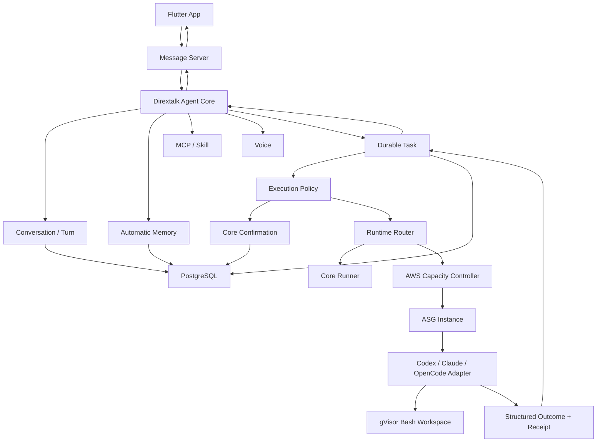

# Product Agent Capability Migration Design

Status: proposed for implementation

Date: 2026-08-07

Base: `adam/agent-core-v1-integration` at `bd88d18`

Branch: `codex/product-agent-capability-migration`

## 1. Objective

Upgrade `dirextalk-agent` with the proven non-image capabilities from
`direxio-product-agent` while preserving the Agent Core's current ownership,
security, durability, Protobuf/gRPC, PostgreSQL, Confirmation, and isolated
runner boundaries.

The resulting system has one authoritative Agent Core, one task ledger, one
confirmation authority, and one user-visible delivery path. It must not embed
the TypeScript Product Agent as a second control plane.

## 2. Approved Direction

Three approaches were considered:

1. **Semantic migration into the Go Agent Core — selected.** Reimplement the
   Product Agent's domain behavior behind existing Core services and durable
   ledgers. This costs more engineering effort but preserves one source of
   truth and the target repository's production boundaries.
2. **Run the TypeScript Product Agent as a permanent sidecar.** This would
   deliver features faster, but it would preserve duplicate task, approval,
   retry, credential, and delivery authorities. It is rejected for production.
3. **Replace Agent Core with Product Agent.** This keeps existing TypeScript
   features but discards the stronger gRPC contract, runner isolation,
   provider profiles, Voice, extension lifecycle, and broad durable-state
   coverage. It is rejected.

Temporary shadow evaluation may call the legacy Product Agent with no write or
delivery authority. It must never become a fallback execution path.

## 3. Scope

### 3.1 Included

- Replace the fixed model/tool round termination with a resumable execution
  policy based on stage deadlines, cost/risk approval, cancellation, and
  no-progress detection.
- Add automatic long-term memory candidate extraction, deterministic privacy
  and value filtering, canonical reconciliation, semantic indexing, and user
  correction/deletion.
- Add a typed subagent runtime catalog and capability-first runtime selection.
- Add durable delegated Agent tasks that can run Codex-, Claude-, or
  OpenCode-compatible runtime adapters through isolated runners.
- Add task-scoped model access for delegated runtimes without exposing stored
  provider credentials to runner containers.
- Add resource planning, execution receipts, and AWS capacity-session records.
- Add an ASG-backed capacity provider that can scale eligible delegated work
  from zero after bound user confirmation.
- Add task-scoped Bash execution through the Core Runner with gVisor/runsc,
  resource limits, and policy-controlled public egress.
- Preserve Message Server as the only App-facing proxy and the Agent Core as
  the only producer of final task/turn delivery.
- Add contracts, migrations, focused tests, Linux CI evidence, and delivery
  tracker updates for every phase.

### 3.2 Explicitly Excluded

- Image generation, image intent routing, image workers, or image message
  projection.
- Multi-user tenancy, Agent clusters, user-visible worker pools, task priority,
  graph/DAG authoring, REST APIs, or a standalone admin UI.
- Importing in-flight Product Agent tasks, model-call ledgers, tool-call
  ledgers, or execution sessions.
- Runtime compatibility shims that make the old Product Agent a production
  fallback.
- Production deployment, paid AWS mutation, credential entry, or destructive
  cleanup without separate authorization.

## 4. Authority and Surface Classification

### 4.1 Locked Surfaces

- Agent Core remains the sole owner of mutable Agent state.
- PostgreSQL Core tables remain the sole durable business authority.
- Message Server remains the owner-authenticated App proxy.
- Protobuf/gRPC remains the public Agent contract.
- Core, Extension Runner, and Core Runner isolation remains fail-closed.
- Existing migration contents and checksums are immutable.
- Confirmation, security, and eval rules cannot be weakened to make a change
  pass.

### 4.2 Editable Surfaces

- New Go domain packages and provider adapters.
- Additive Protobuf operations and new migration statements.
- Core runtime composition and background workers.
- Runner descriptors and policy declarations.
- Tests, documentation, configuration schema, and readiness probes.

### 4.3 Append-only Surfaces

- Task and operation event histories.
- Execution receipts and capacity-session events.
- Delivery tracker verification evidence.
- Migration ledger.

### 4.4 Human-controlled Surfaces

- Production deployment and traffic cutover.
- Model credentials and AWS credentials.
- Paid instance creation and destructive AWS changes.
- Merge authority and legacy data deletion.

## 5. Target Architecture



Eino remains the model abstraction. Durable orchestration remains an Agent
Core responsibility rather than becoming an Eino or LangGraph-owned graph.
The useful state transitions from the TypeScript LangGraph implementation are
ported as explicit Go domain transitions and tests.

## 6. Core Invariants

1. One incoming Native Agent turn creates at most one authoritative turn.
2. One delegated request creates at most one authoritative Core task for its
   idempotency key and request digest.
3. A runner never writes Core PostgreSQL tables directly.
4. A runner never receives the user's stored model or AWS credential material.
5. A paid or destructive plan cannot dispatch without an unexpired
   Confirmation bound to the exact plan digest and revision.
6. A dispatched model/tool/cloud operation with an unknown outcome is
   reconciled; it is not blindly replayed.
7. A worker submits structured progress and one terminal outcome. Only Agent
   Core projects a user-visible final result.
8. Runtime recommendation is advisory until bound into an immutable execution
   snapshot.
9. Public egress is explicit in the execution plan. Cloud metadata and private
   destinations remain blocked.
10. No component falls back to in-process Bash, extension, or delegated Agent
    execution when isolation readiness fails.

## 7. Delivery Phases

Each phase is a reviewable change with its own contract, migration, tests, and
delivery evidence. A later phase cannot become production-ready while an
earlier phase's authority invariant is unresolved.

### Phase 1: Resumable Agent Execution Policy

#### Behavior

- Replace `MaxAgentRounds = 8` as the user-visible termination policy.
- Retain a configurable emergency safety fuse that is not the normal product
  limit and is recorded as an internal fault when hit.
- Before execution, derive a bounded plan containing stages, expected side
  effects, network requirements, estimated duration, and optional cost range.
- Run stages under deadlines and a task lease.
- Detect no progress using repeated model input/output/tool digests and
  unchanged authoritative state.
- Ask for confirmation only for paid compute, destructive effects, broad
  network/secret access, or a material budget revision.
- Allow resume, cancel, or adjust through existing Confirmation and Task
  revision semantics.

#### Persistence

Add execution plan, stage, policy decision, and continuation-command records
under the Core task authority. The plan digest is bound into the task execution
snapshot and Confirmation.

#### Acceptance

- A task requiring more than eight productive rounds completes.
- A repeating tool loop stops with `no_progress`, not a generic max-step error.
- Restart during a stage resumes from a durable boundary.
- An expired or mismatched confirmation cannot dispatch.

### Phase 2: Automatic Canonical Memory

#### Behavior

- After an eligible completed user/assistant turn, enqueue a
  `MEMORY_RECONCILE` task.
- The model returns candidates through a versioned JSON schema. Candidate
  output is untrusted and never writes memory directly.
- Deterministic policy rejects secrets, transient facts, unsupported sensitive
  attributes, low-value text, and malformed keys/scopes.
- Reconciler chooses `create`, `update`, `delete`, or `noop` against canonical
  memory identity.
- Accepted revisions are indexed through the existing Knowledge semantic path.
- Recall remains bounded, marked as untrusted context, and does not leak into
  durable conversation messages.
- Users can list, inspect, correct, and delete memory.

#### Persistence

Extend Memory metadata with canonical key, scope, sensitivity, confidence,
source conversation/turn, candidate schema version, and policy version. Keep
immutable source revisions and current-revision pointers.

#### Acceptance

- Repeated equivalent facts produce one canonical memory.
- A changed stable preference updates the existing memory revision.
- A user correction replaces the prior fact and retrieval returns only the
  promoted revision.
- Secret-like and short-lived candidates are rejected before indexing.
- Retry and restart do not duplicate memory.

### Phase 3: Delegated Runtime Catalog and Routing

#### Behavior

- Introduce versioned runtime profiles for generic, Codex-compatible,
  Claude-compatible, and OpenCode-compatible adapters.
- Runtime selection uses required capabilities, task kind, workspace needs,
  network needs, and enabled profiles. It never accepts a caller-provided image
  URI or infrastructure identifier.
- The model may recommend a runtime; deterministic policy validates and binds
  the final choice.
- If user choice is required, the confirmation uses the user's language and
  shows runtime, reason, resource class, expected duration, network access, and
  estimated cost.

#### Persistence

Add runtime catalog versions, runtime profiles, task runtime bindings, and
immutable image digest references. Only one profile is active per runtime
selection scope in the first release.

#### Acceptance

- Code-modification tasks select a compatible coding runtime when enabled.
- Disabled or digest-missing runtimes cannot be selected.
- Explicit supported user choice wins over the recommendation.
- A task snapshot cannot change runtime after dispatch.

### Phase 4: Durable Subagent Execution

#### Behavior

- Add a delegated Agent task kind to the existing Core task ledger.
- The runner claims work using attempt, lease epoch, task revision, runtime
  binding, and plan digest fences.
- Model access uses a short-lived task-scoped proxy grant. The Core model
  profile credential stays in Core storage.
- The runtime emits structured progress and one terminal outcome:
  `succeeded`, `failed`, `blocked`, `cancelled`, or `uncertain`.
- Agent Core formats and delivers the final user-visible result once.

#### Acceptance

- Worker retry cannot produce two terminal outcomes or duplicate delivery.
- A stale worker cannot update a newer task attempt.
- Revoked/expired model grants fail closed.
- WebSocket or stream disconnect does not lose the durable task result.
- Main Agent can query authoritative task status without asking the model to
  infer it from chat history.

### Phase 5: Resource Planning and AWS Capacity

#### Behavior

- Map workload estimates into named resource classes such as light, standard,
  and heavy. Instance types remain provider configuration, not model output.
- Use a capacity provider interface with a local provider and an AWS ASG
  provider.
- Persist capacity demand before requesting scale-out.
- Confirm paid scale-out against runtime, resource class, budget, network, and
  plan digests.
- Record instance lifecycle through independent AWS read-back.
- Scale down only after terminal task receipt and workspace cleanup are
  reconciled.

#### Acceptance

- Zero-capacity demand can request one eligible worker and bind it to a task.
- Duplicate reconciliation does not create duplicate demand or capacity
  sessions.
- The final receipt records instance ID/type, runtime digest, start/end time,
  estimated cost, terminal task state, and independently verified shutdown
  state.
- Uncertain shutdown remains visible and blocks a false `closed` claim.

### Phase 6: Bash Through the Isolated Core Runner

#### Behavior

- Provide task-scoped workspace operations and Bash execution only through the
  Core Runner.
- Production requires gVisor/runsc readiness. There is no host-shell fallback.
- Apply CPU, memory, process, disk, output, and stage-time limits.
- Public egress is optional and explicit. DNS and HTTPS readiness are proven
  inside the real runner boundary before publication.
- Block metadata endpoints, loopback escape, link-local destinations, and
  private address ranges unless a future typed contract explicitly allows a
  target.
- First release returns bounded text results. Artifact/file return remains a
  separate future phase.

#### Acceptance

- A public read-only Git clone succeeds when egress is enabled.
- Metadata and private network probes fail.
- Cancellation stops the command and cleans the task workspace.
- Oversized output is truncated with an explicit receipt field.
- Missing runsc readiness prevents capability publication.

### Phase 7: Cutover and Legacy Retirement

- Run shadow comparisons with the Product Agent read-only and unable to send
  messages or mutate production state.
- Compare tool/runtime choice, memory decisions, task result, cost, latency,
  and failure classification.
- Enable the new Core path for a controlled cohort.
- Stop legacy Product Agent delivery and task consumption before any old-state
  archival.
- Import only canonical user-visible data: selected memory, prompt skills, and
  model profile metadata. Re-enter or re-encrypt credentials through the Core
  write-only path.
- Do not import in-flight tasks or execution ledgers.

## 8. API and Contract Strategy

- Prefer extending existing Task, Confirmation, Knowledge, AWS/Workload, and
  Execution v2 services over creating parallel APIs.
- Add a new service only when the domain has an independent lifecycle and
  ownership model.
- New mutation requests require idempotency key, expected revision where
  applicable, and a stable request digest.
- Secret values remain write-only and must not appear in Protobuf reads,
  events, errors, logs, fixtures, or execution snapshots.
- Message Server additions remain thin owner-authenticated proxy operations.
- Flutter work is outside this repository and must consume only Message Server
  projections.

## 9. Failure and Recovery Model

| Failure point | Required behavior |
| --- | --- |
| Before durable dispatch intent | Safe to retry with same idempotency key |
| After dispatch intent, before external call | Reconcile ledger and dispatch once |
| After external call, before completion record | Mark uncertain and query provider/runner |
| Worker lease expires | Fence stale worker; new attempt starts from durable boundary |
| Model stream disconnects | Preserve task/turn state; do not infer failure from transport alone |
| Message delivery fails | Retry projection with idempotency key; do not rerun task |
| AWS shutdown cannot be read back | Keep capacity session uncertain/open |
| Memory indexing fails | Preserve canonical memory; retry index generation only |

## 10. Verification Harness

Every phase must add focused tests for its own boundary and update the delivery
tracker with commands and evidence.

Required local checks:

```text
go test ./...
go vet ./...
go build ./cmd/...
buf lint
git diff --check
```

Because important isolation code is Linux-specific, merge evidence also
requires Linux CI for:

- Core/Extension/Core Runner compose readiness.
- PostgreSQL migration from a fresh database.
- gVisor/runsc readiness and network canaries.
- crash/restart tests around dispatched model, tool, and delegated tasks.
- confirmation replay and stale-revision rejection.
- one known-good and one known-bad case per capability.

Real AWS tests require separate human authorization, disposable resources,
cost bounds, and independent resource read-back. Mock tests cannot mark AWS
capacity production-ready.

## 11. Review and Commit Slices

Implementation should use small ordered commits/PRs:

1. Execution policy domain types, persistence, and tests.
2. Runtime integration and removal of normal fixed-round termination.
3. Automatic memory policy/reconciler and tests.
4. Memory task/index/recall integration.
5. Runtime catalog and routing.
6. Durable delegated task and model proxy grant.
7. Local isolated runtime adapter and structured receipt.
8. AWS capacity provider and lifecycle receipt.
9. gVisor Bash descriptor, network policy, and canaries.
10. Shadow/cutover documentation and final full eval.

Each slice must leave the repository buildable. Capability publication is
gated by readiness; incomplete providers remain unavailable instead of using a
fixture or in-process fallback.

## 12. Success Criteria

The migration is complete when:

- Agent Core remains the only business-state and final-delivery authority.
- Complex productive tasks are not abandoned at eight rounds.
- Automatic memory safely creates, updates, deletes, deduplicates, indexes,
  recalls, and exposes user correction.
- An eligible task can select and run an enabled delegated coding runtime with
  durable progress and exactly one final result.
- Paid AWS scale-out is bound to user-confirmed plan/runtime/resource/cost
  digests and produces a verified lifecycle receipt.
- Bash runs only in the isolated task boundary with policy-controlled egress.
- Existing conversation, model, MCP/Skill, Knowledge, AWS, Voice, auth, and
  deprovision tests do not regress.
- No image-generation code or contract is introduced in this migration.

## 13. Deferred Work

- Image generation and image message projection.
- Delegated artifact/file return.
- Additional runtime providers beyond the first catalog.
- Automatic runtime switching during an active task.
- User-visible runtime pools, task priorities, or graph authoring.
